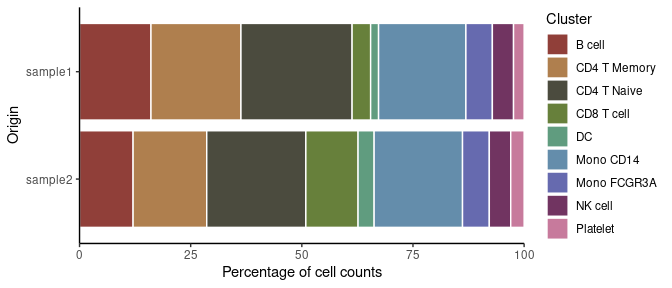
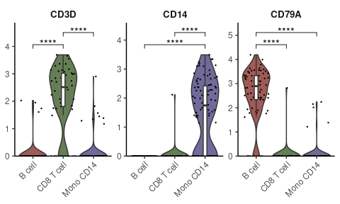
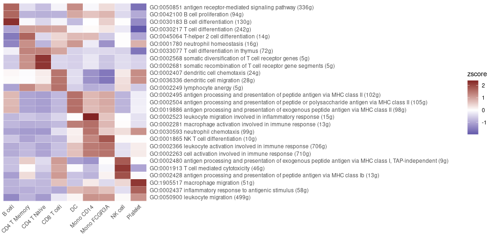
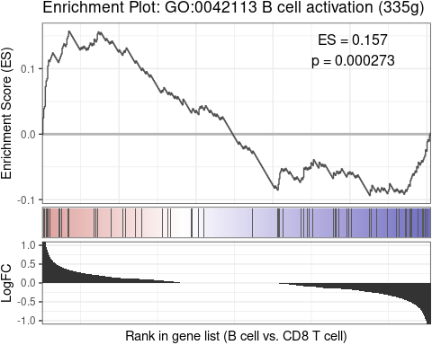
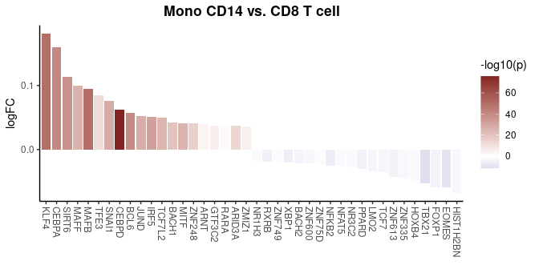
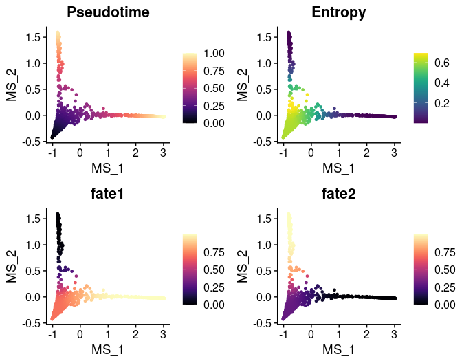
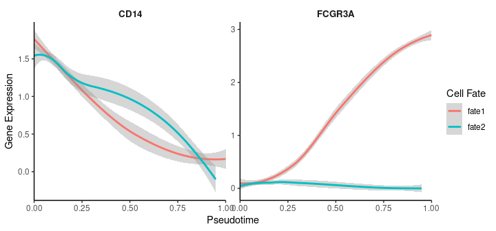
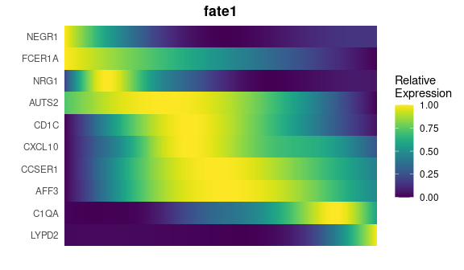
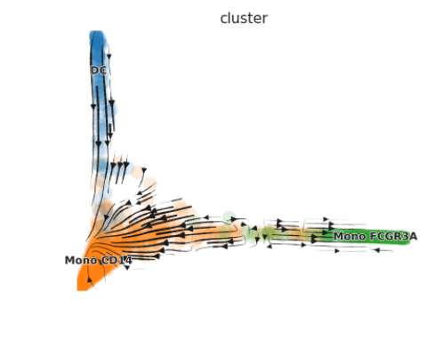

# SeuratExtend: An Enhanced Toolkit for scRNA-seq Analysis

## Overview

`SeuratExtend` is an R package designed to provide an improved and easy-to-use toolkit for scRNA-seq analysis and visualization, built upon the Seurat object. While `Seurat` is a widely-used tool in the R community that offers a foundational framework for scRNA-seq analysis, it has limitations when it comes to more advanced analysis and customized visualization. `SeuratExtend` expands upon `Seurat` by offering an array of enhanced visualization tools, an integrated functional and pathway analysis pipeline, seamless integration with popular Python tools, and a suite of utility functions for data manipulation and presentation. Designed to be user-friendly even for beginners, the package retains a level of professionalism that ensures rigorous analysis.

**Key Features**:

- **Enhanced Data Visualization**: Includes heatmaps, violin plots, feature plots, waterfall plots, proportion bars, and GSEA plots.
- **Integrated Functional and Pathway Analysis**: Supports GO and Reactome databases, with the option to use custom databases.
- **Python Tool Integration**: Easily apply tools like scVelo, SCENIC, and Palantir within R using the Seurat object.
- **Utility Functions**: Assorted functions for calculations and color selections to streamline your scRNA-seq analysis.

## Installation

Install `SeuratExtend` directly from GitHub:

```R
if (!requireNamespace("remotes", quietly = TRUE)) {
    install.packages("remotes")
}
remotes::install_github("huayc09/SeuratExtend")
```

## Vignettes and Tutorials

### [Quick Start-Up Guide](#quick-start-up-guide-1)

### [Enhanced Visualization](vignettes/Visualization.md)
- [Generate a Heatmap Plot](vignettes/Visualization.md#generate-a-heatmap-plot) `Heatmap`
- [Create an Enhanced Dimensional Reduction Plot](vignettes/Visualization.md#create-an-enhanced-dimensional-reduction-plot) `DimPlot2` `FeaturePlot3` `FeaturePlot3.grid`
- [Create an Enhanced Violin Plot](vignettes/Visualization.md#create-an-enhanced-violin-plot) `VlnPlot2`
- [Visualize Cluster Distribution in Samples](vignettes/Visualization.md#visualize-cluster-distribution-in-samples) `ClusterDistrBar`
- [Generate a Waterfall Plot](vignettes/Visualization.md#generate-a-waterfall-plot) `WaterfallPlot`
- [Explore Color Functions](Visualization.md#explore-color-functions) `color_pro` `color_iwh` `ryb2rgb` `save_colors`

### [Geneset Enrichment Analysis (GSEA)](vignettes/GSEA.md)
- [Conduct GSEA using the GO or Reactome database](vignettes/GSEA.md#conduct-gsea-using-the-go-or-reactome-database) `GeneSetAnalysisGO` `GeneSetAnalysisReactome`
- [Perform GSEA using customized genesets](vignettes/GSEA.md#perform-gsea-using-customized-genesets) `GeneSetAnalysis`
- [Find pathways in the GO/Reactome database or customized genesets](vignettes/GSEA.md#find-pathways-in-the-goreactome-database-or-customized-genesets) `SearchDatabase` `SearchPathways`
- [Convert GO/Reactome pathway IDs to pathway names](vignettes/GSEA.md#convert-goreactome-pathway-ids-to-pathway-names) `RenameGO` `RenameReactome`
- [Filter the GO/Reactome pathway list based on certain criteria](vignettes/GSEA.md#filter-the-goreactome-pathway-list-based-on-certain-criteria) `FilterGOTerms` `FilterReactomeTerms`
- [Create a GSEA plot emulating the Broad Institute analysis](vignettes/GSEA.md#create-a-gsea-plot-emulating-the-broad-institute-analysis) `GSEAplot`

### [Trajectory and Pseudotime Analysis](vignettes/Trajectory.md)
-  [scVelo Tutorial for Trajectory Analysis](vignettes/Trajectory.md#analyzing-single-cell-trajectories-with-scvelo) `scVelo.SeuratToAnndata` `scVelo.Plot` 
-  [Palantir Tutorial for Trajectory and Pseudotime Analysis](vignettes/Trajectory.md#palantir-tutorial-for-trajectory-and-pseudotime-analysis) `Palantir.RunDM` `Palantir.Pseudotime`
-  [MAGIC for Denoising and Smoothing Gene Expression](vignettes/Trajectory.md#magic-for-denoising-and-smoothing-gene-expression) `Palantir.Magic`
-  [CellRank Tutorial for Trajectory Analysis](vignettes/Trajectory.md#cellrank-tutorial-for-trajectory-analysis) `Cellrank.Compute` `Cellrank.Plot`
-  [Gene Expression Dynamics Along Differentiation Trajectories](vignettes/Trajectory.md#gene-expression-dynamics-along-differentiation-trajectories) `GeneTrendCurve.Palantir` `GeneTrendHeatmap.Palantir` `GeneTrendCurve.Slingshot` `GeneTrendHeatmap.Slingshot`
-  [Slingshot Tutorial for Pseudotime Analysis](vignettes/Trajectory.md#slingshot-tutorial-for-pseudotime-analysis) `RunSlingshot` 
-  [Integration of Seurat with Python Tools](vignettes/Trajectory.md#integration-of-seurat-with-python-tools) `create_condaenv_seuratextend` `Seu2Adata` `Seu2Loom` `adata.LoadLoom` `adata.AddDR` `adata.AddMetadata` `adata.Save` `adata.Load`

### [SCENIC for Gene Regulatory Networks Analysis](vignettes/SCENIC.md)
- [Importing SCENIC Loom Files into Seurat](vignettes/SCENIC.md#importing-scenic-loom-files-into-seurat) `ImportPyscenicLoom`
- [Visualizing SCENIC Results](vignettes/SCENIC.md#visualizing-scenic-results) 

### [Utility Tools and Functions](vignettes/Utilities.md)
- [Facilitate Gene Naming Conversions](vignettes/Utilities.md#facilitate-gene-naming-conversions) `HumanToMouseGenesymbol` `MouseToHumanGenesymbol` `EnsemblToGenesymbol` `GenesymbolToEnsembl` `UniprotToGenesymbol`
- [Compute Statistics Grouped by Clusters](vignettes/Utilities.md#compute-statistics-grouped-by-clusters) `CalcStats`
- [Assess Proportion of Positive Cells in Clusters](vignettes/Utilities.md#assess-proportion-of-positive-cells-in-clusters) `feature_percent`
- [Run Standard Seurat Pipeline](vignettes/Utilities.md#run-standard-seurat-pipeline) `RunBasicSeurat`

### [FAQ](vignettes/FAQ.md)

## Quick Start-Up Guide

This quick start-up guide provides an overview of the most frequently
used functions in single-cell RNA sequencing (scRNA-seq) analysis. After
running the standard Seurat pipeline (refer to this [Seurat pbmc3k
tutorial](https://satijalab.org/seurat/articles/pbmc3k_tutorial)), you
should have a Seurat object ready for further analysis. Below, we
illustrate the use of a subset of the pbmc dataset as an example to
demonstrate various functionalities of the `SeuratExtend` package.

### Visualizing Clusters

```R
library(Seurat)
library(SeuratExtend)

# Visualizing cell clusters using DimPlot2
DimPlot2(pbmc)
```


### Analyzing Cluster Distribution

To check the percentage of each cluster within different samples:

```R
# Cluster distribution bar plot
ClusterDistrBar(pbmc$orig.ident, pbmc$cluster)
```



### Marker Gene Analysis with Heatmap

To examine the marker genes of each cluster and visualize them using a
heatmap:

```R
# Calculating z-scores for variable features
genes.zscore <- CalcStats(
  pbmc,
  features = VariableFeatures(pbmc),
  group.by = "cluster",
  order = "p",
  n = 4)
  
# Displaying heatmap
Heatmap(genes.zscore, lab_fill = "zscore")
```


### Enhanced Visualization of Marker Genes

For visualizing specific markers via a violin plot that incorporates box
plots, median lines, and performs statistical testing:

```R
# Specifying genes and cells of interest
genes <- c("CD3D", "CD14", "CD79A")
cells <- WhichCells(pbmc, idents = c("B cell", "CD8 T cell", "Mono CD14"))

# Violin plot with statistical analysis
VlnPlot2(
  pbmc,
  features = genes,
  group.by = "cluster",
  cells = cells,
  stat.method = "wilcox.test")
```



### Visualizing Multiple Markers on UMAP

Displaying three markers on a single UMAP, using RYB coloring for each
marker:

```R
FeaturePlot3(pbmc, feature.1 = "CD3D", feature.2 = "CD14", feature.3 = "CD79A")
```


### Conducting Geneset Enrichment Analysis (GSEA)

Examining all the pathways of the immune process in the Gene Ontology
(GO) database, and visualizing by a heatmap that displays the top
pathways of each cluster across multiple cell types:

```R
options(spe = "human")
pbmc <- GeneSetAnalysisGO(pbmc, parent = "immune_system_process", n.min = 5)
matr <- RenameGO(pbmc@misc$AUCell$GO$immune_system_process)
go_zscore <- CalcStats(
  matr,
  f = pbmc$cluster,
  order = "p",
  n = 3)
Heatmap(go_zscore, lab_fill = "zscore")
```



### Detailed Comparison of Two Cell Types

Using a GSEA plot to focus on a specific pathway for deeper comparative
analysis:

```R
GSEAplot(
  pbmc,
  ident.1 = "B cell",
  ident.2 = "CD8 T cell",
  title = "GO:0042113 B cell activation (335g)",
  geneset = GO_Data$human$GO2Gene[["GO:0042113"]])
```



### Importing and Visualizing SCENIC Analysis

After conducting Gene Regulatory Networks Analysis using pySCENIC,
import the output and visualize various aspects within Seurat:

```R
# Downloading a pre-computed SCENIC loom file
scenic_loom_path <- file.path(tempdir(), "pyscenic_integrated-output.loom")
download.file("https://zenodo.org/records/10944066/files/pbmc3k_small_pyscenic_integrated-output.loom", scenic_loom_path)

# Importing SCENIC Loom Files into Seurat
pbmc <- ImportPyscenicLoom(scenic_loom_path, seu = pbmc)

# Visualizing variables such as cluster, gene expression, and SCENIC regulon activity with customized colors
DimPlot2(
  pbmc,
  features = c("cluster", "orig.ident", "CEBPA", "tf_CEBPA"),
  cols = list("tf_CEBPA" = "D"),
  theme = NoAxes()
)
```


```R
# Creating a waterfall plot to compare regulon activity between cell types
DefaultAssay(pbmc) <- "TF"
WaterfallPlot(
  pbmc,
  features = rownames(pbmc),
  ident.1 = "Mono CD14",
  ident.2 = "CD8 T cell",
  exp.transform = FALSE,
  top.n = 20)
```



### Trajectory Analysis with Palantir in R

Trajectory analysis helps identify developmental pathways and
transitions between different cell states. In this section, we
demonstrate how to perform trajectory analysis using the Palantir
algorithm on a subset of myeloid cells, integrating everything within
the R environment.

#### Download and Prepare the Data

First, we download a small subset of myeloid cells to illustrate the
analysis:

```R
# Download the example Seurat Object with myeloid cells
mye_small <- readRDS(url("https://zenodo.org/records/10944066/files/pbmc10k_mye_small_velocyto.rds", "rb"))
```

#### Diffusion Map Calculation

Palantir uses diffusion maps for dimensionality reduction to infer
trajectories. Here’s how to compute and visualize them:

```{r}
# Compute diffusion map
mye_small <- Palantir.RunDM(mye_small)

# Visualize the first two diffusion map dimensions
DimPlot2(mye_small, reduction = "ms")
```


#### Pseudotime Calculation

Pseudotime ordering assigns each cell a time point in a trajectory,
indicating its progression along a developmental path:

```R
# Calculate pseudotime with a specified start cell
mye_small <- Palantir.Pseudotime(mye_small, start_cell = "sample1_GAGAGGTAGCAGTACG-1")

# Store pseudotime results in meta.data for easy plotting
ps <- mye_small@misc$Palantir$Pseudotime
colnames(ps)[3:4] <- c("fate1", "fate2")
mye_small@meta.data[,colnames(ps)] <- ps

# Visualize pseudotime and cell fates
DimPlot2(
  mye_small,
  features = colnames(ps),
  reduction = "ms",
  cols = list(Entropy = "D"))
```



#### Visualization Along Trajectories

Visualizing gene expression or regulon activity along calculated
trajectories can provide insights into dynamic changes:

```R
# Create smoothed gene expression curves along trajectory
GeneTrendCurve.Palantir(
  mye_small,
  pseudotime.data = ps,
  features = c("CD14", "FCGR3A")
)
```



```R
# Create a gene trend heatmap for different fates
GeneTrendHeatmap.Palantir(
  mye_small,
  features = VariableFeatures(mye_small)[1:10],
  pseudotime.data = ps,
  lineage = "fate1"
)
```



### scVelo Analysis

scVelo is a Python tool used for RNA velocity analysis. We demonstrate
how to integrate and analyze velocyto-generated data within the Seurat
workflow using scVelo.

#### Preparing for scVelo

First, download the pre-calculated velocyto loom file:

```R
# Download velocyto loom file
loom_path <- file.path(tempdir(), "pbmc10k_mye_small.loom")
download.file("https://zenodo.org/records/10944066/files/pbmc10k_mye_small.loom", loom_path)

# Path for saving the integrated AnnData object
adata_path <- file.path(tempdir(), "mye_small.h5ad")

# Integrate Seurat Object and velocyto loom into an AnnData object
scVelo.SeuratToAnndata(
  mye_small,
  filename = adata_path,
  velocyto.loompath = loom_path,
  prefix = "sample1_",
  postfix = "-1"
)
```

#### Plotting scVelo Results

Once the data is processed, visualize the RNA velocity:

```R
# Plot RNA velocity
scVelo.Plot(color = "cluster", basis = "ms_cell_embeddings", figsize = c(5,4))
```



For detailed usage of the functions and more advanced analysis, please refer to the vignettes and tutorials.

## License

GPL (>= 3)

## Publications Using SeuratExtend

1. Hua, Y., Vella, G., Rambow, F., et al. (2022). Cancer immunotherapies transition endothelial cells into HEVs that generate TCF1+ T lymphocyte niches through a feed-forward loop. Cancer Cell 40, 1600-1618. https://doi.org/10.1016/j.ccell.2022.11.002
2. Hua, Y., Wu, N., Miao, J., Shen, M. (2023). Single-cell transcriptomic analysis in two patients with rare systemic autoinflammatory diseases treated with anti-TNF therapy. Front. Immunol. 14. https://doi.org/10.3389/fimmu.2023.1091336
