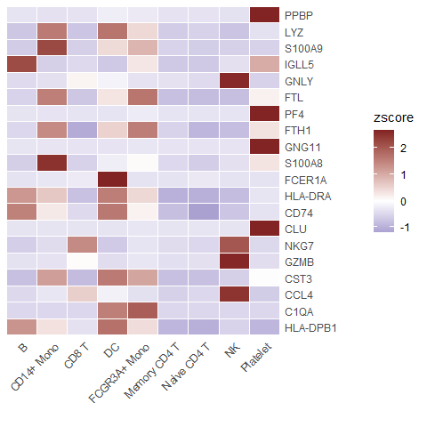
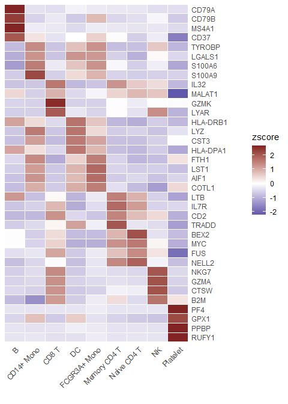
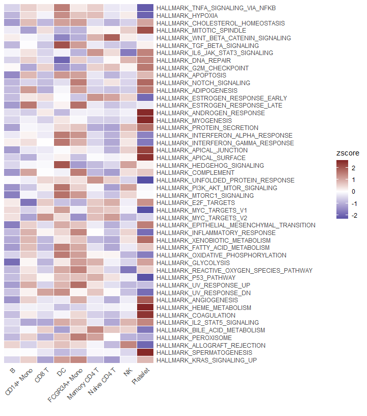

## Introduction

The `CalcStats` function from the `SeuratExtend` package provides a
comprehensive approach to compute various statistics, such as mean,
median, z-scores, or LogFC, for genomic data. This function can handle
data stored in Seurat objects or standard matrices, allowing for
versatile analyses tailored to single-cell datasets.

Whether you’re analyzing genes or pathways, `CalcStats` simplifies the
task by computing statistics for selected features across different cell
groups or clusters.

## Usage

Depending on your data type, whether a Seurat object or a matrix, the
approach to using `CalcStats` varies slightly.

### Using a Seurat Object

Begin by selecting a subset of features, such as genes. For this
example, let’s pick the first 20 variable features from a Seurat object:

    library(Seurat)
    library(SeuratExtend)

    genes <- VariableFeatures(pbmc)[1:20]

Using `CalcStats`, compute your desired metric, like z-scores, for each
feature across different cell clusters:

    genes.zscore <- CalcStats(pbmc, features = genes, method = "zscore", group.by = "cluster")
    head(genes.zscore)

    ##                 B CD14+ Mono      CD8 T         DC FCGR3A+ Mono Memory CD4 T Naive CD4 T         NK   Platelet
    ## PPBP   -0.3515202 -0.3656276 -0.3562711 -0.2276659   -0.2735891   -0.3540491  -0.3579296 -0.3767532  2.6634059
    ## LYZ    -0.6968217  1.6050049 -0.7145679  1.6755134    0.4506888   -0.6390007  -0.5622184 -0.7427155 -0.3758829
    ## S100A9 -0.6359790  2.2257300 -0.5907135  0.4378177    0.8738988   -0.5464319  -0.6152844 -0.5780021 -0.5710357
    ## IGLL5   2.1992608 -0.5932050 -0.4674099 -0.6780586    0.2964938   -0.6780586  -0.6780586 -0.3883289  0.9873649
    ## GNLY   -0.4552790 -0.3843553  0.1288594 -0.1503926   -0.3553292   -0.3672231  -0.4586984  2.6100007 -0.5675825
    ## FTL    -0.5564605  1.5487561 -0.6958221  0.2998978    1.6569409   -0.7921881  -0.8242299 -0.7992858  0.1623916

Display the computed statistics using a heatmap:

    Heatmap(genes.zscore, lab_fill = "zscore")

Select more genes and retain the top 4 genes of each cluster, sorted by
p-value. This can be a convenient method to display the top marker genes
of each cluster:

    genes <- VariableFeatures(pbmc)
    genes.zscore <- CalcStats(
      pbmc, features = genes, method = "zscore", group.by = "cluster", 
      order = "p", n = 4)
    Heatmap(genes.zscore, lab_fill = "zscore")

### Using Matrices as Input

For instance, you might perform Enrichment Analysis (GSEA) using the
Hallmark 50 geneset and obtain the AUCell matrix (rows represent
pathways, columns represent cells):

    pbmc <- GeneSetAnalysis(pbmc, genesets = hall50$human)
    matr <- pbmc@misc$AUCell$genesets

Using the matrix, compute the z-scores for the genesets across various
cell clusters:

    gsea.zscore <- CalcStats(matr, f = pbmc$cluster, method = "zscore")

Present the z-scores using a heatmap:

    Heatmap(gsea.zscore, lab_fill = "zscore")

