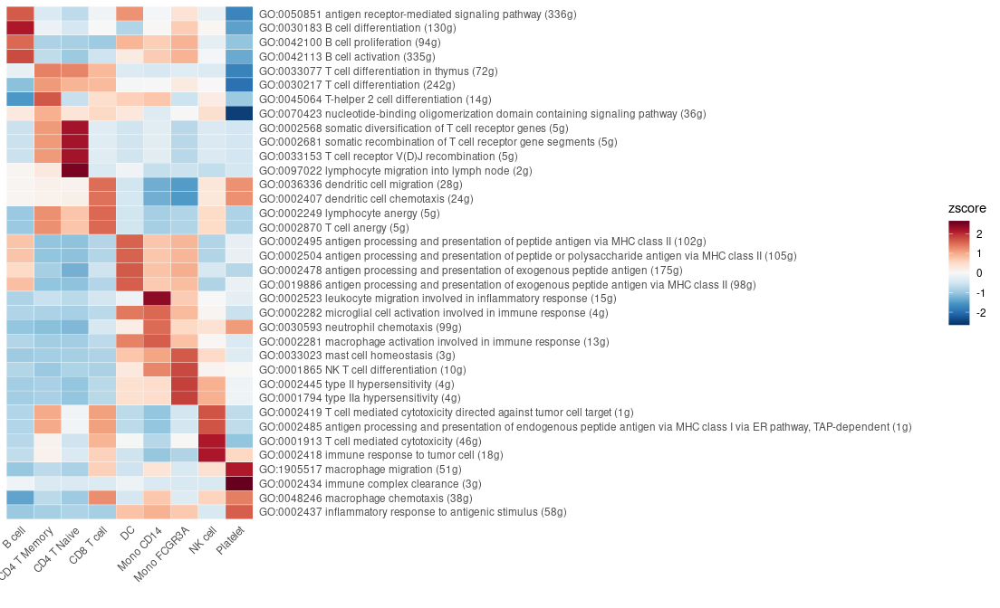
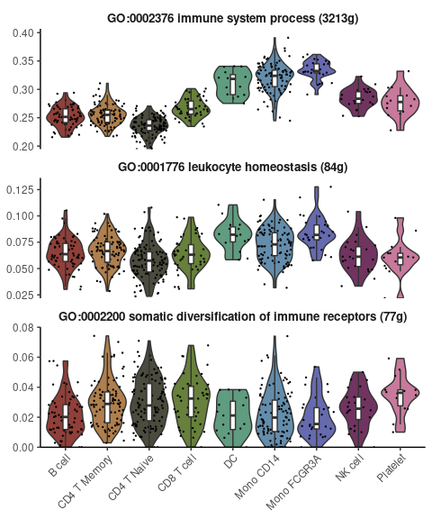
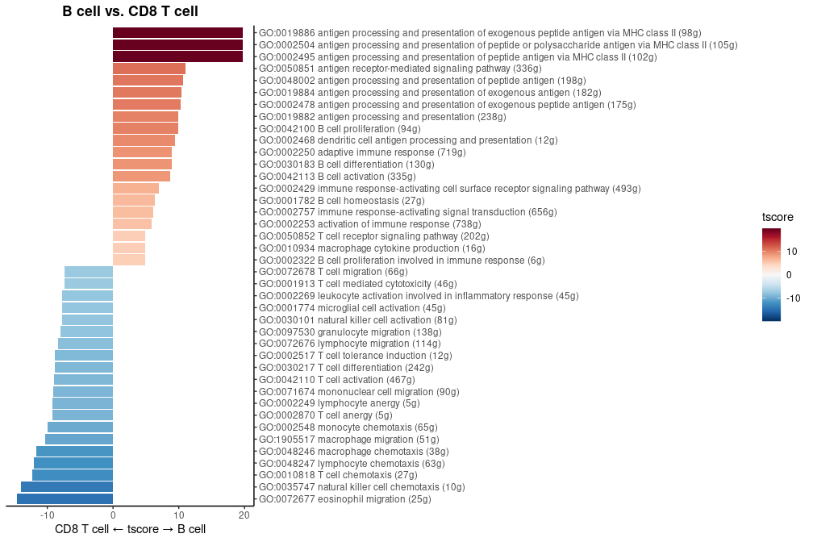
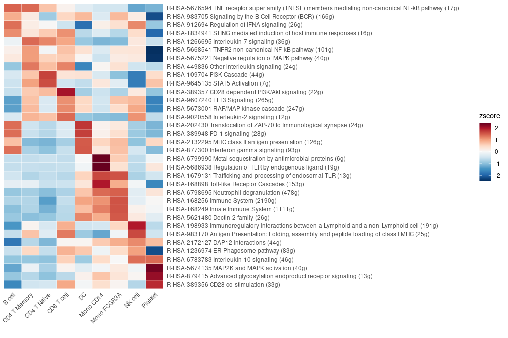
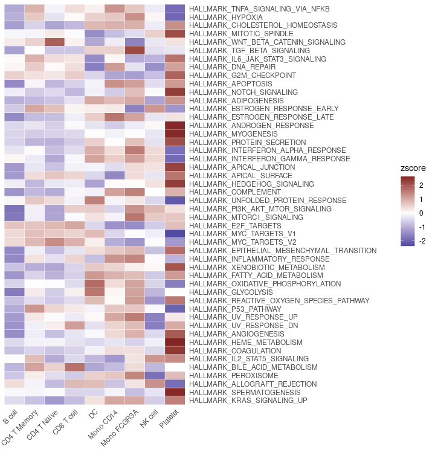
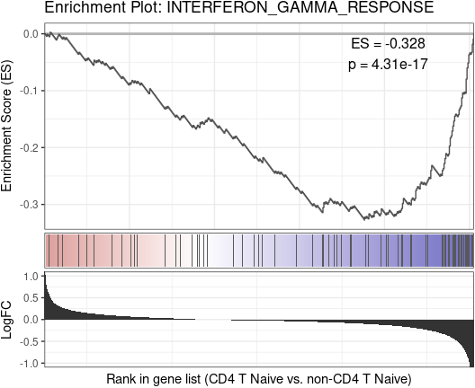

## Table of Contents

1.  [Conduct GSEA using the GO or Reactome database](#conduct-gsea-using-the-go-or-reactome-database)
2.  [Perform GSEA using customized genesets](#perform-gsea-using-customized-genesets)
3.  [Find pathways in the GO/Reactome database or customized genesets](#find-pathways-in-the-goreactome-database-or-customized-genesets)
4.  [Convert GO/Reactome pathway IDs to pathway names](#convert-goreactome-pathway-ids-to-pathway-names)
5.  [Filter the GO/Reactome pathway list based on certain criteria](#filter-the-goreactome-pathway-list-based-on-certain-criteria)
6.  [Create a GSEA plot emulating the Broad Institute analysis](#create-a-gsea-plot-emulating-the-broad-institute-analysis)

## Conduct GSEA using the GO or Reactome database

The `SeuratExtend` package integrates both the GO and Reactome
databases, streamlining the GSEA analysis process. This is primarily
facilitated through the `GeneSetAnalysisGO` and
`GeneSetAnalysisReactome` functions, among other supplementary
functions. In this section, we’ll delve into the usage and features of
these functions.

### Gene Ontology (GO) Database

Performing GSEA using the GO database can be resource-intensive due to
its extensive size. To make the analysis more feasible, you might
consider evaluating pathways under specific categories. For instance, in
the example below, only the pathways under the “immune\_system\_process”
category are evaluated. The results from this analysis are saved in the
location: `seu@misc$AUCell$GO[[title]]`.

```{r}
library(SeuratExtend)
library(dplyr)
options(max.print = 12, spe = "human")

pbmc <- GeneSetAnalysisGO(pbmc, parent = "immune_system_process", nCores = 4) # calculating with 4 cores
matr <- pbmc@misc$AUCell$GO$immune_system_process
matr <- RenameGO(matr)
head(matr, 2:3)
```

    ##                                           cells
    ## gene sets                                  CTATAAGATCGTTT-1 GTGATTCTGGTTCA-1 ACGTTGGACCGTAA-1
    ##   GO:0002376 immune system process (3213g)       0.25536621       0.28481013       0.29963991
    ##   GO:0001776 leukocyte homeostasis (84g)         0.06513243       0.05933047       0.06178234

For the “parent” argument, you can input any term from the GO database,
be it a GO ID or a pathway name. To get a glimpse of commonly used GO
categories, you can run `GeneSetAnalysisGO()` without any arguments:

```{r}
GeneSetAnalysisGO()
```

    ##                 immune_system_process                  response_to_stimulus 
    ##                          "GO:0002376"                          "GO:0050896" 
    ##                             signaling                     metabolic_process 
    ##                          "GO:0023052"                          "GO:0008152" 
    ## regulation_of_vasculature_development                   signal_transduction 
    ##                          "GO:1901342"                          "GO:0007165"

Here are some suggested visualization methods:

-   **Heatmap**: Useful for comparing multiple groups with numerous
    features but provides a less detailed representation.

<!-- -->

```{r}
Heatmap(CalcStats(matr, f = pbmc$cluster, order = "p", n = 4), lab_fill = "zscore")
```



-   **Violin Plot**: Best suited for comparing multiple groups with
    fewer features while presenting more details for individual data
    points.

<!-- -->

```{r}
VlnPlot2(matr[1:3,], f = pbmc$cluster, ncol = 1)
```



-   **Waterfall Plot**: Ideal for comparing two groups.

<!-- -->

```{r}
WaterfallPlot(matr, f = pbmc$cluster, ident.1 = "B cell", ident.2 = "CD8 T cell", top.n = 20)
```



### Reactome Database

For GSEA using the Reactome database, consider assessing pathways under
certain categories to make the process more manageable. The example
below evaluates pathways under the “Immune System” category. Results
from this analysis are saved under: `seu@misc$AUCell$Reactome[[title]]`.

```{r}
pbmc <- GeneSetAnalysisReactome(pbmc, parent = "Immune System")
matr <- pbmc@misc$AUCell$Reactome$`Immune System`
matr <- RenameReactome(matr)
Heatmap(CalcStats(matr, f = pbmc$cluster, order = "p", n = 4), lab_fill = "zscore")
```



Similar to the GO database, running `GeneSetAnalysisReactome()` without
any arguments lets you view commonly used categories in the Reactome
database:

```{r}
GeneSetAnalysisReactome()
```

    ##                           R-HSA-109582                           R-HSA-112316 
    ##                           "Hemostasis"                      "Neuronal System" 
    ##                          R-HSA-1266738                          R-HSA-1430728 
    ##                "Developmental Biology"                           "Metabolism" 
    ##                          R-HSA-1474165                          R-HSA-1474244 
    ##                         "Reproduction"    "Extracellular matrix organization" 
    ##                          R-HSA-1500931                           R-HSA-162582 
    ##              "Cell-Cell communication"                  "Signal Transduction" 
    ##                          R-HSA-1640170                          R-HSA-1643685 
    ##                           "Cell Cycle"                              "Disease" 
    ##                           R-HSA-168256                          R-HSA-1852241 
    ##                        "Immune System" "Organelle biogenesis and maintenance" 
    ##  [ reached getOption("max.print") -- omitted 15 entries ]

## Perform GSEA using customized genesets

To conduct a Gene Set Enrichment Analysis (GSEA) with custom gene sets,
the `GeneSetAnalysis` function is the tool of choice. For instance, one
might consider utilizing the [Hallmark
50](https://www.gsea-msigdb.org/gsea/msigdb/human/genesets.jsp?collection=H)
gene set, commonly employed for general screening. This set can be
accessed via the `hall50` object. Upon execution, the resulting AUCell
matrix will be stored under the path: `seu@misc$AUCell[[title]]`.

```{r}
pbmc <- GeneSetAnalysis(pbmc, genesets = hall50$human)
matr <- pbmc@misc$AUCell$genesets
Heatmap(CalcStats(matr, f = pbmc$cluster), lab_fill = "zscore")
```



For those seeking a plethora of other gene sets, the
`SeuratExtendData::Genesets_data` offers an expansive collection sourced
from the [GSEA MSigDB
website](https://www.gsea-msigdb.org/gsea/msigdb/human/collections.jsp).
Here’s how you can view the available collections:

```{r}
names(SeuratExtendData::Genesets_data$human$GSEA)
```

    ##  [1] "positional gene sets"                 "all curated gene sets"               
    ##  [3] "chemical and genetic perturbations"   "BioCarta gene sets"                  
    ##  [5] "KEGG gene sets"                       "PID gene sets"                       
    ##  [7] "all canonical pathways"               "all motif gene sets"                 
    ##  [9] "transcription factor targets"         "all computational gene sets"         
    ## [11] "all immunologic signatures gene sets" "hallmark gene sets"

Furthermore, for cluster annotations, the `SeuratExtend::PanglaoDB_data`
contains a valuable resource: marker lists for 178 distinct cell types,
curated from [PanglaoDB](https://panglaodb.se/markers.html). To explore
these marker lists:

```{r}
names(SeuratExtend::PanglaoDB_data$marker_list_human)
```

    ##  [1] "Acinar cells"                   "Adipocyte progenitor cells"     "Adipocytes"                    
    ##  [4] "Adrenergic neurons"             "Airway epithelial cells"        "Airway goblet cells"           
    ##  [7] "Airway smooth muscle cells"     "Alpha cells"                    "Alveolar macrophages"          
    ## [10] "Anterior pituitary gland cells" "Astrocytes"                     "B cells"                       
    ##  [ reached getOption("max.print") -- omitted 166 entries ]

## Find pathways in the GO/Reactome database or customized genesets

Navigating the plethora of pathways in databases like GO and Reactome
can be overwhelming. The `SearchDatabase` function simplifies this
process by offering a wide array of customizable search parameters.

### General Search

The ‘item’ parameter is highly versatile, allowing you to search by gene
name, pathway ID, or even keywords within pathway names. The following
example demonstrates how to find pathways containing the gene “CD3D” or
pathways with names including “metabolic.”

```{r}
result <- SearchDatabase(c("CD3D", "metabolic"))
names(result)
```

    ##  [1] "GO:0000023 maltose metabolic process (3g)"                                  
    ##  [2] "GO:0000038 very long-chain fatty acid metabolic process (31g)"              
    ##  [3] "GO:0000052 citrulline metabolic process (8g)"                               
    ##  [4] "GO:0000053 argininosuccinate metabolic process (1g)"                        
    ##  [5] "GO:0000096 sulfur amino acid metabolic process (43g)"                       
    ##  [6] "GO:0000255 allantoin metabolic process (2g)"                                
    ##  [7] "GO:0000270 peptidoglycan metabolic process (6g)"                            
    ##  [8] "GO:0000820 regulation of glutamine family amino acid metabolic process (6g)"
    ##  [9] "GO:0000821 regulation of arginine metabolic process (2g)"                   
    ## [10] "GO:0000959 mitochondrial RNA metabolic process (48g)"                       
    ## [11] "GO:0001523 retinoid metabolic process (103g)"                               
    ## [12] "GO:0001573 ganglioside metabolic process (21g)"                             
    ##  [ reached getOption("max.print") -- omitted 1029 entries ]

```{r}
glimpse(head(result, 3))
```

    ## List of 3
    ##  $ GO:0000023 maltose metabolic process (3g)                    :List of 3
    ##   ..$ SetID  : chr "GO:0000023"
    ##   ..$ SetName: chr "maltose metabolic process"
    ##   ..$ Genes  : chr [1:3] "MGAM" "GAA" "GANC"
    ##  $ GO:0000038 very long-chain fatty acid metabolic process (31g):List of 3
    ##   ..$ SetID  : chr "GO:0000038"
    ##   ..$ SetName: chr "very long-chain fatty acid metabolic process"
    ##   ..$ Genes  : chr [1:31] "ELOVL7" "HACD1" "SLC27A2" "ACAA1" ...
    ##  $ GO:0000052 citrulline metabolic process (8g)                 :List of 3
    ##   ..$ SetID  : chr "GO:0000052"
    ##   ..$ SetName: chr "citrulline metabolic process"
    ##   ..$ Genes  : chr [1:8] "DDAH1" "DDAH2" "OTC" "ASS1" ...

### Type-Specific Search

If you wish to limit your search to specific types of items such as gene
names, you can utilize the ‘type’ parameter as shown below.

```{r}
result <- SearchDatabase("CD3D", type = "gene")
names(result)
```

    ##  [1] "GO:0001775 cell activation (1458g)"                                                  
    ##  [2] "GO:0002250 adaptive immune response (719g)"                                          
    ##  [3] "GO:0002253 activation of immune response (738g)"                                     
    ##  [4] "GO:0002376 immune system process (3213g)"                                            
    ##  [5] "GO:0002429 immune response-activating cell surface receptor signaling pathway (493g)"
    ##  [6] "GO:0002520 immune system development (967g)"                                         
    ##  [7] "GO:0002521 leukocyte differentiation (517g)"                                         
    ##  [8] "GO:0002682 regulation of immune system process (1662g)"                              
    ##  [9] "GO:0002684 positive regulation of immune system process (1213g)"                     
    ## [10] "GO:0002757 immune response-activating signal transduction (656g)"                    
    ## [11] "GO:0002764 immune response-regulating signaling pathway (690g)"                      
    ## [12] "GO:0002768 immune response-regulating cell surface receptor signaling pathway (526g)"
    ##  [ reached getOption("max.print") -- omitted 168 entries ]

### Database-Specific Search

To focus your search within a particular database, specify the database
name using the ‘database’ parameter.

```{r}
result <- SearchDatabase("CD3D", database = "Reactome")
names(result)
```

    ##  [1] "R-HSA-1280218 Adaptive Immune System (817g)"                                                 
    ##  [2] "R-HSA-168256 Immune System (2190g)"                                                          
    ##  [3] "R-HSA-198933 Immunoregulatory interactions between a Lymphoid and a non-Lymphoid cell (191g)"
    ##  [4] "R-HSA-199991 Membrane Trafficking (628g)"                                                    
    ##  [5] "R-HSA-202403 TCR signaling (124g)"                                                           
    ##  [6] "R-HSA-202424 Downstream TCR signaling (102g)"                                                
    ##  [7] "R-HSA-202427 Phosphorylation of CD3 and TCR zeta chains (27g)"                               
    ##  [8] "R-HSA-202430 Translocation of ZAP-70 to Immunological synapse (24g)"                         
    ##  [9] "R-HSA-202433 Generation of second messenger molecules (39g)"                                 
    ## [10] "R-HSA-388841 Costimulation by the CD28 family (74g)"                                         
    ## [11] "R-HSA-389948 PD-1 signaling (28g)"                                                           
    ## [12] "R-HSA-5653656 Vesicle-mediated transport (723g)"                                             
    ##  [ reached getOption("max.print") -- omitted 2 entries ]

### Species-Specific Search

You can specify either ‘human’ or ‘mouse’ using the ‘spe’ parameter.

```{r}
result <- SearchDatabase("Cd3d", spe = "mouse")
glimpse(head(result, 3))
```

    ## List of 3
    ##  $ GO:0001775 cell activation (1169g)        :List of 3
    ##   ..$ SetID  : chr "GO:0001775"
    ##   ..$ SetName: chr "cell activation"
    ##   ..$ Genes  : chr [1:1169] "Cd86" "Cd79a" "Cd80" "Serpine2" ...
    ##  $ GO:0002250 adaptive immune response (640g):List of 3
    ##   ..$ SetID  : chr "GO:0002250"
    ##   ..$ SetName: chr "adaptive immune response"
    ##   ..$ Genes  : chr [1:640] "Cd86" "Cd79a" "Msh2" "Traf2" ...
    ##  $ GO:0002376 immune system process (2850g)  :List of 3
    ##   ..$ SetID  : chr "GO:0002376"
    ##   ..$ SetName: chr "immune system process"
    ##   ..$ Genes  : chr [1:2850] "Gm42543" "Cd86" "Cd79a" "Cd80" ...

### Customizing Return Types

The function also offers flexibility in output types. For example, if
you require a list of pathway IDs for downstream analysis, you can use
the ‘return’ parameter as follows.

```{r}
result <- SearchDatabase("CD3D", return = "ID")
result
```

    ##  [1] "GO:0001775" "GO:0002250" "GO:0002253" "GO:0002376" "GO:0002429" "GO:0002520" "GO:0002521"
    ##  [8] "GO:0002682" "GO:0002684" "GO:0002757" "GO:0002764" "GO:0002768"
    ##  [ reached getOption("max.print") -- omitted 168 entries ]

Alternatively, if you need the output as a gene list formatted for
`GeneSetAnalysis`, adjust the ‘return’ parameter like so:

```{r}
result <- SearchDatabase("CD3D", return = "genelist")
glimpse(head(result, 5))
```

    ## List of 5
    ##  $ GO:0001775: chr [1:1458] "IGHV3-64" "IGHV4-4" "IGHV4OR15-8" "IGHV3OR16-12" ...
    ##  $ GO:0002250: chr [1:719] "IGKV3-7" "IGKV1D-42" "IGLV4-69" "IGLV8-61" ...
    ##  $ GO:0002253: chr [1:738] "IGKV2-28" "IGHV3-64" "IGHV4-4" "IGKV2D-30" ...
    ##  $ GO:0002376: chr [1:3213] "IGKV3-7" "IGKV1D-42" "IGLV4-69" "IGLV8-61" ...
    ##  $ GO:0002429: chr [1:493] "IGKV2-28" "IGHV3-64" "IGHV4-4" "IGKV2D-30" ...

To export the result as a data frame, suitable for formats like Excel or
CSV, set the ‘export.to.data.frame’ parameter to TRUE.

```{r}
result <- SearchDatabase("CD3D", export.to.data.frame = TRUE)
glimpse(result)
```

    ## Rows: 180
    ## Columns: 3
    ## $ SetID   <chr> "GO:0001775", "GO:0002250", "GO:0002253", "GO:0002376", "GO:0002429", "GO:0002520", "GO…
    ## $ SetName <chr> "cell activation", "adaptive immune response", "activation of immune response", "immune…
    ## $ Genes   <chr> "IGHV3-64,IGHV4-4,IGHV4OR15-8,IGHV3OR16-12,IGHV1OR15-1,IGHV3OR15-7,IGHV3OR16-13,IGHV3OR…

### Filtering a Customized Gene Set

Lastly, you can also filter a given gene set list with the
`SearchPathways` function. For instance, within the “Hallmark 50”
database, you can find pathways that include the gene “CD3D” or have
names that contain “interferon.”

```{r}
SearchPathways(genesets = hall50$human, item = c("CD3D", "interferon"))
```

    ## $HALLMARK_INTERFERON_ALPHA_RESPONSE
    ##  [1] "MX1"        "ISG15"      "AC004551.1" "IFIT3"      "IFI44"      "IFI35"      "IRF7"      
    ##  [8] "RSAD2"      "IFI44L"     "IFITM1"     "IFI27"      "IRF9"      
    ##  [ reached getOption("max.print") -- omitted 85 entries ]
    ## 
    ## $HALLMARK_INTERFERON_GAMMA_RESPONSE
    ##  [1] "STAT1"   "ISG15"   "IFIT1"   "MX1"     "IFIT3"   "IFI35"   "IRF7"    "IFIT2"   "OAS2"    "TAP1"   
    ## [11] "EIF2AK2" "RSAD2"  
    ##  [ reached getOption("max.print") -- omitted 188 entries ]
    ## 
    ## $HALLMARK_ALLOGRAFT_REJECTION
    ##  [1] "PTPRC" "IL12B" "TGFB1" "IL12A" "CD3E"  "CD3D"  "CD28"  "LYN"   "HCLS1" "IL18"  "CRTAM" "IFNG" 
    ##  [ reached getOption("max.print") -- omitted 188 entries ]

## Convert GO/Reactome pathway IDs to pathway names

During the course of analyses, researchers often encounter pathway IDs
from databases such as GO and Reactome. While these IDs are great for
computational tasks, they can be cryptic when it comes to
interpretability. `RenameGO` and `RenameReactome` functions provide a
convenient means to transform these IDs into their more descriptive
pathway names.

The primary parameter these functions require is “item”. This can either
be:

1.  A character vector of GO or Reactome IDs. For example, this could be
    the output from functions like `FilterGOTerms` or
    `FilterReactomeTerms`.
2.  A matrix where the IDs are stored in the rownames, such as the
    output of `GeneSetAnalysisGO` or `GeneSetAnalysisReactome`.

Convert GO IDs to their respective pathway names for human:

```{r}
RenameGO(c("GO:0002376","GO:0050896"), spe = "human")
```

    ## [1] "GO:0002376 immune system process (3213g)" "GO:0050896 response to stimulus (9342g)"

Similarly, for Reactome IDs:

```{r}
RenameReactome(c("R-HSA-109582","R-HSA-112316"), spe = "human")
```

    ## [1] "R-HSA-109582 Hemostasis (679g)"      "R-HSA-112316 Neuronal System (411g)"

## Filter the GO/Reactome pathway list based on certain criteria

Both GO and Reactome databases contain thousands of pathways, but not
all of which may be relevant to your study. To streamline the analysis,
you can use the `FilterGOTerms` and `FilterReactomeTerms` functions to
subset and refine the list of GO or Reactome pathways based on specific
criteria.

### Filtering GO Pathways

Let’s start by looking at how you can filter GO pathways:

-   **By Parent Term:** To select pathways under a specific category,
    use the `parent` parameter. For example, to get pathways related to
    the immune system process:

<!-- -->

```{r}
terms <- FilterGOTerms(parent = "GO:0002376")
RenameGO(terms)
```

    ##  [1] "GO:0001773 myeloid dendritic cell activation (28g)"      
    ##  [2] "GO:0001774 microglial cell activation (45g)"             
    ##  [3] "GO:0001776 leukocyte homeostasis (84g)"                  
    ##  [4] "GO:0001777 T cell homeostatic proliferation (4g)"        
    ##  [5] "GO:0001779 natural killer cell differentiation (21g)"    
    ##  [6] "GO:0001780 neutrophil homeostasis (16g)"                 
    ##  [7] "GO:0001782 B cell homeostasis (27g)"                     
    ##  [8] "GO:0001787 natural killer cell proliferation (11g)"      
    ##  [9] "GO:0001788 antibody-dependent cellular cytotoxicity (2g)"
    ## [10] "GO:0001794 type IIa hypersensitivity (4g)"               
    ## [11] "GO:0001802 type III hypersensitivity (2g)"               
    ## [12] "GO:0001806 type IV hypersensitivity (4g)"                
    ##  [ reached getOption("max.print") -- omitted 395 entries ]

-   **By Gene Count:** If you’re interested in pathways of a specific
    size (i.e., containing a certain number of genes), you can further
    refine your previously filtered list using the `n.min` and `n.max`
    parameters. Building upon the pathways we selected under the “immune
    system process” (`terms`), to keep only those pathways that contain
    between 10 and 1000 genes:

<!-- -->

```{r}
terms2 <- FilterGOTerms(term = terms, n.min = 10, n.max = 1000)
RenameGO(terms2)
```

    ##  [1] "GO:0001773 myeloid dendritic cell activation (28g)"                                        
    ##  [2] "GO:0001774 microglial cell activation (45g)"                                               
    ##  [3] "GO:0001776 leukocyte homeostasis (84g)"                                                    
    ##  [4] "GO:0001779 natural killer cell differentiation (21g)"                                      
    ##  [5] "GO:0001780 neutrophil homeostasis (16g)"                                                   
    ##  [6] "GO:0001782 B cell homeostasis (27g)"                                                       
    ##  [7] "GO:0001787 natural killer cell proliferation (11g)"                                        
    ##  [8] "GO:0001865 NK T cell differentiation (10g)"                                                
    ##  [9] "GO:0001867 complement activation, lectin pathway (11g)"                                    
    ## [10] "GO:0001913 T cell mediated cytotoxicity (46g)"                                             
    ## [11] "GO:0002200 somatic diversification of immune receptors (77g)"                              
    ## [12] "GO:0002204 somatic recombination of immunoglobulin genes involved in immune response (50g)"
    ##  [ reached getOption("max.print") -- omitted 202 entries ]

-   **End-Level Pathways:** If you prefer to look at only the end-level
    (most specific) pathways, set the `only.end.terms` parameter to
    `TRUE`.

<!-- -->

```{r}
terms3 <- FilterGOTerms(term = terms, only.end.terms = TRUE)
RenameGO(terms3)
```

    ##  [1] "GO:0001777 T cell homeostatic proliferation (4g)"                      
    ##  [2] "GO:0001780 neutrophil homeostasis (16g)"                               
    ##  [3] "GO:0001787 natural killer cell proliferation (11g)"                    
    ##  [4] "GO:0001788 antibody-dependent cellular cytotoxicity (2g)"              
    ##  [5] "GO:0001802 type III hypersensitivity (2g)"                             
    ##  [6] "GO:0001806 type IV hypersensitivity (4g)"                              
    ##  [7] "GO:0001865 NK T cell differentiation (10g)"                            
    ##  [8] "GO:0001866 NK T cell proliferation (7g)"                               
    ##  [9] "GO:0001867 complement activation, lectin pathway (11g)"                
    ## [10] "GO:0001905 activation of membrane attack complex (3g)"                 
    ## [11] "GO:0001922 B-1 B cell homeostasis (3g)"                                
    ## [12] "GO:0002223 stimulatory C-type lectin receptor signaling pathway (112g)"
    ##  [ reached getOption("max.print") -- omitted 188 entries ]

### Filtering Reactome Pathways

The process for Reactome pathways is analogous. For instance, to select
pathways related to the Immune System:

```{r}
terms <- FilterReactomeTerms(parent = "R-HSA-168256")
RenameReactome(terms)
```

    ##  [1] "R-HSA-1059683 Interleukin-6 signaling (11g)"                                         
    ##  [2] "R-HSA-109703 PKB-mediated events (2g)"                                               
    ##  [3] "R-HSA-109704 PI3K Cascade (44g)"                                                     
    ##  [4] "R-HSA-1168372 Downstream signaling events of B Cell Receptor (BCR) (81g)"            
    ##  [5] "R-HSA-1169091 Activation of NF-kappaB in B cells (67g)"                              
    ##  [6] "R-HSA-1169092 Activation of RAS in B cells (5g)"                                     
    ##  [7] "R-HSA-1169408 ISG15 antiviral mechanism (74g)"                                       
    ##  [8] "R-HSA-1169410 Antiviral mechanism by IFN-stimulated genes (82g)"                     
    ##  [9] "R-HSA-1170546 Prolactin receptor signaling (15g)"                                    
    ## [10] "R-HSA-1222556 ROS and RNS production in phagocytes (36g)"                            
    ## [11] "R-HSA-1236973 Cross-presentation of particulate exogenous antigens (phagosomes) (8g)"
    ## [12] "R-HSA-1236974 ER-Phagosome pathway (83g)"                                            
    ##  [ reached getOption("max.print") -- omitted 185 entries ]

## Create a GSEA plot emulating the Broad Institute analysis

The `GSEAplot` function is designed to generate plots that emulate the
Gene Set Enrichment Analysis (GSEA) as developed by the Broad Institute.
This function provides a way to visualize the enrichment of specific
gene sets within different biological states or conditions.

Here’s how you can create a GSEA plot for the
“INTERFERON\_GAMMA\_RESPONSE” gene set within the “Naive CD4 T” cell
population of the `pbmc` dataset:

```{r}
GSEAplot(
  pbmc, 
  ident.1 = "CD4 T Naive", 
  title = "INTERFERON_GAMMA_RESPONSE",
  geneset = hall50$human$HALLMARK_INTERFERON_GAMMA_RESPONSE
)
```


