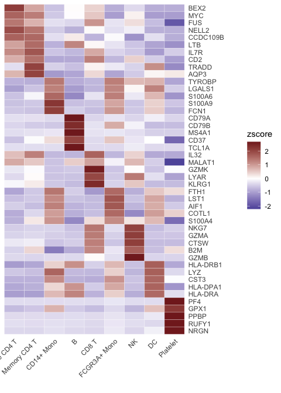
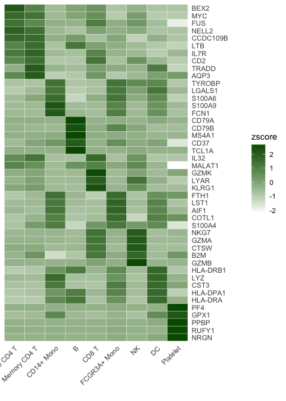
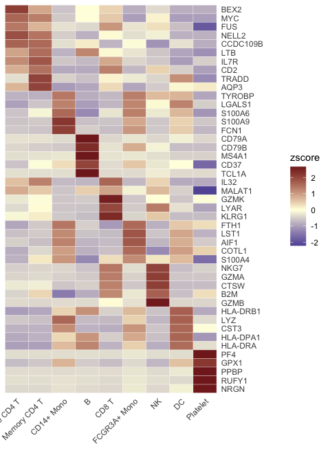
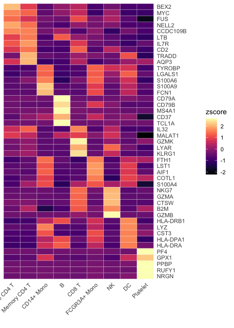
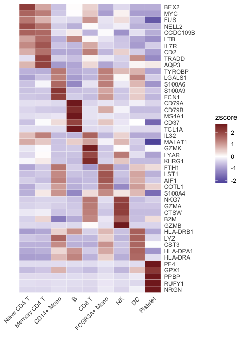
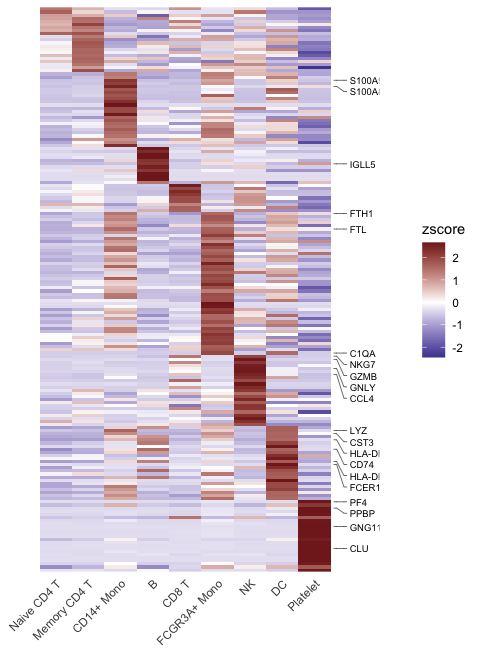
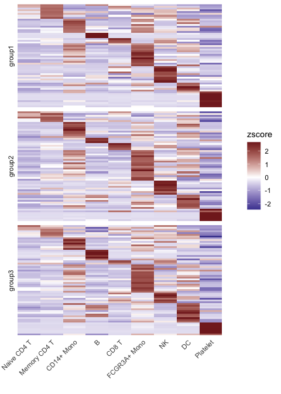

## Introduction

The `Heatmap` function provides a flexible and comprehensive way to
visualize matrices, especially those produced by the `CalcStats`
function. This vignette provides a quick overview of how to utilize the
various features and capabilities of the `Heatmap` function to generate
customized visualizations.

## Basic Usage

First, let’s generate a sample matrix using the `CalcStats` function:

    library(Seurat)
    library(SeuratExtend)

    # Assuming pbmc data and VariableFeatures function are available
    genes <- VariableFeatures(pbmc)
    toplot <- CalcStats(pbmc, features = genes, method = "zscore", order = "p", n = 5)

Now, we can produce a basic heatmap:

    Heatmap(toplot, lab_fill = "zscore")

## Customizing the Heatmap

### Adjusting Color Schemes

The `color_scheme` parameter allows for flexibility in visualizing data.
Here are some ways to change the color theme of your heatmap:

    # White to dark green
    Heatmap(toplot, lab_fill = "zscore", color_scheme = c("white", muted("green")))

    ## Using id as id variables

    # Dark blue to light yellow (centered at 0) to dark red
    Heatmap(toplot, lab_fill = "zscore", color_scheme = c(
      low = muted("blue"),
      mid = "lightyellow",
      high = muted("red"))
    )

    ## Using id as id variables

You can also use predefined color schemes, such as those from the
viridis package:

    Heatmap(toplot, lab_fill = "zscore", color_scheme = "A")

    ## Using id as id variables

### Modifying Axis and Labels

If the first name on the x-axis is too long and surpasses the left
boundary of the plot, you can expand the x-axis’s left boundary:

    Heatmap(toplot, lab_fill = "zscore", expand_limits_x = -0.5)

    ## Using id as id variables

For denser matrices, you may wish to only show a subset of gene names:

    toplot2 <- CalcStats(pbmc, features = genes[1:500], method = "zscore", order = "p")
    Heatmap(toplot2, lab_fill = "zscore", feature_text_subset = genes[1:20], expand_limits_x = c(-0.5, 11))

    ## Using id as id variables

### Faceting the Heatmap

You can also split the heatmap based on gene groups:

    gene_groups <- sample(c("group1", "group2", "group3"), nrow(toplot2), replace = TRUE)
    Heatmap(toplot2, lab_fill = "zscore", facet_row = gene_groups) +
      theme(axis.text.y = element_blank())

    ## Using id as id variables

