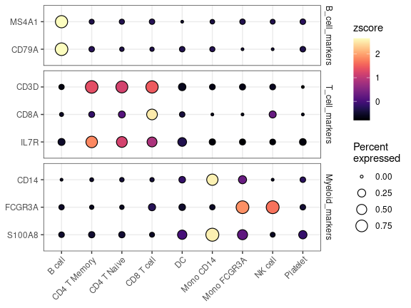
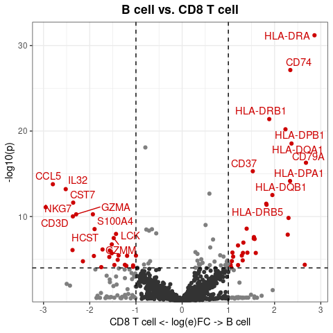
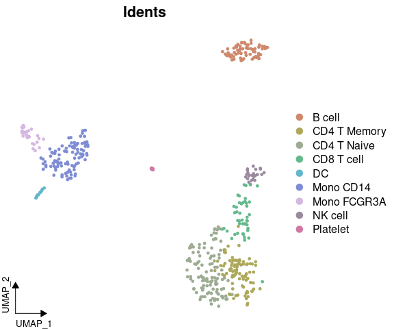
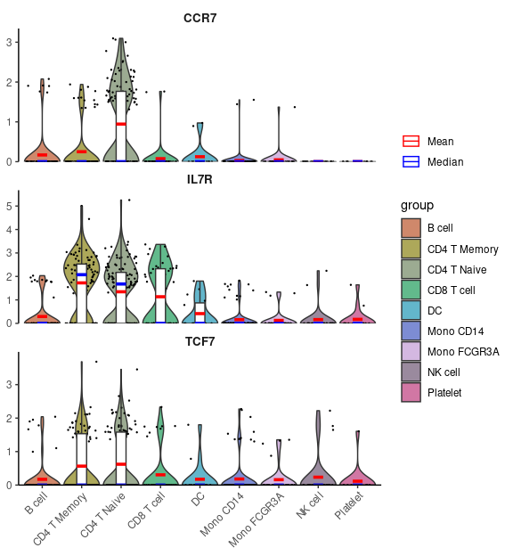
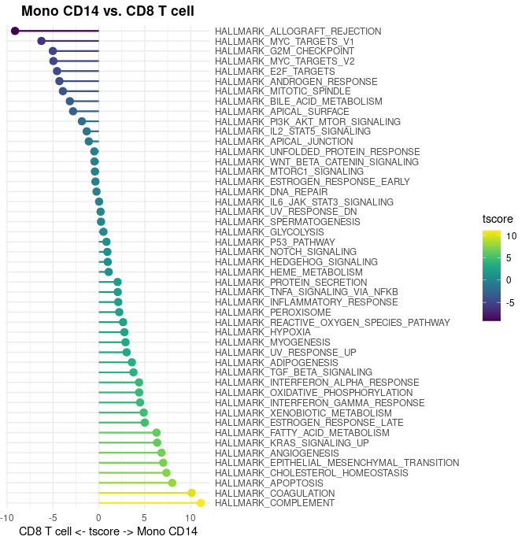
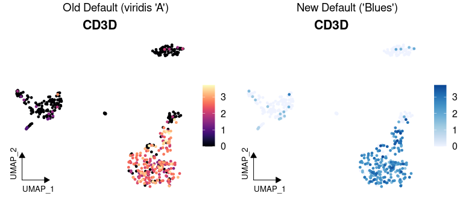
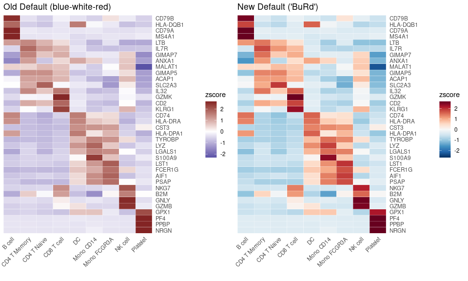

## New Features and Enhancements in v1.2.0

### Dark Theme Support for Feature Plot Visualization

The `FeaturePlot3` and `FeaturePlot3.grid` functions now support a dark
theme option, providing better contrast for visualizing gene expression
patterns, particularly in presentations or low-light environments:

``` r
library(Seurat)
library(SeuratExtend)

# Using dark theme with FeaturePlot3
FeaturePlot3(
  pbmc, 
  color = "rgb", 
  feature.1 = "CD3D", 
  feature.2 = "CD14", 
  feature.3 = "CD79A", 
  pt.size = 1,
  dark.theme = TRUE
)
```

<!-- -->

### New Violin Plot Styling Options

The `VlnPlot2` function now supports an “outline” style option, which
uses white-filled violins with colored outlines instead of the default
filled style:

``` r
# Outline style for violin plots
genes <- c("CD3D", "CD14", "CD79A")
VlnPlot2(pbmc, features = genes, style = "outline", ncol = 1)
```

<!-- -->

### New ClusterDistrPlot Function

The new `ClusterDistrPlot` function extends `ClusterDistrBar` to allow
comparison of cluster distribution patterns between experimental
conditions. When the `condition` parameter is provided, it creates
boxplots grouped by condition instead of stacked bars:

``` r
# Compare cluster distribution between conditions
ClusterDistrPlot(
  origin = pbmc$sample_id,
  cluster = pbmc$cluster,
  condition = pbmc$condition
)
```

<!-- -->

This function inherits styling options from `VlnPlot2` when in boxplot
mode, making it highly versatile for comparing cell type proportions
across experimental groups.

### Enhanced Log Fold Change Options in Differential Analysis Plots

Both `WaterfallPlot` and `VolcanoPlot` functions now support different
logarithm bases for fold change calculations through the `log.base`
parameter:

``` r
# Using log base 2 for fold change calculations in WaterfallPlot
WaterfallPlot(
  pbmc, 
  group.by = "cluster", 
  features = VariableFeatures(pbmc)[1:80],
  ident.1 = "Mono CD14", 
  ident.2 = "CD8 T cell", 
  length = "logFC",
  log.base = "2",    # Use log2 instead of natural log
  top.n = 20)
```

<!-- -->

``` r
# Using log base 2 in VolcanoPlot
VolcanoPlot(
  pbmc,
  ident.1 = "B cell",
  ident.2 = "CD8 T cell",
  log.base = "2"    # Use log2 instead of natural log
)
```

<!-- -->

Available options include: - `log.base = "e"`: Natural logarithm
(default) - `log.base = "2"`: Log base 2 - `log.base = "10"`: Log base
10 - Any numeric value for custom bases

### Color Scheme Updates

#### New “Bright” Color Scheme and Default Change

A new vibrant color scheme “bright” has been added for visualizations
requiring higher contrast:

``` r
library(cowplot)
DimPlot2(pbmc, features = c("orig.ident", "cluster"), cols = "bright", ncol = 2, theme = NoAxes())
```

<!-- -->

Based on user feedback, the default discrete color scheme has been
changed from “default” (darker theme) to “light” to avoid color
inconsistency in `DimPlot2` when toggling between labeled and unlabeled
displays.

If you prefer to retain the original “default” (darker) color scheme,
you can use:

``` r
seu <- save_colors(seu, col_list = list("discrete" = "default"))
```

### Enhanced Gene Set Enrichment Analysis (GSEA) Capabilities

#### Improved Database Management

SeuratExtend now offers enhanced ways to manage and update the GO and
Reactome databases used in your GSEA analyses:

``` r
# Install specific versions of SeuratExtendData for different database releases
install_SeuratExtendData("latest")    # Latest version (April 2025 data)
install_SeuratExtendData("stable")    # Stable version (January 2020 data)
install_SeuratExtendData("v0.2.1")    # Specific version with January 2020 datasets
install_SeuratExtendData("v0.3.0")    # Specific version with April 2025 datasets
```

This ensures compatibility with specific analysis workflows or when you
need to match results from previous studies.

#### Creating and Using Custom Databases

SeuratExtend now provides a more streamlined workflow for creating and
using custom GO or Reactome databases:

``` r
# Load custom database
custom_GO_Data <- readRDS("path/to/your/GO_Data.rds")

# Use with SeuratExtend by assigning to global environment
GO_Data <- custom_GO_Data

# Run analysis
seu <- GeneSetAnalysisGO(seu, parent = "immune_system_process")

# When done, remove the global variable
rm(GO_Data)
```

This feature is particularly useful for: - Using the latest database
updates - Creating databases for additional model organisms - Developing
custom pathway collections

For detailed documentation on creating custom databases, SeuratExtend
provides comprehensive guides accessible through:

``` r
browseURL("https://github.com/huayc09/SeuratExtendData/blob/main/inst/db_creation/README_GO_Data.md")
browseURL("https://github.com/huayc09/SeuratExtendData/blob/main/inst/db_creation/README_Reactome_Data.md")
```

### Apple Silicon (M1/M2/M3/M4) Support for Trajectory Analysis

SeuratExtend v1.2.0 adds support for Apple Silicon chips (M1/M2/M3/M4),
allowing macOS users to run Python-based trajectory analysis tools.
However, this support comes with specific limitations that require
following a particular workflow to avoid R session crashes:

``` r
# IMPORTANT: Apple Silicon users MUST initialize Python environment BEFORE loading any data
library(SeuratExtend)
activate_python()  # Must call this function FIRST to prevent memory-related crashes

# Only THEN load your data and proceed with analysis
seu <- readRDS("path/to/seurat_object.rds")
```

**Important Considerations:**

- On Apple Silicon, memory management issues exist between R and Python,
  especially when performing operations like PCA on AnnData objects
- If R objects are loaded before calling Python functions, the R session
  will likely crash
- You must start a fresh R session and call `activate_python()` before
  loading any data
- This initialization sequence is necessary when using tools like
  scVelo, Palantir, or CellRank

Despite these limitations, the `create_condaenv_seuratextend()` function
now automatically detects Apple Silicon and uses the appropriate
configuration, enabling Mac users to run:

- scVelo: for RNA velocity analysis
- Palantir: for cell fate determination and pseudotime analysis
- CellRank: for trajectory analysis
- MAGIC: for gene expression denoising and smoothing

### Bug Fixes and Improvements

Several important bug fixes and enhancements have been implemented based
on user feedback:

- **scVelo Functions**: Fixed issues related to scVelo functionality,
  addressing reported bugs in GitHub issue \#30.
- **DotPlot2**: Fixed bugs affecting the appearance and functionality of
  the `DotPlot2` function (GitHub issues \#22 and \#29).
- **Palantir Windows Compatibility**: Fixed compatibility issues for
  Palantir functions on Windows systems (GitHub issue \#24).
- **Color Palette Enhancement**: Increased the color limit from 50 to 80
  colors in the `color_pro` function, allowing for more color options in
  visualizations.
- **ClusterDistrBar Validation**: Added input validation to the
  `ClusterDistrBar` function to prevent errors from invalid inputs.
- **RColorBrewer Sequential Palettes**: Enhanced the lightest colors in
  sequential color palettes to improve visibility against white
  backgrounds.
- **VlnPlot2 Documentation**: Added detailed explanations of the
  statistics options in the `VlnPlot2` function documentation.
- **Package Installation**: Fixed issues in the internal `import`
  function related to automatic package installation.
- **WaterfallPlot Improvements**:
  - Added automatic adjustment of x-axis text angle and alignment for
    better readability
  - Added option to display borders around bars for improved visual
    clarity

## New Features and Enhancements in v1.1.0

### New Visualization Functions

#### Enhanced Dot Plots with `DotPlot2`

A new function `DotPlot2` has been introduced, combining dot size
(percent of expressing cells) with color intensity (average expression)
for more informative visualizations:

``` r
library(Seurat)
library(SeuratExtend)

# With grouped features
grouped_features <- list(
  "B_cell_markers" = c("MS4A1", "CD79A"),
  "T_cell_markers" = c("CD3D", "CD8A", "IL7R"),
  "Myeloid_markers" = c("CD14", "FCGR3A", "S100A8")
)
DotPlot2(pbmc, features = grouped_features)
```

<!-- -->

#### New Volcano Plots

The new `VolcanoPlot` function provides statistical visualization of
differential expression:

``` r
VolcanoPlot(pbmc, 
            ident.1 = "B cell",
            ident.2 = "CD8 T cell")
```

<!-- -->

#### UMAP Arrow Annotations

Added `theme_umap_arrows` for simplified axis indicators on dimension
reduction plots:

``` r
DimPlot2(pbmc, theme = NoAxes()) + theme_umap_arrows()
```

<!-- -->

### Enhanced Existing Functions

#### VlnPlot2 Enhancements

Added support for mean and median lines in violin plots:

``` r
VlnPlot2(pbmc, 
         features = c("CCR7", "IL7R", "TCF7"),
         cols = "light",
         show.mean = TRUE,      # Show mean and median lines
         mean_colors = c("red", "blue"),  # Colors for mean and median
         ncol = 1)
```

<!-- -->

### New WaterfallPlot Style: “segment”

Added a new visualization style “segment” to WaterfallPlot, providing an
alternative way to display differences between conditions:

``` r
# Prepare data
pbmc <- GeneSetAnalysis(pbmc, genesets = hall50$human)
matr <- pbmc@misc$AUCell$genesets

# Create a plot using the new segment style
WaterfallPlot(
  matr,
  f = pbmc$cluster,
  ident.1 = "Mono CD14",
  ident.2 = "CD8 T cell",
  style = "segment",
  color_theme = "D"
)
```

<!-- -->

### Color Scheme Updates

#### New Default Color Schemes

Two major color scheme changes have been implemented in v1.1.0:

1.  For continuous variables: Changed from viridis “A” to RColorBrewer
    “Blues”
2.  For heatmaps: Updated from
    `c(low = muted("blue"), mid = "white", high = muted("red"))` to
    “BuRd”

Here are visual comparisons of the old and new defaults:

##### Continuous Variable Color Scheme

``` r
# Create a side-by-side comparison for continuous variables
library(cowplot)
library(ggpubr)

# Old default (viridis "A")
p1 <- DimPlot2(pbmc, 
               features = "CD3D", 
               cols = "A",  # Old default
               theme = theme_umap_arrows()) 

# New default (Blues)
p2 <- DimPlot2(pbmc, 
               features = "CD3D", 
               theme = theme_umap_arrows()) 

plot_grid(
  annotate_figure(p1, top = text_grob("Old Default (viridis 'A')", size = 14)), 
  annotate_figure(p2, top = text_grob("New Default ('Blues')", size = 14)),
  ncol = 2)
```

<!-- -->

##### Heatmap Color Scheme

``` r
# Calculate data for heatmap
genes <- VariableFeatures(pbmc)
toplot <- CalcStats(pbmc, features = genes, method = "zscore", order = "p", n = 4)

# Create side-by-side heatmap comparison
p1 <- Heatmap(toplot, 
              color_scheme = c(low = scales::muted("blue"), 
                             mid = "white", 
                             high = scales::muted("red")), # Old default
              lab_fill = "zscore") +
      ggtitle("Old Default (blue-white-red)")

p2 <- Heatmap(toplot, 
              lab_fill = "zscore") +  # New default (BuRd) is automatically applied
      ggtitle("New Default ('BuRd')")

plot_grid(p1, p2, ncol = 2)
```

<!-- -->

To revert to previous color schemes: - For continuous variables: Use
`cols = "A"` - For heatmaps: Use
`color_scheme = c(low = scales::muted("blue"), mid = "white", high = scales::muted("red"))`

#### New RColorBrewer Integration

Added support for RColorBrewer sequential and diverging palettes:

- Sequential: “Blues”, “BuGn”, “BuPu”, “GnBu”, etc.
- Diverging: “BrBG”, “PiYG”, “PRGn”, “PuOr”, etc.
- Custom diverging: “GnYlRd”, “BuYlRd”, “GyRd”, “BuRd”, “PuOr”

### Feature Enhancements

- **VlnPlot2**: Now supports both `stats.method` and `stat.method` as
  parameter inputs
  ([\#10](https://github.com/huayc09/SeuratExtend/issues/10))
- **ClusterDistrBar**: Added `reverse_order` parameter to adjust the
  stacking order
  ([\#11](https://github.com/huayc09/SeuratExtend/issues/11))
- **WaterfallPlot**: Set upper limit for -log10(p) values to avoid NA
  issues ([\#14](https://github.com/huayc09/SeuratExtend/issues/14))
- **DimPlot2**: Improved automatic point size adjustment and fixed point
  display issues in raster mode
  ([\#17](https://github.com/huayc09/SeuratExtend/issues/17))
- **show_col2**: Function is now exported, allowing users to knit
  Visualization.Rmd without issues
  ([\#8](https://github.com/huayc09/SeuratExtend/issues/8))

### Bug Fixes

- **VlnPlot2**: Now explicitly uses `dplyr::select` internally to avoid
  conflicts with other packages’ select functions
  ([\#5](https://github.com/huayc09/SeuratExtend/issues/5),
  [\#10](https://github.com/huayc09/SeuratExtend/issues/10))
- **ClusterDistrBar**: Fixed display issues when factor levels are
  numeric (e.g., seurat_clusters)

### Documentation Updates

#### Conda Environment Setup

The `create_condaenv_seuratextend()` function documentation has been
updated with important compatibility information:

- Currently supported and tested on:
  - Windows
  - Intel-based macOS (not Apple Silicon/M1/M2)
  - Linux (Ubuntu 20.04)

**Note for Apple Silicon Users**: The function is not currently
compatible with Apple Silicon/M1/M2 devices
([\#7](https://github.com/huayc09/SeuratExtend/issues/7)). Users with
Apple Silicon devices who are interested in contributing to the
development of M1/M2 support are welcome to reach out via GitHub Issues.

#### Windows-Specific File Download

When downloading loom files (which are HDF5-based binary files) on
Windows, it’s essential to use `mode = "wb"` in the download.file()
function:

``` r
# Example for Windows users
download.file("https://example.com/file.loom", "file.loom", mode = "wb")
```

This prevents Windows from modifying line endings in the binary file,
which would corrupt the HDF5 format. Mac and Linux users don’t require
this parameter, but including it is harmless.

``` r
sessionInfo()
```

    ## R version 4.4.0 (2024-04-24)
    ## Platform: x86_64-pc-linux-gnu
    ## Running under: Ubuntu 20.04.6 LTS
    ## 
    ## Matrix products: default
    ## BLAS:   /usr/lib/x86_64-linux-gnu/blas/libblas.so.3.9.0 
    ## LAPACK: /usr/lib/x86_64-linux-gnu/lapack/liblapack.so.3.9.0
    ## 
    ## locale:
    ##  [1] LC_CTYPE=en_US.UTF-8       LC_NUMERIC=C               LC_TIME=de_BE.UTF-8        LC_COLLATE=en_US.UTF-8    
    ##  [5] LC_MONETARY=de_BE.UTF-8    LC_MESSAGES=en_US.UTF-8    LC_PAPER=de_BE.UTF-8       LC_NAME=C                 
    ##  [9] LC_ADDRESS=C               LC_TELEPHONE=C             LC_MEASUREMENT=de_BE.UTF-8 LC_IDENTIFICATION=C       
    ## 
    ## time zone: Europe/Brussels
    ## tzcode source: system (glibc)
    ## 
    ## attached base packages:
    ##  [1] tools     grid      parallel  stats4    stats     graphics  grDevices utils     datasets  methods   base     
    ## 
    ## other attached packages:
    ##  [1] ggbeeswarm_0.7.2          glue_1.7.0                mgcv_1.9-1                nlme_3.1-165             
    ##  [5] reticulate_1.38.0         loomR_0.2.1.9000          hdf5r_1.3.11              R6_2.5.1                 
    ##  [9] ggrepel_0.9.5             cowplot_1.1.3             ggpubr_0.6.0              tidyr_1.3.1              
    ## [13] rlist_0.4.6.2             RColorBrewer_1.1-3        viridis_0.6.5             viridisLite_0.4.2        
    ## [17] mosaic_1.9.1              mosaicData_0.20.4         ggformula_0.12.0          lattice_0.22-6           
    ## [21] rlang_1.1.4               scales_1.3.0              reshape2_1.4.4            ggplot2_3.5.1            
    ## [25] doMC_1.3.8                iterators_1.0.14          foreach_1.5.2             DelayedMatrixStats_1.26.0
    ## [29] DelayedArray_0.30.1       SparseArray_1.4.8         S4Arrays_1.4.1            abind_1.4-5              
    ## [33] IRanges_2.38.1            S4Vectors_0.42.1          MatrixGenerics_1.16.0     matrixStats_1.3.0        
    ## [37] BiocGenerics_0.50.0       Matrix_1.7-0              dplyr_1.1.4               Seurat_5.2.1             
    ## [41] SeuratExtend_1.2.0        SeuratObject_5.0.2        sp_2.1-4                  SeuratExtendData_0.3.0   
    ## 
    ## loaded via a namespace (and not attached):
    ##   [1] RcppAnnoy_0.0.22         splines_4.4.0            later_1.3.2              tibble_3.2.1            
    ##   [5] polyclip_1.10-6          fastDummies_1.7.3        lifecycle_1.0.4          rstatix_0.7.2           
    ##   [9] processx_3.8.4           globals_0.16.3           MASS_7.3-61              backports_1.5.0         
    ##  [13] magrittr_2.0.3           plotly_4.10.4            rmarkdown_2.29           remotes_2.5.0           
    ##  [17] yaml_2.3.9               httpuv_1.6.15            sctransform_0.4.1        spam_2.10-0             
    ##  [21] spatstat.sparse_3.1-0    pbapply_1.7-2            zlibbioc_1.50.0          Rtsne_0.17              
    ##  [25] downlit_0.4.4            purrr_1.0.2              rappdirs_0.3.3           labelled_2.13.0         
    ##  [29] irlba_2.3.5.1            listenv_0.9.1            spatstat.utils_3.0-5     goftest_1.2-3           
    ##  [33] RSpectra_0.16-1          spatstat.random_3.2-3    fitdistrplus_1.2-1       parallelly_1.37.1       
    ##  [37] pkgdown_2.0.7            codetools_0.2-20         xml2_1.3.6               tidyselect_1.2.1        
    ##  [41] farver_2.1.2             spatstat.explore_3.2-7   jsonlite_1.8.8           progressr_0.14.0        
    ##  [45] ggridges_0.5.6           survival_3.7-0           ica_1.0-3                Rcpp_1.0.13             
    ##  [49] gridExtra_2.3            xfun_0.45                usethis_2.2.3            withr_3.0.0             
    ##  [53] BiocManager_1.30.23      fastmap_1.2.0            fansi_1.0.6              callr_3.7.6             
    ##  [57] digest_0.6.36            mime_0.12                colorspace_2.1-0         scattermore_1.2         
    ##  [61] tensor_1.5               spatstat.data_3.1-2      utf8_1.2.4               generics_0.1.3          
    ##  [65] data.table_1.15.4        httr_1.4.7               htmlwidgets_1.6.4        whisker_0.4.1           
    ##  [69] uwot_0.2.2               pkgconfig_2.0.3          gtable_0.3.5             rsconnect_1.3.1         
    ##  [73] lmtest_0.9-40            XVector_0.44.0           htmltools_0.5.8.1        carData_3.0-5           
    ##  [77] dotCall64_1.1-1          png_0.1-8                knitr_1.48               rstudioapi_0.16.0       
    ##  [81] curl_6.0.1               cachem_1.1.0             zoo_1.8-12               stringr_1.5.1           
    ##  [85] KernSmooth_2.23-24       vipor_0.4.7              miniUI_0.1.1.1           desc_1.4.3              
    ##  [89] pillar_1.9.0             vctrs_0.6.5              RANN_2.6.1               promises_1.3.0          
    ##  [93] car_3.1-2                xtable_1.8-4             cluster_2.1.6            beeswarm_0.4.0          
    ##  [97] evaluate_0.24.0          cli_3.6.3                compiler_4.4.0           crayon_1.5.3            
    ## [101] future.apply_1.11.2      ggsignif_0.6.4           labeling_0.4.3           ps_1.7.7                
    ## [105] plyr_1.8.9               forcats_1.0.0            fs_1.6.4                 stringi_1.8.4           
    ## [109] deldir_2.0-4             munsell_0.5.1            lazyeval_0.2.2           spatstat.geom_3.2-9     
    ## [113] mosaicCore_0.9.4.0       RcppHNSW_0.6.0           hms_1.1.3                patchwork_1.2.0         
    ## [117] bit64_4.0.5              sparseMatrixStats_1.16.0 future_1.33.2            shiny_1.8.1.1           
    ## [121] highr_0.11               haven_2.5.4              ROCR_1.0-11              igraph_2.0.3            
    ## [125] broom_1.0.6              memoise_2.0.1            bit_4.0.5
