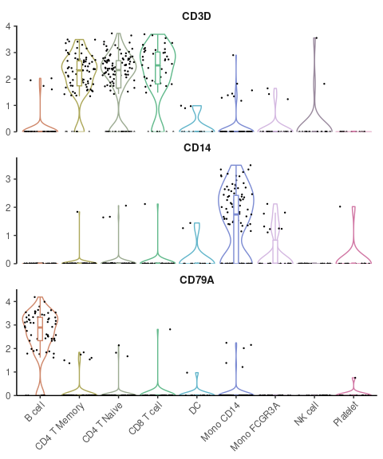
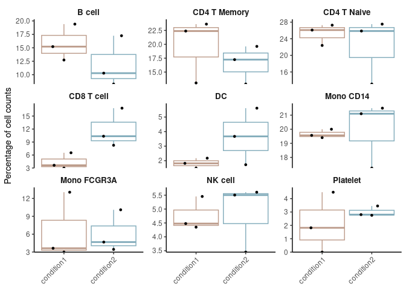

## New Features and Enhancements in v1.1.0

### New Visualization Functions

#### Enhanced Dot Plots with `DotPlot2`

A new function `DotPlot2` has been introduced, combining dot size
(percent of expressing cells) with color intensity (average expression)
for more informative visualizations:

``` r
library(Seurat)
library(SeuratExtend)

# With grouped features
grouped_features <- list(
  "B_cell_markers" = c("MS4A1", "CD79A"),
  "T_cell_markers" = c("CD3D", "CD8A", "IL7R"),
  "Myeloid_markers" = c("CD14", "FCGR3A", "S100A8")
)
DotPlot2(pbmc, features = grouped_features)
```

<!-- -->

#### New Volcano Plots

The new `VolcanoPlot` function provides statistical visualization of
differential expression:

``` r
VolcanoPlot(pbmc, 
            ident.1 = "B cell",
            ident.2 = "CD8 T cell")
```

<!-- -->

#### UMAP Arrow Annotations

Added `theme_umap_arrows` for simplified axis indicators on dimension
reduction plots:

``` r
DimPlot2(pbmc, theme = NoAxes()) + theme_umap_arrows()
```

<!-- -->

### Enhanced Existing Functions

#### VlnPlot2 Enhancements

Added support for mean and median lines in violin plots:

``` r
VlnPlot2(pbmc, 
         features = c("CCR7", "IL7R", "TCF7"),
         cols = "light",
         show.mean = TRUE,      # Show mean and median lines
         mean_colors = c("red", "blue"),  # Colors for mean and median
         ncol = 1)
```

<!-- -->

### New WaterfallPlot Style: “segment”

Added a new visualization style “segment” to WaterfallPlot, providing an
alternative way to display differences between conditions:

``` r
# Prepare data
pbmc <- GeneSetAnalysis(pbmc, genesets = hall50$human)
matr <- pbmc@misc$AUCell$genesets

# Create a plot using the new segment style
WaterfallPlot(
  matr,
  f = pbmc$cluster,
  ident.1 = "Mono CD14",
  ident.2 = "CD8 T cell",
  style = "segment",
  color_theme = "D"
)
```

<!-- -->

### Color Scheme Updates

#### New Default Color Schemes

Two major color scheme changes have been implemented in v1.1.0:

1.  For continuous variables: Changed from viridis “A” to RColorBrewer
    “Blues”
2.  For heatmaps: Updated from
    `c(low = muted("blue"), mid = "white", high = muted("red"))` to
    “BuRd”

Here are visual comparisons of the old and new defaults:

##### Continuous Variable Color Scheme

``` r
# Create a side-by-side comparison for continuous variables
library(cowplot)
library(ggpubr)

# Old default (viridis "A")
p1 <- DimPlot2(pbmc, 
               features = "CD3D", 
               cols = "A",  # Old default
               theme = theme_umap_arrows()) 

# New default (Blues)
p2 <- DimPlot2(pbmc, 
               features = "CD3D", 
               theme = theme_umap_arrows()) 

plot_grid(
  annotate_figure(p1, top = text_grob("Old Default (viridis 'A')", size = 14)), 
  annotate_figure(p2, top = text_grob("New Default ('Blues')", size = 14)),
  ncol = 2)
```

<!-- -->

##### Heatmap Color Scheme

``` r
# Calculate data for heatmap
genes <- VariableFeatures(pbmc)
toplot <- CalcStats(pbmc, features = genes, method = "zscore", order = "p", n = 4)

# Create side-by-side heatmap comparison
p1 <- Heatmap(toplot, 
              color_scheme = c(low = scales::muted("blue"), 
                             mid = "white", 
                             high = scales::muted("red")), # Old default
              lab_fill = "zscore") +
      ggtitle("Old Default (blue-white-red)")

p2 <- Heatmap(toplot, 
              lab_fill = "zscore") +  # New default (BuRd) is automatically applied
      ggtitle("New Default ('BuRd')")

plot_grid(p1, p2, ncol = 2)
```

<!-- -->

To revert to previous color schemes: - For continuous variables: Use
`cols = "A"` - For heatmaps: Use
`color_scheme = c(low = scales::muted("blue"), mid = "white", high = scales::muted("red"))`

#### New RColorBrewer Integration

Added support for RColorBrewer sequential and diverging palettes:

- Sequential: “Blues”, “BuGn”, “BuPu”, “GnBu”, etc.
- Diverging: “BrBG”, “PiYG”, “PRGn”, “PuOr”, etc.
- Custom diverging: “GnYlRd”, “BuYlRd”, “GyRd”, “BuRd”, “PuOr”

### Feature Enhancements

- **VlnPlot2**: Now supports both `stats.method` and `stat.method` as
  parameter inputs
  ([\#10](https://github.com/huayc09/SeuratExtend/issues/10))
- **ClusterDistrBar**: Added `reverse_order` parameter to adjust the
  stacking order
  ([\#11](https://github.com/huayc09/SeuratExtend/issues/11))
- **WaterfallPlot**: Set upper limit for -log10(p) values to avoid NA
  issues ([\#14](https://github.com/huayc09/SeuratExtend/issues/14))
- **DimPlot2**: Improved automatic point size adjustment and fixed point
  display issues in raster mode
  ([\#17](https://github.com/huayc09/SeuratExtend/issues/17))
- **show_col2**: Function is now exported, allowing users to knit
  Visualization.Rmd without issues
  ([\#8](https://github.com/huayc09/SeuratExtend/issues/8))

### Bug Fixes

- **VlnPlot2**: Now explicitly uses `dplyr::select` internally to avoid
  conflicts with other packages’ select functions
  ([\#5](https://github.com/huayc09/SeuratExtend/issues/5),
  [\#10](https://github.com/huayc09/SeuratExtend/issues/10))
- **ClusterDistrBar**: Fixed display issues when factor levels are
  numeric (e.g., seurat_clusters)

### Documentation Updates

#### Conda Environment Setup

The `create_condaenv_seuratextend()` function documentation has been
updated with important compatibility information:

- Currently supported and tested on:
  - Windows
  - Intel-based macOS (not Apple Silicon/M1/M2)
  - Linux (Ubuntu 20.04)

**Note for Apple Silicon Users**: The function is not currently
compatible with Apple Silicon/M1/M2 devices
([\#7](https://github.com/huayc09/SeuratExtend/issues/7)). Users with
Apple Silicon devices who are interested in contributing to the
development of M1/M2 support are welcome to reach out via GitHub Issues.

#### Windows-Specific File Download

When downloading loom files (which are HDF5-based binary files) on
Windows, it’s essential to use `mode = "wb"` in the download.file()
function:

``` r
# Example for Windows users
download.file("https://example.com/file.loom", "file.loom", mode = "wb")
```

This prevents Windows from modifying line endings in the binary file,
which would corrupt the HDF5 format. Mac and Linux users don’t require
this parameter, but including it is harmless.

``` r
sessionInfo()
```

    ## R version 4.4.0 (2024-04-24)
    ## Platform: x86_64-pc-linux-gnu
    ## Running under: Ubuntu 20.04.6 LTS
    ## 
    ## Matrix products: default
    ## BLAS:   /usr/lib/x86_64-linux-gnu/blas/libblas.so.3.9.0 
    ## LAPACK: /usr/lib/x86_64-linux-gnu/lapack/liblapack.so.3.9.0
    ## 
    ## locale:
    ##  [1] LC_CTYPE=en_US.UTF-8       LC_NUMERIC=C               LC_TIME=de_BE.UTF-8        LC_COLLATE=en_US.UTF-8    
    ##  [5] LC_MONETARY=de_BE.UTF-8    LC_MESSAGES=en_US.UTF-8    LC_PAPER=de_BE.UTF-8       LC_NAME=C                 
    ##  [9] LC_ADDRESS=C               LC_TELEPHONE=C             LC_MEASUREMENT=de_BE.UTF-8 LC_IDENTIFICATION=C       
    ## 
    ## time zone: Europe/Brussels
    ## tzcode source: system (glibc)
    ## 
    ## attached base packages:
    ##  [1] grid      stats4    tools     stats     graphics  grDevices utils     datasets  methods   base     
    ## 
    ## other attached packages:
    ##  [1] ggrepel_0.9.5               tidyr_1.3.1                 rlist_0.4.6.2              
    ##  [4] DelayedMatrixStats_1.26.0   DelayedArray_0.30.1         SparseArray_1.4.8          
    ##  [7] S4Arrays_1.4.1              abind_1.4-5                 ggpubr_0.6.0               
    ## [10] mosaic_1.9.1                mosaicData_0.20.4           ggformula_0.12.0           
    ## [13] Matrix_1.7-0                lattice_0.22-6              slingshot_2.12.0           
    ## [16] TrajectoryUtils_1.12.0      SingleCellExperiment_1.26.0 SummarizedExperiment_1.34.0
    ## [19] Biobase_2.64.0              GenomicRanges_1.56.1        GenomeInfoDb_1.40.1        
    ## [22] IRanges_2.38.1              S4Vectors_0.42.1            BiocGenerics_0.50.0        
    ## [25] MatrixGenerics_1.16.0       matrixStats_1.3.0           princurve_2.1.6            
    ## [28] rlang_1.1.4                 scales_1.3.0                dplyr_1.1.4                
    ## [31] mgcv_1.9-1                  nlme_3.1-165                reshape2_1.4.4             
    ## [34] viridis_0.6.5               viridisLite_0.4.2           cowplot_1.1.3              
    ## [37] RColorBrewer_1.1-3          ggplot2_3.5.1               reticulate_1.38.0          
    ## [40] glue_1.7.0                  hdf5r_1.3.11                SeuratExtend_1.0.9         
    ## [43] SeuratExtendData_0.2.1      Seurat_5.1.0                SeuratObject_5.0.2         
    ## [46] sp_2.1-4                   
    ## 
    ## loaded via a namespace (and not attached):
    ##   [1] RcppAnnoy_0.0.22         splines_4.4.0            later_1.3.2              tibble_3.2.1            
    ##   [5] polyclip_1.10-6          fastDummies_1.7.3        lifecycle_1.0.4          rstatix_0.7.2           
    ##   [9] globals_0.16.3           MASS_7.3-61              backports_1.5.0          magrittr_2.0.3          
    ##  [13] plotly_4.10.4            rmarkdown_2.27           yaml_2.3.9               httpuv_1.6.15           
    ##  [17] sctransform_0.4.1        spam_2.10-0              spatstat.sparse_3.1-0    pbapply_1.7-2           
    ##  [21] pkgload_1.4.0            zlibbioc_1.50.0          Rtsne_0.17               purrr_1.0.2             
    ##  [25] rappdirs_0.3.3           labelled_2.13.0          GenomeInfoDbData_1.2.12  irlba_2.3.5.1           
    ##  [29] listenv_0.9.1            spatstat.utils_3.0-5     goftest_1.2-3            RSpectra_0.16-1         
    ##  [33] spatstat.random_3.2-3    fitdistrplus_1.2-1       parallelly_1.37.1        pkgdown_2.1.0           
    ##  [37] leiden_0.4.3.1           codetools_0.2-20         tidyselect_1.2.1         UCSC.utils_1.0.0        
    ##  [41] farver_2.1.2             spatstat.explore_3.2-7   jsonlite_1.8.8           progressr_0.14.0        
    ##  [45] ggridges_0.5.6           survival_3.7-0           ica_1.0-3                Rcpp_1.0.13             
    ##  [49] gridExtra_2.3            xfun_0.45                usethis_2.2.3            withr_3.0.0             
    ##  [53] fastmap_1.2.0            fansi_1.0.6              digest_0.6.36            R6_2.5.1                
    ##  [57] mime_0.12                colorspace_2.1-0         scattermore_1.2          tensor_1.5              
    ##  [61] spatstat.data_3.1-2      utf8_1.2.4               generics_0.1.3           data.table_1.15.4       
    ##  [65] httr_1.4.7               htmlwidgets_1.6.4        uwot_0.2.2               pkgconfig_2.0.3         
    ##  [69] gtable_0.3.5             rsconnect_1.3.1          lmtest_0.9-40            XVector_0.44.0          
    ##  [73] htmltools_0.5.8.1        carData_3.0-5            dotCall64_1.1-1          png_0.1-8               
    ##  [77] knitr_1.48               rstudioapi_0.16.0        zoo_1.8-12               stringr_1.5.1           
    ##  [81] KernSmooth_2.23-24       parallel_4.4.0           miniUI_0.1.1.1           pillar_1.9.0            
    ##  [85] vctrs_0.6.5              RANN_2.6.1               promises_1.3.0           car_3.1-2               
    ##  [89] xtable_1.8-4             cluster_2.1.6            evaluate_0.24.0          cli_3.6.3               
    ##  [93] compiler_4.4.0           crayon_1.5.3             ggsignif_0.6.4           future.apply_1.11.2     
    ##  [97] labeling_0.4.3           forcats_1.0.0            plyr_1.8.9               fs_1.6.4                
    ## [101] stringi_1.8.4            deldir_2.0-4             munsell_0.5.1            lazyeval_0.2.2          
    ## [105] spatstat.geom_3.2-9      mosaicCore_0.9.4.0       RcppHNSW_0.6.0           hms_1.1.3               
    ## [109] patchwork_1.2.0          sparseMatrixStats_1.16.0 bit64_4.0.5              future_1.33.2           
    ## [113] shiny_1.8.1.1            haven_2.5.4              highr_0.11               ROCR_1.0-11             
    ## [117] broom_1.0.6              igraph_2.0.3             bit_4.0.5
