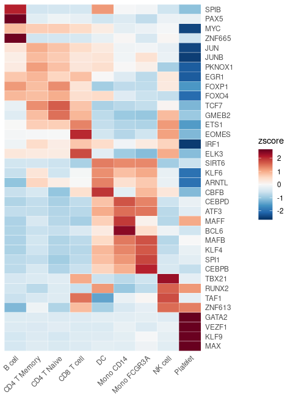
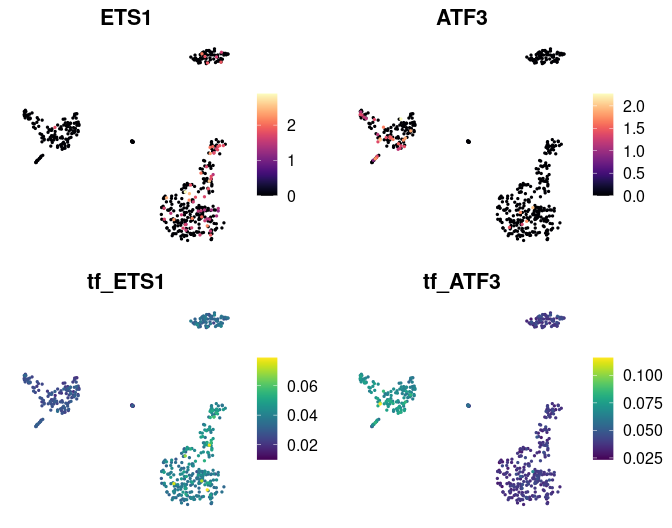
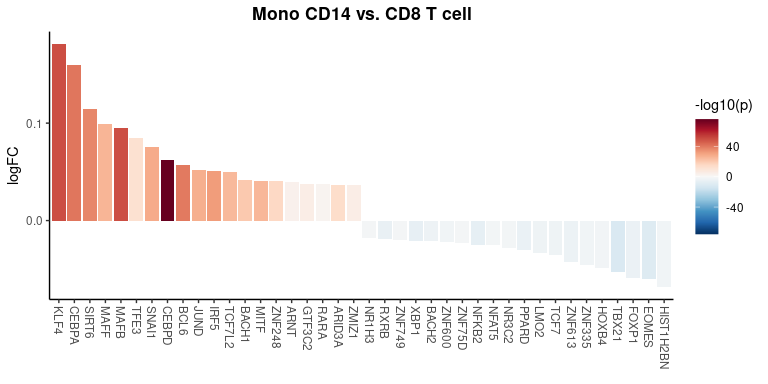

## Table of Contents

1.  [Importing SCENIC Loom Files into
    Seurat](#importing-scenic-loom-files-into-seurat)
2.  [Visualizing SCENIC Results](#visualizing-scenic-results)

## Importing SCENIC Loom Files into Seurat

[SCENIC](https://www.nature.com/articles/nmeth.4463) (Single-Cell
Regulatory Network Inference and Clustering) is a computational method
that provides deep insights into the regulatory networks governing gene
expression in single cells. It is highly recommended to use the Nextflow
pipeline to run SCENIC, which can be found
[here](https://github.com/aertslab/SCENICprotocol/). This process
requires a loom file as input, which can be generated directly using the
`Seu2Loom()` function. Currently, the `SeuratExtend` package does not
integrate the `RunScenic` functionality directly (requiring the use of
Nextflow command line), but if there is user demand, this could be
considered for future updates. The workflow results in a file named
“pyscenic\_integrated-output.loom,” which includes a list of
transcription factors (TFs) and their regulated genes, as well as a
TF-cell matrix representing the AUCell values. The AUCell score
represents the enrichment score of all genes regulated by a TF,
indicating regulon activity. The `ImportPyscenicLoom()` function allows
for the import of SCENIC-generated loom files into Seurat objects,
facilitating further analysis and visualization within the Seurat
framework.

As an example, we use a pre-computed SCENIC loom file which can be
downloaded as follows:

    library(SeuratExtend)
    scenic_loom_path <- file.path(tempdir(), "pyscenic_integrated-output.loom")
    download.file("https://zenodo.org/records/10944066/files/pbmc3k_small_pyscenic_integrated-output.loom",
                  scenic_loom_path, mode = "wb")  # Use binary mode for Windows compatibility

    # Importing SCENIC Loom Files into Seurat
    pbmc <- ImportPyscenicLoom(scenic_loom_path, seu = pbmc)

If you prefer to import SCENIC results without specifying a Seurat
object:

    # Importing SCENIC results without an existing Seurat object
    scenic_output <- ImportPyscenicLoom(scenic_loom_path)

### Examining SCENIC Outputs

SCENIC results are stored in `seu@misc$SCENIC`, which includes
`seu@misc$SCENIC$Regulons`, a list where each element’s name is a TF
name and the value is a list of genes it regulates. Additionally,
`seu@misc$SCENIC$RegulonsAUC`, a TF-cell AUCell matrix, is also loaded
into the “TF” assay of the Seurat object, making the manipulation of TF
regulon activity as straightforward as handling gene expression data.

    # Viewing the outputs
    tf_auc <- pbmc@misc$SCENIC$RegulonsAUC
    head(tf_auc, 4:5)

    ##                         AHR     ARID3A ARNT     ARNTL       ATF1
    ## CTATAAGATCGTTT-1 0.01406902 0.03347861    0 0.1144568 0.01673053
    ## GTGATTCTGGTTCA-1 0.00000000 0.00000000    0 0.1730939 0.01719192
    ##  [ reached 'max' / getOption("max.print") -- omitted 2 rows ]

    tf_gene_list <- pbmc@misc$SCENIC$Regulons
    head(tf_gene_list, 5)

    ## $AHR
    ##  [1] "NFYC-AS1" "MYSM1"    "ZZZ3"     "FUBP1"    "WDR77"    "TMEM183A" "TGOLN2"   "SEC22C"   "ATXN7"    "RBPJ"    
    ## [11] "C5orf24"  "CREBRF"  
    ##  [ reached getOption("max.print") -- omitted 37 entries ]
    ## 
    ## $ARID3A
    ##  [1] "CDC7"      "IL6R"      "LAMC1"     "LINC01136" "CDC42EP3"  "HNMT"      "GPBAR1"    "OARD1"     "GNB2"     
    ## [10] "ATP6V1F"   "YWHAZ"     "XPA"      
    ##  [ reached getOption("max.print") -- omitted 12 entries ]
    ## 
    ## $ARNT
    ## [1] "EPHB3"   "SMIM14"  "GPR68"   "ANXA2"   "MORF4L1" "ZFP3"   
    ## 
    ## $ARNTL
    ## [1] "SLC4A10" "AP2M1"   "EMC2"    "PHF20L1" "SLC43A1" "CFL1"    "SPG21"   "CRB3"    "RPS28"  
    ## 
    ## $ATF1
    ##  [1] "CAMK2N1" "PAFAH2"  "BCAS2"   "S100A13" "ZNF281"  "LIN9"    "THUMPD2" "CALM2"   "ACVR1"   "NAB1"    "ZDBF2"  
    ## [12] "SNRK"   
    ##  [ reached getOption("max.print") -- omitted 67 entries ]

## Visualizing SCENIC Results

Once SCENIC data is integrated into a Seurat object, users can leverage
a variety of visualization tools provided in the **Enhanced
Visualization** section to explore and interpret these regulatory
networks. Both the extracted `tf_auc` matrix or the Seurat object itself
can be used as inputs. Here are some practical examples:

### Identifying Top Activated TFs in Each Cluster

    tf_zscore <- CalcStats(tf_auc, f = pbmc$cluster, order = "p", n = 4, t = TRUE)
    Heatmap(tf_zscore, lab_fill = "zscore")

### Comparing TF Gene Expression Levels and Regulon Activity (AUCell)

Since we have imported SCENIC results into the “TF” assay, we can easily
access the corresponding AUCell values by prefixing “tf\_” to the TF
name:

    DimPlot2(
      pbmc,
      features = c("ETS1", "ATF3", "tf_ETS1", "tf_ATF3"),
      cols = list("tf_ETS1" = "D", "tf_ATF3" = "D"),
      theme = NoAxes()
    )

### Simplifying Regulon Activity Access by Setting Default Assay

If you find manually adding “tf\_” to each transcription factor
cumbersome, you can set the default assay to “TF”, which simplifies
operations involving regulon activity. For example, to create a
waterfall plot that compares the regulon activity between two cell
types, you can do the following:

    # Setting the default assay to "TF" for easier access to regulon activity
    DefaultAssay(pbmc) <- "TF"

    # Creating a waterfall plot to compare regulon activity between monocytes and CD8 T cells
    WaterfallPlot(
      pbmc,
      features = rownames(pbmc),  # Using all available TFs in the "TF" assay
      ident.1 = "Mono CD14",      # First group of cells
      ident.2 = "CD8 T cell",     # Second group of cells
      exp.transform = FALSE,      # Disable transformation of expression data
      top.n = 20                  # Display the top 20 most differentially active TFs
    )

These examples illustrate how to integrate and utilize SCENIC analysis
within the Seurat framework, providing a comprehensive approach to
understanding gene regulatory mechanisms at the single-cell level.

    sessionInfo()

    ## R version 4.4.0 (2024-04-24)
    ## Platform: x86_64-pc-linux-gnu
    ## Running under: Ubuntu 20.04.6 LTS
    ## 
    ## Matrix products: default
    ## BLAS:   /usr/lib/x86_64-linux-gnu/blas/libblas.so.3.9.0 
    ## LAPACK: /usr/lib/x86_64-linux-gnu/lapack/liblapack.so.3.9.0
    ## 
    ## locale:
    ##  [1] LC_CTYPE=en_US.UTF-8       LC_NUMERIC=C               LC_TIME=de_BE.UTF-8        LC_COLLATE=en_US.UTF-8    
    ##  [5] LC_MONETARY=de_BE.UTF-8    LC_MESSAGES=en_US.UTF-8    LC_PAPER=de_BE.UTF-8       LC_NAME=C                 
    ##  [9] LC_ADDRESS=C               LC_TELEPHONE=C             LC_MEASUREMENT=de_BE.UTF-8 LC_IDENTIFICATION=C       
    ## 
    ## time zone: Europe/Brussels
    ## tzcode source: system (glibc)
    ## 
    ## attached base packages:
    ##  [1] parallel  grid      tools     stats4    stats     graphics  grDevices utils     datasets  methods   base     
    ## 
    ## other attached packages:
    ##  [1] doMC_1.3.8             foreach_1.5.2          loomR_0.2.0            itertools_0.1-3       
    ##  [5] iterators_1.0.14       R6_2.5.1               hyc_0.1.5              ggbeeswarm_0.7.2      
    ##  [9] ggtext_0.1.2           magrittr_2.0.3         slingshot_2.12.0       TrajectoryUtils_1.12.0
    ##  [ reached getOption("max.print") -- omitted 47 entries ]
    ## 
    ## loaded via a namespace (and not attached):
    ##  [1] fs_1.6.4              spatstat.sparse_3.1-0 httr_1.4.7            sctransform_0.4.1     backports_1.5.0      
    ##  [6] utf8_1.2.4            lazyeval_0.2.2        uwot_0.2.2            withr_2.5.0           gridExtra_2.3        
    ## [11] progressr_0.14.0      cli_3.6.3            
    ##  [ reached getOption("max.print") -- omitted 112 entries ]
