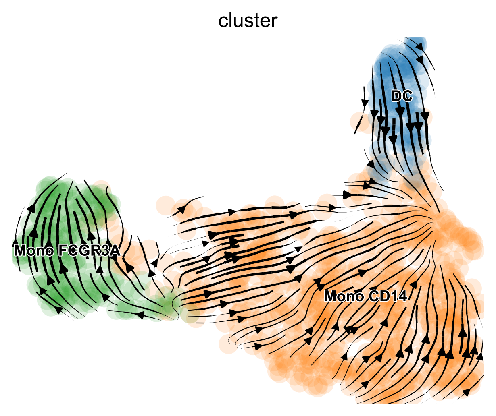
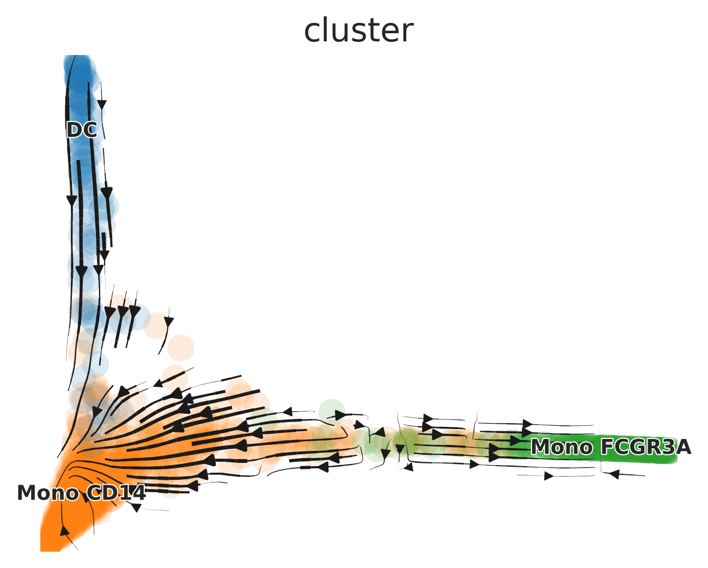
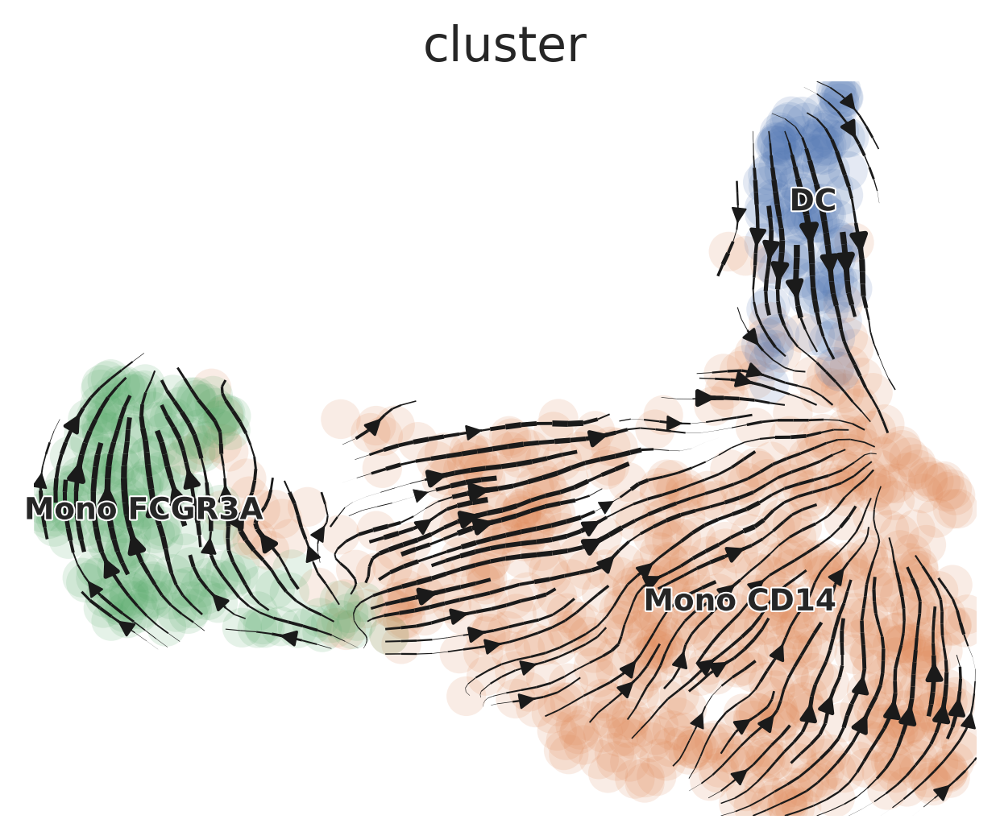

## Table of Contents

1. [scVelo Tutorial for Trajectory Analysis](#analyzing-single-cell-trajectories-with-scvelo)
2. [Palantir Tutorial for Trajectory and Pseudotime Analysis](#palantir-tutorial-for-trajectory-and-pseudotime-analysis)
3. [MAGIC for Denoising and Smoothing Gene Expression](#magic-for-denoising-and-smoothing-gene-expression)
4. [CellRank Tutorial for Trajectory Analysis](#cellrank-tutorial-for-trajectory-analysis)
5. [Gene Expression Dynamics Along Differentiation Trajectories](#gene-expression-dynamics-along-differentiation-trajectories)
6. [Slingshot Tutorial for Pseudotime Analysis](#slingshot-tutorial-for-pseudotime-analysis)
7. [Integration of Seurat with Python Tools](#integration-of-seurat-with-python-tools)

## Analyzing Single-Cell Trajectories with scVelo {#analyzing-single-cell-trajectories-with-scvelo}

`scVelo` is a widely used tool for trajectory analysis that leverages spliced and unspliced RNA information, as calculated by Velocyto, to predict the direction of cell differentiation. For more information, see [scVelo's documentation](https://scvelo.readthedocs.io/en/stable/). `SeuratExtend` includes a series of functions that allow you to easily run everything in R. In this tutorial, we use an example dataset (`pbmc10k_10X`) downloaded from the [10X Genomics website](https://www.10xgenomics.com/datasets), focusing on a small subset of myeloid cells for simplicity.

### Downloading Example Data

First, we need to download the example data, including a small Seurat object and a corresponding small loom file generated by Velocyto. These files are stored on Zenodo:

```{r, message=FALSE, warning=FALSE}
library(Seurat)
library(SeuratExtend)

# Download the example Seurat Object
mye_small <- readRDS(url("https://zenodo.org/records/10944066/files/pbmc10k_mye_small_velocyto.rds", "rb"))

# Download the example velocyto loom file
loom_path <- file.path(tempdir(), "pbmc10k_mye_small.loom")
download.file("https://zenodo.org/records/10944066/files/pbmc10k_mye_small.loom", 
              loom_path,
              mode = "wb")  # Use binary mode for Windows compatibility

```

**Note:** 

1. When downloading loom files (which are HDF5-based binary files) on Windows, it's essential to use `mode = "wb"` in the download.file() function. This prevents Windows from modifying line endings in the binary file, which would corrupt the HDF5 format. Mac and Linux users don't require this parameter, but including it is harmless. 
2. To save disk space, the data downloaded for this tutorial is stored in the temporary folder and will be automatically deleted after the R session is closed. If you wish to permanently retain the tutorial files, please manually change the storage location to your working directory.

### Preparing Data for scVelo

`scVelo` requires an `AnnData` object from Python's `Scanpy` library for its analyses. `SeuratExtend` makes this process seamless by integrating a Seurat object and a velocyto loom file into a new `AnnData` object, serving as a bridge between R and Python.

**Note**: If this is your first time running Python-related functions (`scVelo`, `Palantir`, etc.) in `SeuratExtend`, it will prompt you to install a conda environment named "seuratextend". This environment automatically installs all required Python packages. It is currently supported and tested on Windows, macOS (both Intel-based and Apple Silicon/M-series), and Linux (Ubuntu 20.04) systems.

**macOS-Specific Considerations**: 

* **Intel Macs**: When using R Markdown in RStudio with Python tools like scVelo, the R session may crash. To work around this issue, use regular .R script files instead of R Markdown files.

* **Apple Silicon (M1/M2/M3/M4)** *(new in v1.2.0)*: Testing on M4 chips has revealed memory management issues between R and Python. If any R objects are loaded in the session before calling Python functions (particularly operations like PCA on AnnData objects), the R session may crash.

  **Solution**: Start with a fresh R session and call `activate_python()` at the beginning of your workflow before loading any R objects:
  
  ```r
  # Run at the beginning of your session on macOS
  library(SeuratExtend)
  activate_python()
  
  # Then load your data and proceed with analysis
  seu <- readRDS("path/to/seurat_object.rds")
  ```
  
  After this initialization, all scVelo-related functions should work properly.

More details on managing the `Anndata` object and Python dependencies are provided here: [Integration of Seurat with Python Tools](#integration-of-seurat-with-python-tools).

```{r, message=FALSE, warning=FALSE}

# Set up the path for saving the AnnData object in the HDF5 (h5ad) format
if (.Platform$OS.type == "windows") {
    adata_path <- normalizePath(file.path(tempdir(), "mye_small.h5ad"), winslash = "/")
} else {
    adata_path <- file.path(tempdir(), "mye_small.h5ad")
}

# Integrate Seurat Object and velocyto loom information into one AnnData object.
# This object will be stored at the specified path.
scVelo.SeuratToAnndata(
  mye_small, # The downloaded example Seurat object
  filename = adata_path, # Path where the AnnData object will be saved
  velocyto.loompath = loom_path, # Path to the loom file
  prefix = "sample1_", # Prefix for cell IDs in the Seurat object
  postfix = "-1" # Postfix for cell IDs in the Seurat object
)
```

### Generating scVelo Plots

Now, you're ready to generate scVelo plots. The default dimension reduction method is typically UMAP, colored by cluster.

```{r, message=FALSE, warning=FALSE, eval=FALSE}
scVelo.Plot(color = "cluster", save = "umap1.png", figsize = c(5,4))
```
{width=700px}

`SeuratExtend` supports most commonly used parameters for scVelo plots. You can customize the plot style, dimensionality reduction method, color palette, displayed clusters, and more. For more detailed information on customization and advanced features, refer to the function documentation or the [official scVelo documentation](https://scvelo.readthedocs.io/en/stable/scvelo.pl.velocity_embedding_stream.html?highlight=stream).

```{r, message=FALSE, warning=FALSE, eval=FALSE}
scVelo.Plot(
  style = "scatter",
  color = "cluster",
  groups = c("DC", "Mono CD14"),
  palette = color_pro(3, "light"),
  xlim = c(0, 5), ylim = c(0, 10),
  save = "umap2_specified_area.png",
  figsize = c(5,4)
)
```

{width=700px}

## Palantir Tutorial for Trajectory and Pseudotime Analysis {#palantir-tutorial-for-trajectory-and-pseudotime-analysis}

### Introduction

[Palantir](https://github.com/dpeerlab/Palantir) is a Python tool designed for aligning cells along differentiation trajectories, determining cell fate, and calculating pseudotime. `SeuratExtend` enables these functionalities within R, storing the results in a Seurat object for streamlined analysis.

### Downloading Example Data

We will use a subset of myeloid cells from the `pbmc10k_10X` dataset available on the [10X Genomics website](https://www.10xgenomics.com/datasets). If you have already loaded the Seurat object, you can skip this step.

```{r setup, message=FALSE, warning=FALSE, eval=FALSE}
library(Seurat)
library(SeuratExtend)

# Download the example Seurat Object
mye_small <- readRDS(url("https://zenodo.org/records/10944066/files/pbmc10k_mye_small_velocyto.rds", "rb"))
```

### Running Diffusion Map

Palantir aligns cells along differentiation trajectories by first calculating the diffusion map. This is done in Python via `reticulate`, based on pre-calculated dimension reductions in Seurat (e.g., PCA, harmony). The diffusion map (`dm`) and multiscale space (`ms`) embeddings are then added back to the Seurat object.

```{r run-diffusion-map, warning=FALSE, message=FALSE}
mye_small <- Palantir.RunDM(mye_small)

# View the new dimensional reductions "dm" and "ms" in the Seurat Object:
mye_small@reductions

# View the first 2 ms dimensions:
DimPlot2(mye_small, reduction = "ms", group.by = "cluster", label = TRUE)
```

#### UMAP Based on "ms"

In this simple example, the multiscale space ('ms') reduction has only 2 dimensions, which makes additional dimension reduction unnecessary for visualization. However, in more complex datasets, 'ms' reductions often yield more dimensions, necessitating further reduction for effective visualization.

For such cases, one can create a new differentiation trajectory space by running UMAP based on the "ms" reduction. This approach allows for a more comprehensible display in a two-dimensional plot, especially when dealing with a higher-dimensional 'ms' space. The following code, although not run in this tutorial, illustrates how to implement UMAP on 'ms' with hypothetical ten dimensions and visualize the result:

```{r umap-ms, eval=FALSE}
# Assuming 'ms' has 10 dimensions:
# mye_small <- RunUMAP(mye_small, reduction = "ms", dims = 1:10)
# DimPlot2(mye_small, group.by = "cluster", label = TRUE, reduction = "umap")
```

#### (Optional) Incorporating Newly Calculated Dimension Reductions into AnnData

If you've previously followed the scVelo tutorial, an `adata` object should already exist in your Python environment. If you wish to incorporate the dimension reductions calculated by Palantir (such as 'ms') into this `adata` and use it for visualization, you can do so with the following commands:

```{r add-dm, eval=FALSE}
# Add the 'ms' dimension reduction to the existing AnnData object
adata.AddDR(mye_small, dr = "ms", scv.graph = TRUE)

# Generate a plot using the newly added 'ms' dimension reduction
scVelo.Plot(basis = "ms", color = "cluster", save = "umap3_ms.png", figsize = c(5,4))
```
{width=700px}

### Determining Cell Fates and Calculating Pseudotime

To predict cell fates and calculate pseudotime, You can manually select "start cells" using the `CellSelector` function.

```{r select-start-cells, eval=FALSE}
p <- DimPlot(mye_small, reduction = "ms", group.by = "cluster")
cells <- CellSelector(p)
```

Then, calculate pseudotime. Results are stored in `SeuratObj@misc$Palantir$Pseudotime`.

```{r calculate-pseudotime}
mye_small <- Palantir.Pseudotime(mye_small, start_cell = "sample1_GAGAGGTAGCAGTACG-1")
ps <- mye_small@misc$Palantir$Pseudotime
head(ps)

# Visualize cell fate on UMAP
colnames(ps)[3:4] <- c("fate1", "fate2")
mye_small@meta.data[,colnames(ps)] <- ps
DimPlot2(mye_small, features = colnames(ps), reduction = "ms", 
         cols = list(continuous = "A", Entropy = "D"), theme = NoAxes())
```

## MAGIC for Denoising and Smoothing Gene Expression {#magic-for-denoising-and-smoothing-gene-expression}

Another related tool, [MAGIC (Markov Affinity-based Graph Imputation of Cells)](https://github.com/KrishnaswamyLab/MAGIC), denoises and smooths gene expression in scRNA-seq data. Here's how to run it and observe the differences in gene expression:

```{r run-magic}
mye_small <- Palantir.Magic(mye_small)

# Creates a new assay "magic" in the Seurat object
mye_small <- NormalizeData(mye_small)
DimPlot2(mye_small, features = c("CD14", "magic_CD14", "FLT3", "magic_FLT3"), 
         cols = "A", theme = NoAxes())
```

## CellRank Tutorial for Trajectory Analysis {#cellrank-tutorial-for-trajectory-analysis}

### Introduction

While [scVelo](https://scvelo.readthedocs.io/) is a powerful tool for predicting differentiation potential, it may sometimes produce arrows pointing opposite the known differentiation trajectory, which is inconsistent with biological knowledge. For more details and examples, visit the [CellRank documentation](https://cellrank.readthedocs.io/en/latest/notebooks/tutorials/kernels/300_pseudotime.html). In such cases, CellRank offers an alternative by utilizing pre-calculated pseudotime to create trajectory plots. **However, it's crucial to ensure that the pseudotime calculation aligns with validated biological knowledge to avoid misuse of the algorithm.**

This tutorial assumes you have already completed the tutorials for velocyto and Palantir. We will use CellRank to build trajectory plots, continuing from where those tutorials left off.

### Adding Pseudotime to the `adata` Object

First, we add the Pseudotime calculated by Palantir to the `adata` object. This information is saved in the `meta.data` of the Seurat Object. We transfer the relevant column from Seurat to `adata`:

```{r add-pseudotime}
adata.AddMetadata(mye_small, col = colnames(ps))
```

### Running CellRank Kernel

Next, we run the CellRank Kernel to compute the trajectory plots using the previously added Pseudotime information.

```{r cellrank-kernel, eval=FALSE}
Cellrank.Compute(time_key = "Pseudotime")
```

### Generating the Plots

The process for generating plots with CellRank is similar to that used with `scVelo.Plot`:

```{r cellrank-plot, eval=FALSE}
# Generate a plot using the 'ms' dimension reduction
Cellrank.Plot(color = "cluster", basis = "ms", save = "umap3_ms_cellrank.png")
```

{width=700px}

## Gene Expression Dynamics Along Differentiation Trajectories] {#gene-expression-dynamics-along-differentiation-trajectories}

Visualizing smoothed gene expression along a trajectory offers insightful perspectives on cellular differentiation and development. `SeuratExtend` introduces two methods for such visualization, leveraging the pseudotime calculated by tools like `Palantir`.

### Gene Trend Curves with Palantir

Assuming you have already executed `Palantir.Pseudotime` as shown in a previous tutorial, you can create gene trend curves as follows:

```{r gene-trend-curve-initial, message=FALSE, warning=FALSE, fig.width=7, fig.height=3}
library(SeuratExtend)

# Basic gene trend curve visualization
GeneTrendCurve.Palantir(mye_small, features = c("CD14", "FCGR3A"))
```

#### Customizing Gene Trend Curves

You can customize the plots, for instance, by adding points, removing confidence intervals, and renaming cell fates:

```{r gene-trend-curve-custom, fig.width=5.5, fig.height=3}
# Accessing pseudotime and adjusting fate names
ps <- mye_small@misc$Palantir$Pseudotime
head(ps)
colnames(ps)[3:4] <- c("fate1", "fate2")

# Customized gene trend curve visualization
GeneTrendCurve.Palantir(
  mye_small, 
  pseudotime.data = ps, 
  features = c("CD14", "FCGR3A"),
  point = TRUE, 
  se = FALSE
)
```

### Gene Trend Heatmaps with Palantir

Another powerful method for visualizing gene expression dynamics is through heatmaps, which can illustrate how gene expression changes across pseudotime and for specific lineages:

```{r gene-trend-heatmap, message=FALSE, warning=FALSE, fig.width=6, fig.height=3}
# Creating a gene trend heatmap
GeneTrendHeatmap.Palantir(
  mye_small, 
  features = c("CD14", VariableFeatures(mye_small)[1:10]), 
  pseudotime.data = ps, 
  magic = FALSE, 
  lineage = "fate1"
)
```

## Slingshot Tutorial for Pseudotime Analysis {#slingshot-tutorial-for-pseudotime-analysis}

Apart from Palantir, `Slingshot` is another valuable tool for calculating pseudotime, particularly useful for mapping cellular trajectories in single-cell RNA sequencing data.

### Running Slingshot

To calculate pseudotime using Slingshot, we start by integrating it with our Seurat object:

```{r run-slingshot, message=FALSE, warning=FALSE}
library(SeuratExtend)

mye_small <- RunSlingshot(mye_small, group.by = "cluster", start.clus = "Mono CD14")
```

### Accessing Slingshot Output

The Slingshot output is stored within the Seurat object. Let's extract the pseudotime values and visualize them on the UMAP:

```{r access-slingshot-output, fig.width=7, fig.height=3}
sling <- mye_small@misc$slingshot$PCA$SlingPseudotime
head(sling)
mye_small@meta.data[,colnames(sling)] <- as.data.frame(sling)

DimPlot2(mye_small, features = colnames(sling), cols = "C", theme = NoAxes())
```

### Gene Trend Curves for Slingshot Pseudotime

Similar to Palantir, Slingshot pseudotime allows for the creation of gene trend curves, illustrating the dynamics of gene expression along the computed trajectories:

```{r gene-trend-curve-slingshot, fig.width=6.5, fig.height=3}
GeneTrendCurve.Slingshot(mye_small, features = c("CD14", "FCGR3A"))
```

### Visualizing Gene Trends with Heatmaps

Additionally, Slingshot pseudotime can be used to generate heatmaps, showcasing the progression of gene expression across different lineages:

```{r gene-trend-heatmap-slingshot, fig.width=6, fig.height=3}
GeneTrendHeatmap.Slingshot(
  mye_small, 
  features = c("CD14", VariableFeatures(mye_small)[1:10]), 
  lineage = "slingPseudotime_2"
)
```

## Integration of Seurat with Python Tools {#integration-of-seurat-with-python-tools}

### Introduction

`SeuratExtend` incorporates numerous functions that utilize Python packages such as `Scanpy`, `scVelo`, `Palantir`, and `CellRank`. This integration facilitates a seamless workflow between `Seurat` objects and `AnnData` formats, crucial for leveraging the comprehensive analytical capabilities of both R and Python ecosystems.

To understand the mechanisms behind these functions, it is important to grasp the fundamentals of how `Seurat` and `AnnData` communicate. Initially, `loom` files serve as the intermediary; these h5 format files are widely used for storing scRNA-seq data and are compatible with both R and Python. Tools such as `velocyto` and `SCENIC` utilize loom files, which can store gene expression and metadata but have limitations, such as the inability to store dimensional reduction and neighborhood graph information.

In `SeuratExtend`, the conversion from a `Seurat` object to an `AnnData` object does not occur directly. Instead, `loom` files act as a bridge—first converting `Seurat` to `loom` and then from `loom` to `AnnData.` The loss of dimensional reduction information during this process is compensated by other related functions within `SeuratExtend`.

### Creating a Conda Environment with All Required Python Packages

If it is your first time running functions related to `scVelo`, `Palantir`, or `CellRank`, you will be automatically prompted to install a Conda environment named "seuratextend". This environment includes all the Python packages required by `SeuratExtend` and is managed through `reticulate`.

**Note:** Before creating the conda environment, ensure that Git is installed on your system, as it's required for installing certain Python packages:

- **Windows**: Download and install from [Git for Windows](https://gitforwindows.org/)
- **Mac**: Install via Homebrew (`brew install git`) or Xcode Command Line Tools (`xcode-select --install`)
- **Linux**: Install using your package manager:
  * Ubuntu/Debian: `sudo apt-get install git`
  * Fedora: `sudo dnf install git`
  * CentOS/RHEL: `sudo yum install git`

If you prefer to initiate the conda environment installation step manually, you can easily do so by running:

```{r create-conda-env, eval=FALSE}
create_condaenv_seuratextend()
```

This function automatically detects your operating system and sets up the environment accordingly. It is currently supported and tested on Windows, macOS (both Intel-based and Apple Silicon/M-series), and Linux (Ubuntu 20.04) systems.

**Important for macOS Users**: 

* **Intel Macs**: Using R Markdown in RStudio may cause crashes when calling Python functions. If you encounter this issue, switch to using regular .R script files.

* **Apple Silicon (M1/M2/M3/M4)** *(new in v1.2.0)*: Testing on M4 chips has shown that memory management issues between R and Python can cause crashes, particularly when performing operations like PCA on AnnData objects after loading R objects. To prevent this:

  ```r
  # Run this at the START of your session on macOS (before loading any objects)
  library(SeuratExtend)
  activate_python()
  
  # Only then load your data and proceed with analysis
  seu <- readRDS("path/to/seurat_object.rds")
  ```

### Integrating Seurat with AnnData

In this section, we demonstrate the utility of functions designed to bridge `Seurat` objects with Python's `AnnData` structures, using a small `pbmc` Seurat object as an example. The process covers conversion to a `loom` file, importing into `AnnData`, and appending additional metadata and dimension reduction data.

#### Converting Seurat Object to Loom

First, we convert a `Seurat` object to a `loom` file which can then be used to create an `AnnData` object:

```{r convert-seurat-to-loom}
# Convert Seurat object to loom file and save it locally
pbmc_loom_path <- file.path(tempdir(), "pbmc3k_small.loom")
Seu2Loom(pbmc, filename = pbmc_loom_path, add.normdata = TRUE)
```

#### Importing Loom File into AnnData

Next, we import the `loom` file into an `AnnData` object, which is handled by Python:

```{r import-loom-to-anndata}
# Load the loom file into an AnnData object
adata.LoadLoom(loompath = pbmc_loom_path)
```

#### Viewing AnnData Object

To view the newly created `AnnData` object, we use `reticulate` to execute Python code:

```{r view-anndata}
# Print the AnnData object details
py_run_string("print(adata)")
```

#### Adding Dimension Reduction Data

`AnnData` objects can store more than just gene expression and metadata; here we add dimension reduction data from `Seurat`:

```{r add-dimension-reduction}
# Add dimension reduction data from Seurat to AnnData
adata.AddDR(pbmc)
# Print the updated AnnData object
py_run_string("print(adata)")
```

#### Direct Conversion from Seurat to AnnData

For a streamlined conversion that includes the steps of `Seu2Loom()`, `adata.LoadLoom()` and `adata.AddDR()`, you can use a single function:

```{r direct-seurat-to-anndata}
# Directly convert Seurat object to AnnData object
Seu2Adata(pbmc)
```

#### Updating AnnData with New Metadata

If new metadata columns are added to the `Seurat` object, they can also be incorporated into the `AnnData` object:

```{r update-anndata-metadata}
# Add new metadata column to AnnData
pbmc$cluster2 <- pbmc$cluster
adata.AddMetadata(pbmc, col = "cluster2")
# Print the updated AnnData object
py_run_string("print(adata)")
```

#### Saving and Loading AnnData

You can save the `AnnData` object to a local file for future use:

```{r save-anndata}
# Save the AnnData object to a local file
pbmc_adata_path <- file.path(tempdir(), "pbmc3k_small.h5ad")
adata.Save(pbmc_adata_path)
```

And load it back when needed:

```{r load-anndata}
# Load an existing AnnData object from file
adata.Load(pbmc_adata_path)
```

If you have completed the scVelo tutorial and saved the results, you can load the `AnnData` object and directly generate plots:

```{r visualize-scvelo, eval=FALSE}
# Load the scVelo tutorial results and generate a plot
adata.Load(adata_path)
scVelo.Plot(color = "cluster", figsize = c(5,4), save = "umap4_load_adata.png")
```
{width=700px}

```{r}
sessionInfo()
```
