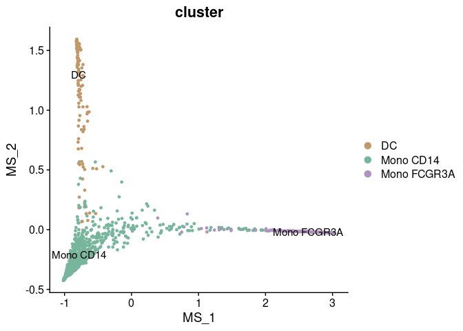
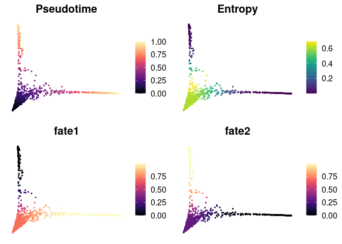
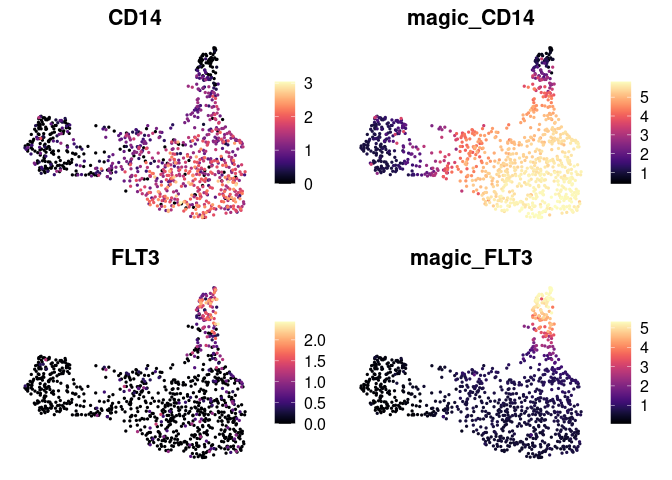
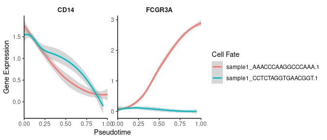
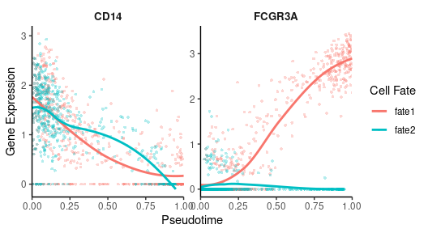
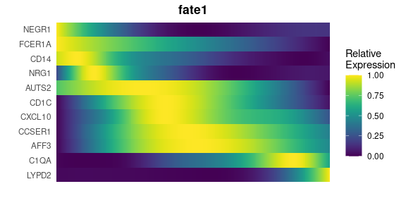
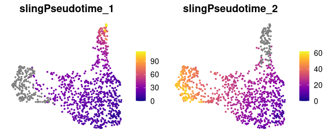
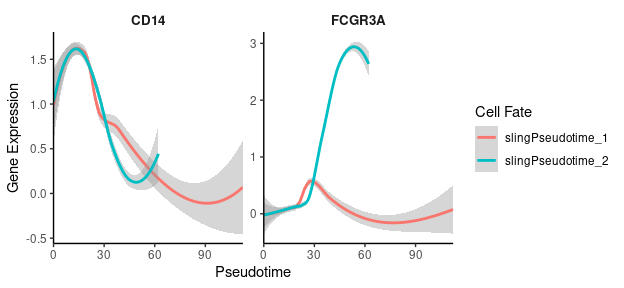
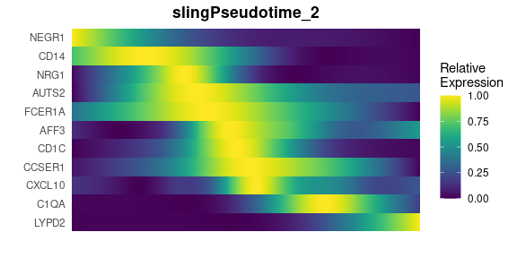

## Table of Contents

1.  [scVelo Tutorial for Trajectory
    Analysis](#analyzing-single-cell-trajectories-with-scvelo)
2.  [Palantir Tutorial for Trajectory and Pseudotime
    Analysis](#palantir-tutorial-for-trajectory-and-pseudotime-analysis)
3.  [MAGIC for Denoising and Smoothing Gene
    Expression](#magic-for-denoising-and-smoothing-gene-expression)
4.  [CellRank Tutorial for Trajectory
    Analysis](#cellrank-tutorial-for-trajectory-analysis)
5.  [Gene Expression Dynamics Along Differentiation
    Trajectories](#gene-expression-dynamics-along-differentiation-trajectories)
6.  [Slingshot Tutorial for Pseudotime
    Analysis](#slingshot-tutorial-for-pseudotime-analysis)
7.  [Integration of Seurat with Python
    Tools](#integration-of-seurat-with-python-tools)

## Analyzing Single-Cell Trajectories with scVelo

`scVelo` is a widely used tool for trajectory analysis that leverages
spliced and unspliced RNA information, as calculated by Velocyto, to
predict the direction of cell differentiation. For more information, see
[scVelo’s documentation](https://scvelo.readthedocs.io/en/stable/).
`SeuratExtend` includes a series of functions that allow you to easily
run everything in R. In this tutorial, we use an example dataset
(`pbmc10k_10X`) downloaded from the [10X Genomics
website](https://www.10xgenomics.com/datasets), focusing on a small
subset of myeloid cells for simplicity.

### Downloading Example Data

First, we need to download the example data, including a small Seurat
object and a corresponding small loom file generated by Velocyto. These
files are stored on Zenodo:

``` r
library(Seurat)
library(SeuratExtend)

# Download the example Seurat Object
mye_small <- readRDS(url("https://zenodo.org/records/10944066/files/pbmc10k_mye_small_velocyto.rds", "rb"))

# Download the example velocyto loom file
loom_path <- file.path(tempdir(), "pbmc10k_mye_small.loom")
download.file("https://zenodo.org/records/10944066/files/pbmc10k_mye_small.loom", 
              loom_path,
              mode = "wb")  # Use binary mode for Windows compatibility
```

**Note:**

1.  When downloading loom files (which are HDF5-based binary files) on
    Windows, it’s essential to use `mode = "wb"` in the download.file()
    function. This prevents Windows from modifying line endings in the
    binary file, which would corrupt the HDF5 format. Mac and Linux
    users don’t require this parameter, but including it is harmless.
2.  To save disk space, the data downloaded for this tutorial is stored
    in the temporary folder and will be automatically deleted after the
    R session is closed. If you wish to permanently retain the tutorial
    files, please manually change the storage location to your working
    directory.

### Preparing Data for scVelo

`scVelo` requires an `AnnData` object from Python’s `Scanpy` library for
its analyses. `SeuratExtend` makes this process seamless by integrating
a Seurat object and a velocyto loom file into a new `AnnData` object,
serving as a bridge between R and Python.

**Note**: If this is your first time running Python-related functions
(`scVelo`, `Palantir`, etc.) in `SeuratExtend`, it will prompt you to
install a conda environment named “seuratextend”. This environment
automatically installs all required Python packages. It is currently
supported and tested on Windows, Intel-based macOS (not Apple
Silicon/M1/M2), and Linux (Ubuntu 20.04) systems. Users with Apple
Silicon devices who are interested in contributing to the development of
M1/M2 support are welcome to reach out via GitHub Issues. More details
on managing the `Anndata` object and Python dependencies are provided
here: [Integration of Seurat with Python
Tools](#integration-of-seurat-with-python-tools).

``` r
# Set up the path for saving the AnnData object in the HDF5 (h5ad) format
if (.Platform$OS.type == "windows") {
    adata_path <- normalizePath(file.path(tempdir(), "mye_small.h5ad"), winslash = "/")
} else {
    adata_path <- file.path(tempdir(), "mye_small.h5ad")
}

# Integrate Seurat Object and velocyto loom information into one AnnData object.
# This object will be stored at the specified path.
scVelo.SeuratToAnndata(
  mye_small, # The downloaded example Seurat object
  filename = adata_path, # Path where the AnnData object will be saved
  velocyto.loompath = loom_path, # Path to the loom file
  prefix = "sample1_", # Prefix for cell IDs in the Seurat object
  postfix = "-1" # Postfix for cell IDs in the Seurat object
)
```

    ## Running scvelo 0.3.0 (python 3.10.12) on 2024-11-28 12:59.
    ## Filtered out 10891 genes that are detected 20 counts (shared).
    ## Normalized count data: X, spliced, unspliced.
    ## Extracted 2000 highly variable genes.
    ## Logarithmized X.
    ## computing neighbors
    ##     finished (0:00:04) --> added 
    ##     'distances' and 'connectivities', weighted adjacency matrices (adata.obsp)
    ## computing moments based on connectivities
    ##     finished (0:00:00) --> added 
    ##     'Ms' and 'Mu', moments of un/spliced abundances (adata.layers)
    ## computing velocities
    ##     finished (0:00:00) --> added 
    ##     'velocity', velocity vectors for each individual cell (adata.layers)
    ## computing velocity graph (using 1/28 cores)
    ## WARNING: Unable to create progress bar. Consider installing `tqdm` as `pip install tqdm` and `ipywidgets` as `pip install ipywidgets`,
    ## or disable the progress bar using `show_progress_bar=False`.
    ##     finished (0:00:01) --> added 
    ##     'velocity_graph', sparse matrix with cosine correlations (adata.uns)

### Generating scVelo Plots

Now, you’re ready to generate scVelo plots. The default dimension
reduction method is typically UMAP, colored by cluster.

``` r
scVelo.Plot(color = "cluster", save = "umap1.png", figsize = c(5,4))
```

 

`SeuratExtend` supports most commonly used parameters for scVelo plots. You can
customize the plot style, dimensionality reduction method, color
palette, displayed clusters, and more. For more detailed information on
customization and advanced features, refer to the function documentation
or the [official scVelo
documentation](https://scvelo.readthedocs.io/en/stable/scvelo.pl.velocity_embedding_stream.html?highlight=stream).

``` r
scVelo.Plot(
  style = "scatter",
  color = "cluster",
  groups = c("DC", "Mono CD14"),
  palette = color_pro(3, "light"),
  xlim = c(0, 5), ylim = c(0, 10),
  save = "umap2_specified_area.png",
  figsize = c(5,4)
)
```


## Palantir Tutorial for Trajectory and Pseudotime Analysis

### Introduction

[Palantir](https://github.com/dpeerlab/Palantir) is a Python tool
designed for aligning cells along differentiation trajectories,
determining cell fate, and calculating pseudotime. `SeuratExtend`
enables these functionalities within R, storing the results in a Seurat
object for streamlined analysis.

### Downloading Example Data

We will use a subset of myeloid cells from the `pbmc10k_10X` dataset
available on the [10X Genomics
website](https://www.10xgenomics.com/datasets). If you have already
loaded the Seurat object, you can skip this step.

``` r
library(Seurat)
library(SeuratExtend)

# Download the example Seurat Object
mye_small <- readRDS(url("https://zenodo.org/records/10944066/files/pbmc10k_mye_small_velocyto.rds", "rb"))
```

### Running Diffusion Map

Palantir aligns cells along differentiation trajectories by first
calculating the diffusion map. This is done in Python via `reticulate`,
based on pre-calculated dimension reductions in Seurat (e.g., PCA,
harmony). The diffusion map (`dm`) and multiscale space (`ms`)
embeddings are then added back to the Seurat object.

``` r
mye_small <- Palantir.RunDM(mye_small)
```

    ## Determing nearest neighbor graph...

``` r
# View the new dimensional reductions "dm" and "ms" in the Seurat Object:
mye_small@reductions
```

    ## $pca
    ## A dimensional reduction object with key PC_ 
    ##  Number of dimensions: 50 
    ##  Number of cells: 1000 
    ##  Projected dimensional reduction calculated:  FALSE 
    ##  Jackstraw run: FALSE 
    ##  Computed using assay: RNA 
    ## 
    ## $umap
    ## A dimensional reduction object with key UMAP_ 
    ##  Number of dimensions: 2 
    ##  Number of cells: 1000 
    ##  Projected dimensional reduction calculated:  FALSE 
    ##  Jackstraw run: FALSE 
    ##  Computed using assay: RNA 
    ## 
    ## $dm
    ## A dimensional reduction object with key DM_ 
    ##  Number of dimensions: 50 
    ##  Number of cells: 1000 
    ##  Projected dimensional reduction calculated:  FALSE 
    ##  Jackstraw run: FALSE 
    ##  Computed using assay: RNA 
    ## 
    ## $ms
    ## A dimensional reduction object with key MS_ 
    ##  Number of dimensions: 2 
    ##  Number of cells: 1000 
    ##  Projected dimensional reduction calculated:  FALSE 
    ##  Jackstraw run: FALSE 
    ##  Computed using assay: RNA

``` r
# View the first 2 ms dimensions:
DimPlot2(mye_small, reduction = "ms", group.by = "cluster", label = TRUE)
```

<!-- -->

#### UMAP Based on “ms”

In this simple example, the multiscale space (‘ms’) reduction has only 2
dimensions, which makes additional dimension reduction unnecessary for
visualization. However, in more complex datasets, ‘ms’ reductions often
yield more dimensions, necessitating further reduction for effective
visualization.

For such cases, one can create a new differentiation trajectory space by
running UMAP based on the “ms” reduction. This approach allows for a
more comprehensible display in a two-dimensional plot, especially when
dealing with a higher-dimensional ‘ms’ space. The following code,
although not run in this tutorial, illustrates how to implement UMAP on
‘ms’ with hypothetical ten dimensions and visualize the result:

``` r
# Assuming 'ms' has 10 dimensions:
# mye_small <- RunUMAP(mye_small, reduction = "ms", dims = 1:10)
# DimPlot2(mye_small, group.by = "cluster", label = TRUE, reduction = "umap")
```

#### (Optional) Incorporating Newly Calculated Dimension Reductions into AnnData

If you’ve previously followed the scVelo tutorial, an `adata` object
should already exist in your Python environment. If you wish to
incorporate the dimension reductions calculated by Palantir (such as
‘ms’) into this `adata` and use it for visualization, you can do so with
the following commands:

``` r
# Add the 'ms' dimension reduction to the existing AnnData object
adata.AddDR(mye_small, dr = "ms", scv.graph = TRUE)

# Generate a plot using the newly added 'ms' dimension reduction
scVelo.Plot(basis = "ms", color = "cluster", save = "umap3_ms.png", figsize = c(5,4))
```


### Determining Cell Fates and Calculating Pseudotime

To predict cell fates and calculate pseudotime, You can manually select
“start cells” using the `CellSelector` function.

``` r
p <- DimPlot(mye_small, reduction = "ms", group.by = "cluster")
cells <- CellSelector(p)
```

Then, calculate pseudotime. Results are stored in
`SeuratObj@misc$Palantir$Pseudotime`.

``` r
mye_small <- Palantir.Pseudotime(mye_small, start_cell = "sample1_GAGAGGTAGCAGTACG-1")
```

    ## Sampling and flocking waypoints...
    ## Time for determining waypoints: 0.0011950333913167317 minutes
    ## Determining pseudotime...
    ## Shortest path distances using 30-nearest neighbor graph...
    ## Time for shortest paths: 0.1065106749534607 minutes
    ## Iteratively refining the pseudotime...
    ## Correlation at iteration 1: 1.0000
    ## Entropy and branch probabilities...
    ## Markov chain construction...
    ## Identification of terminal states...
    ## Computing fundamental matrix and absorption probabilities...
    ## Project results to all cells...

``` r
ps <- mye_small@misc$Palantir$Pseudotime
head(ps)
```

    ##                            Pseudotime   Entropy sample1_AAACCCAAGGCCCAAA.1 sample1_CCTCTAGGTGAACGGT.1
    ## sample1_GAGTCATGTACCCGCA-1  0.0369992 0.6087369                  0.7024933                  0.2975067
    ## sample1_TGGAGGAGTGTATACC-1  0.1307173 0.6093996                  0.7017203                  0.2982797
    ## sample1_CCCGGAAGTTGGCTAT-1  0.1137811 0.6082388                  0.7030721                  0.2969279
    ## sample1_CTGAGGCAGTCAGGGT-1  0.2990304 0.4924385                  0.8056717                  0.1943283
    ## sample1_GCCAACGTCCCGTGTT-1  0.1455877 0.6137009                  0.6966202                  0.3033798
    ## sample1_TCAAGCAGTGTGGTCC-1  0.0759786 0.6087872                  0.7024348                  0.2975652

``` r
# Visualize cell fate on UMAP
colnames(ps)[3:4] <- c("fate1", "fate2")
mye_small@meta.data[,colnames(ps)] <- ps
DimPlot2(mye_small, features = colnames(ps), reduction = "ms", 
         cols = list(Entropy = "D"), theme = NoAxes())
```

    ## Loading required package: viridis

    ## Loading required package: viridisLite

<!-- -->

## MAGIC for Denoising and Smoothing Gene Expression

Another related tool, [MAGIC (Markov Affinity-based Graph Imputation of
Cells)](https://github.com/KrishnaswamyLab/MAGIC), denoises and smooths
gene expression in scRNA-seq data. Here’s how to run it and observe the
differences in gene expression:

``` r
mye_small <- Palantir.Magic(mye_small)
```

    ## Determing nearest neighbor graph...

    ## Warning: Layer counts isn't present in the assay object; returning NULL

``` r
# Creates a new assay "magic" in the Seurat object
mye_small <- NormalizeData(mye_small)
DimPlot2(mye_small, features = c("CD14", "magic_CD14", "FLT3", "magic_FLT3"), 
         cols = "A", theme = NoAxes())
```

<!-- -->

## CellRank Tutorial for Trajectory Analysis

### Introduction

While [scVelo](https://scvelo.readthedocs.io/) is a powerful tool for
predicting differentiation potential, it may sometimes produce arrows
pointing opposite the known differentiation trajectory, which is
inconsistent with biological knowledge. For more details and examples,
visit the [CellRank
documentation](https://cellrank.readthedocs.io/en/latest/notebooks/tutorials/kernels/300_pseudotime.html).
In such cases, CellRank offers an alternative by utilizing
pre-calculated pseudotime to create trajectory plots. **However, it’s
crucial to ensure that the pseudotime calculation aligns with validated
biological knowledge to avoid misuse of the algorithm.**

This tutorial assumes you have already completed the tutorials for
velocyto and Palantir. We will use CellRank to build trajectory plots,
continuing from where those tutorials left off.

### Adding Pseudotime to the `adata` Object

First, we add the Pseudotime calculated by Palantir to the `adata`
object. This information is saved in the `meta.data` of the Seurat
Object. We transfer the relevant column from Seurat to `adata`:

``` r
adata.AddMetadata(mye_small, col = colnames(ps))
```

### Running CellRank Kernel

Next, we run the CellRank Kernel to compute the trajectory plots using
the previously added Pseudotime information.

``` r
Cellrank.Compute(time_key = "Pseudotime")
```

### Generating the Plots

The process for generating plots with CellRank is similar to that used
with `scVelo.Plot`:

``` r
# Generate a plot using the 'ms' dimension reduction
Cellrank.Plot(color = "cluster", basis = "ms", save = "umap3_ms_cellrank.png")
```


## Gene Expression Dynamics Along Differentiation Trajectories\]

Visualizing smoothed gene expression along a trajectory offers
insightful perspectives on cellular differentiation and development.
`SeuratExtend` introduces two methods for such visualization, leveraging
the pseudotime calculated by tools like `Palantir`.

### Gene Trend Curves with Palantir

Assuming you have already executed `Palantir.Pseudotime` as shown in a
previous tutorial, you can create gene trend curves as follows:

``` r
library(SeuratExtend)

# Basic gene trend curve visualization
GeneTrendCurve.Palantir(mye_small, features = c("CD14", "FCGR3A"))
```

<!-- -->

#### Customizing Gene Trend Curves

You can customize the plots, for instance, by adding points, removing
confidence intervals, and renaming cell fates:

``` r
# Accessing pseudotime and adjusting fate names
ps <- mye_small@misc$Palantir$Pseudotime
head(ps)
```

    ##                            Pseudotime   Entropy sample1_AAACCCAAGGCCCAAA.1 sample1_CCTCTAGGTGAACGGT.1
    ## sample1_GAGTCATGTACCCGCA-1  0.0369992 0.6087369                  0.7024933                  0.2975067
    ## sample1_TGGAGGAGTGTATACC-1  0.1307173 0.6093996                  0.7017203                  0.2982797
    ## sample1_CCCGGAAGTTGGCTAT-1  0.1137811 0.6082388                  0.7030721                  0.2969279
    ## sample1_CTGAGGCAGTCAGGGT-1  0.2990304 0.4924385                  0.8056717                  0.1943283
    ## sample1_GCCAACGTCCCGTGTT-1  0.1455877 0.6137009                  0.6966202                  0.3033798
    ## sample1_TCAAGCAGTGTGGTCC-1  0.0759786 0.6087872                  0.7024348                  0.2975652

``` r
colnames(ps)[3:4] <- c("fate1", "fate2")

# Customized gene trend curve visualization
GeneTrendCurve.Palantir(
  mye_small, 
  pseudotime.data = ps, 
  features = c("CD14", "FCGR3A"),
  point = TRUE, 
  se = FALSE
)
```

    ## `geom_smooth()` using method = 'loess' and formula = 'y ~ x'

<!-- -->

### Gene Trend Heatmaps with Palantir

Another powerful method for visualizing gene expression dynamics is
through heatmaps, which can illustrate how gene expression changes
across pseudotime and for specific lineages:

``` r
# Creating a gene trend heatmap
GeneTrendHeatmap.Palantir(
  mye_small, 
  features = c("CD14", VariableFeatures(mye_small)[1:10]), 
  pseudotime.data = ps, 
  magic = FALSE, 
  lineage = "fate1"
)
```

<!-- -->

## Slingshot Tutorial for Pseudotime Analysis

Apart from Palantir, `Slingshot` is another valuable tool for
calculating pseudotime, particularly useful for mapping cellular
trajectories in single-cell RNA sequencing data.

### Running Slingshot

To calculate pseudotime using Slingshot, we start by integrating it with
our Seurat object:

``` r
library(SeuratExtend)

mye_small <- RunSlingshot(mye_small, group.by = "cluster", start.clus = "Mono CD14")
```

### Accessing Slingshot Output

The Slingshot output is stored within the Seurat object. Let’s extract
the pseudotime values and visualize them on the UMAP:

``` r
sling <- mye_small@misc$slingshot$PCA$SlingPseudotime
head(sling)
```

    ## DataFrame with 6 rows and 2 columns
    ##                            slingPseudotime_1 slingPseudotime_2
    ##                                    <numeric>         <numeric>
    ## sample1_GAGTCATGTACCCGCA-1           12.3665           12.3423
    ## sample1_TGGAGGAGTGTATACC-1           20.2568           20.3749
    ## sample1_CCCGGAAGTTGGCTAT-1           19.6071           19.7093
    ## sample1_CTGAGGCAGTCAGGGT-1           26.1367           28.3753
    ## sample1_GCCAACGTCCCGTGTT-1           17.0883           17.5357
    ## sample1_TCAAGCAGTGTGGTCC-1           16.5014           16.4016

``` r
mye_small@meta.data[,colnames(sling)] <- as.data.frame(sling)

DimPlot2(mye_small, features = colnames(sling), cols = "C", theme = NoAxes())
```

<!-- -->

### Gene Trend Curves for Slingshot Pseudotime

Similar to Palantir, Slingshot pseudotime allows for the creation of
gene trend curves, illustrating the dynamics of gene expression along
the computed trajectories:

``` r
GeneTrendCurve.Slingshot(mye_small, features = c("CD14", "FCGR3A"))
```

    ## `geom_smooth()` using method = 'loess' and formula = 'y ~ x'

<!-- -->

### Visualizing Gene Trends with Heatmaps

Additionally, Slingshot pseudotime can be used to generate heatmaps,
showcasing the progression of gene expression across different lineages:

``` r
GeneTrendHeatmap.Slingshot(
  mye_small, 
  features = c("CD14", VariableFeatures(mye_small)[1:10]), 
  lineage = "slingPseudotime_2"
)
```

    ## Using id as id variables

<!-- -->

## Integration of Seurat with Python Tools

### Introduction

`SeuratExtend` incorporates numerous functions that utilize Python
packages such as `Scanpy`, `scVelo`, `Palantir`, and `CellRank`. This
integration facilitates a seamless workflow between `Seurat` objects and
`AnnData` formats, crucial for leveraging the comprehensive analytical
capabilities of both R and Python ecosystems.

To understand the mechanisms behind these functions, it is important to
grasp the fundamentals of how `Seurat` and `AnnData` communicate.
Initially, `loom` files serve as the intermediary; these h5 format files
are widely used for storing scRNA-seq data and are compatible with both
R and Python. Tools such as `velocyto` and `SCENIC` utilize loom files,
which can store gene expression and metadata but have limitations, such
as the inability to store dimensional reduction and neighborhood graph
information.

In `SeuratExtend`, the conversion from a `Seurat` object to an `AnnData`
object does not occur directly. Instead, `loom` files act as a
bridge—first converting `Seurat` to `loom` and then from `loom` to
`AnnData.` The loss of dimensional reduction information during this
process is compensated by other related functions within `SeuratExtend`.

### Creating a Conda Environment with All Required Python Packages

If it is your first time running functions related to `scVelo`,
`Palantir`, or `CellRank`, you will be automatically prompted to install
a Conda environment named “seuratextend”. This environment includes all
the Python packages required by `SeuratExtend` and is managed through
`reticulate`.

**Note:** Before creating the conda environment, ensure that Git is
installed on your system, as it’s required for installing certain Python
packages:

- **Windows**: Download and install from [Git for
  Windows](https://gitforwindows.org/)
- **Mac**: Install via Homebrew (`brew install git`) or Xcode Command
  Line Tools (`xcode-select --install`)
- **Linux**: Install using your package manager:
  - Ubuntu/Debian: `sudo apt-get install git`
  - Fedora: `sudo dnf install git`
  - CentOS/RHEL: `sudo yum install git`

If you prefer to initiate the conda environment installation step
manually, you can easily do so by running:

``` r
create_condaenv_seuratextend()
```

This function automatically detects your operating system and sets up
the environment accordingly. It is currently supported and tested on
Windows, Intel-based macOS (not Apple Silicon/M1/M2), and Linux (Ubuntu
20.04) systems. Users with Apple Silicon devices who are interested in
contributing to the development of M1/M2 support are welcome to reach
out via GitHub Issues.

### Integrating Seurat with AnnData

In this section, we demonstrate the utility of functions designed to
bridge `Seurat` objects with Python’s `AnnData` structures, using a
small `pbmc` Seurat object as an example. The process covers conversion
to a `loom` file, importing into `AnnData`, and appending additional
metadata and dimension reduction data.

#### Converting Seurat Object to Loom

First, we convert a `Seurat` object to a `loom` file which can then be
used to create an `AnnData` object:

``` r
# Convert Seurat object to loom file and save it locally
pbmc_loom_path <- file.path(tempdir(), "pbmc3k_small.loom")
Seu2Loom(pbmc, filename = pbmc_loom_path, add.normdata = TRUE)
```

#### Importing Loom File into AnnData

Next, we import the `loom` file into an `AnnData` object, which is
handled by Python:

``` r
# Load the loom file into an AnnData object
adata.LoadLoom(loompath = pbmc_loom_path)
```

#### Viewing AnnData Object

To view the newly created `AnnData` object, we use `reticulate` to
execute Python code:

``` r
# Print the AnnData object details
py_run_string("print(adata)")
```

    ## AnnData object with n_obs × n_vars = 500 × 12627
    ##     obs: 'RNA_snn_res.0.5', 'cluster', 'nCount_RNA', 'nFeature_RNA', 'orig.ident', 'percent.mt', 'seurat_clusters'
    ##     layers: 'counts'

#### Adding Dimension Reduction Data

`AnnData` objects can store more than just gene expression and metadata;
here we add dimension reduction data from `Seurat`:

``` r
# Add dimension reduction data from Seurat to AnnData
adata.AddDR(pbmc)
# Print the updated AnnData object
py_run_string("print(adata)")
```

    ## AnnData object with n_obs × n_vars = 500 × 12627
    ##     obs: 'RNA_snn_res.0.5', 'cluster', 'nCount_RNA', 'nFeature_RNA', 'orig.ident', 'percent.mt', 'seurat_clusters'
    ##     obsm: 'X_pca', 'X_umap'
    ##     layers: 'counts'

#### Direct Conversion from Seurat to AnnData

For a streamlined conversion that includes the steps of `Seu2Loom()`,
`adata.LoadLoom()` and `adata.AddDR()`, you can use a single function:

``` r
# Directly convert Seurat object to AnnData object
Seu2Adata(pbmc)
```

#### Updating AnnData with New Metadata

If new metadata columns are added to the `Seurat` object, they can also
be incorporated into the `AnnData` object:

``` r
# Add new metadata column to AnnData
pbmc$cluster2 <- pbmc$cluster
adata.AddMetadata(pbmc, col = "cluster2")
# Print the updated AnnData object
py_run_string("print(adata)")
```

    ## AnnData object with n_obs × n_vars = 500 × 12627
    ##     obs: 'RNA_snn_res.0.5', 'cluster', 'nCount_RNA', 'nFeature_RNA', 'orig.ident', 'percent.mt', 'seurat_clusters', 'cluster2'
    ##     obsm: 'X_pca', 'X_umap'
    ##     layers: 'counts'

#### Saving and Loading AnnData

You can save the `AnnData` object to a local file for future use:

``` r
# Save the AnnData object to a local file
pbmc_adata_path <- file.path(tempdir(), "pbmc3k_small.h5ad")
adata.Save(pbmc_adata_path)
```

And load it back when needed:

``` r
# Load an existing AnnData object from file
adata.Load(pbmc_adata_path)
```

If you have completed the scVelo tutorial and saved the results, you can
load the `AnnData` object and directly generate plots:

``` r
# Load the scVelo tutorial results and generate a plot
adata.Load(adata_path)
scVelo.Plot(color = "cluster", figsize = c(5,4), save = "umap4_load_adata.png")
```


``` r
sessionInfo()
```

    ## R version 4.4.0 (2024-04-24)
    ## Platform: x86_64-pc-linux-gnu
    ## Running under: Ubuntu 20.04.6 LTS
    ## 
    ## Matrix products: default
    ## BLAS:   /usr/lib/x86_64-linux-gnu/blas/libblas.so.3.9.0 
    ## LAPACK: /usr/lib/x86_64-linux-gnu/lapack/liblapack.so.3.9.0
    ## 
    ## locale:
    ##  [1] LC_CTYPE=en_US.UTF-8       LC_NUMERIC=C               LC_TIME=de_BE.UTF-8        LC_COLLATE=en_US.UTF-8    
    ##  [5] LC_MONETARY=de_BE.UTF-8    LC_MESSAGES=en_US.UTF-8    LC_PAPER=de_BE.UTF-8       LC_NAME=C                 
    ##  [9] LC_ADDRESS=C               LC_TELEPHONE=C             LC_MEASUREMENT=de_BE.UTF-8 LC_IDENTIFICATION=C       
    ## 
    ## time zone: Europe/Brussels
    ## tzcode source: system (glibc)
    ## 
    ## attached base packages:
    ## [1] stats4    tools     stats     graphics  grDevices utils     datasets  methods   base     
    ## 
    ## other attached packages:
    ##  [1] slingshot_2.12.0            TrajectoryUtils_1.12.0      SingleCellExperiment_1.26.0
    ##  [4] SummarizedExperiment_1.34.0 Biobase_2.64.0              GenomicRanges_1.56.1       
    ##  [7] GenomeInfoDb_1.40.1         IRanges_2.38.1              S4Vectors_0.42.1           
    ## [10] BiocGenerics_0.50.0         MatrixGenerics_1.16.0       matrixStats_1.3.0          
    ## [13] princurve_2.1.6             rlang_1.1.4                 scales_1.3.0               
    ## [16] dplyr_1.1.4                 mgcv_1.9-1                  nlme_3.1-165               
    ## [19] reshape2_1.4.4              viridis_0.6.5               viridisLite_0.4.2          
    ## [22] cowplot_1.1.3               RColorBrewer_1.1-3          ggplot2_3.5.1              
    ## [25] reticulate_1.38.0           glue_1.7.0                  hdf5r_1.3.11               
    ## [28] SeuratExtend_1.0.9          SeuratExtendData_0.2.1      Seurat_5.1.0               
    ## [31] SeuratObject_5.0.2          sp_2.1-4                   
    ## 
    ## loaded via a namespace (and not attached):
    ##   [1] rstudioapi_0.16.0         jsonlite_1.8.8            magrittr_2.0.3            spatstat.utils_3.0-5     
    ##   [5] farver_2.1.2              rmarkdown_2.27            zlibbioc_1.50.0           fs_1.6.4                 
    ##   [9] vctrs_0.6.5               ROCR_1.0-11               DelayedMatrixStats_1.26.0 spatstat.explore_3.2-7   
    ##  [13] S4Arrays_1.4.1            htmltools_0.5.8.1         usethis_2.2.3             SparseArray_1.4.8        
    ##  [17] sctransform_0.4.1         parallelly_1.37.1         KernSmooth_2.23-24        htmlwidgets_1.6.4        
    ##  [21] ica_1.0-3                 plyr_1.8.9                plotly_4.10.4             zoo_1.8-12               
    ##  [25] igraph_2.0.3              mime_0.12                 lifecycle_1.0.4           pkgconfig_2.0.3          
    ##  [29] Matrix_1.7-0              R6_2.5.1                  fastmap_1.2.0             GenomeInfoDbData_1.2.12  
    ##  [33] fitdistrplus_1.2-1        future_1.33.2             shiny_1.8.1.1             digest_0.6.36            
    ##  [37] colorspace_2.1-0          patchwork_1.2.0           tensor_1.5                RSpectra_0.16-1          
    ##  [41] irlba_2.3.5.1             labeling_0.4.3            progressr_0.14.0          fansi_1.0.6              
    ##  [45] spatstat.sparse_3.1-0     httr_1.4.7                polyclip_1.10-6           abind_1.4-5              
    ##  [49] compiler_4.4.0            bit64_4.0.5               withr_3.0.0               fastDummies_1.7.3        
    ##  [53] highr_0.11                MASS_7.3-61               DelayedArray_0.30.1       rappdirs_0.3.3           
    ##  [57] lmtest_0.9-40             httpuv_1.6.15             future.apply_1.11.2       goftest_1.2-3            
    ##  [61] promises_1.3.0            grid_4.4.0                Rtsne_0.17                cluster_2.1.6            
    ##  [65] generics_0.1.3            gtable_0.3.5              spatstat.data_3.1-2       tidyr_1.3.1              
    ##  [69] data.table_1.15.4         XVector_0.44.0            utf8_1.2.4                spatstat.geom_3.2-9      
    ##  [73] RcppAnnoy_0.0.22          ggrepel_0.9.5             RANN_2.6.1                pillar_1.9.0             
    ##  [77] stringr_1.5.1             spam_2.10-0               RcppHNSW_0.6.0            later_1.3.2              
    ##  [81] splines_4.4.0             lattice_0.22-6            survival_3.7-0            bit_4.0.5                
    ##  [85] deldir_2.0-4              tidyselect_1.2.1          miniUI_0.1.1.1            pbapply_1.7-2            
    ##  [89] knitr_1.48                gridExtra_2.3             scattermore_1.2           xfun_0.45                
    ##  [93] UCSC.utils_1.0.0          stringi_1.8.4             lazyeval_0.2.2            yaml_2.3.9               
    ##  [97] evaluate_0.24.0           codetools_0.2-20          tibble_3.2.1              cli_3.6.3                
    ## [101] uwot_0.2.2                xtable_1.8-4              munsell_0.5.1             Rcpp_1.0.13              
    ## [105] globals_0.16.3            spatstat.random_3.2-3     png_0.1-8                 parallel_4.4.0           
    ## [109] pkgdown_2.1.0             dotCall64_1.1-1           sparseMatrixStats_1.16.0  listenv_0.9.1            
    ## [113] rlist_0.4.6.2             ggridges_0.5.6            crayon_1.5.3              leiden_0.4.3.1           
    ## [117] purrr_1.0.2
