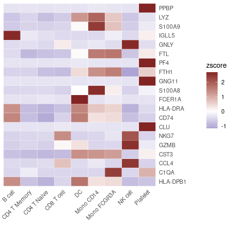
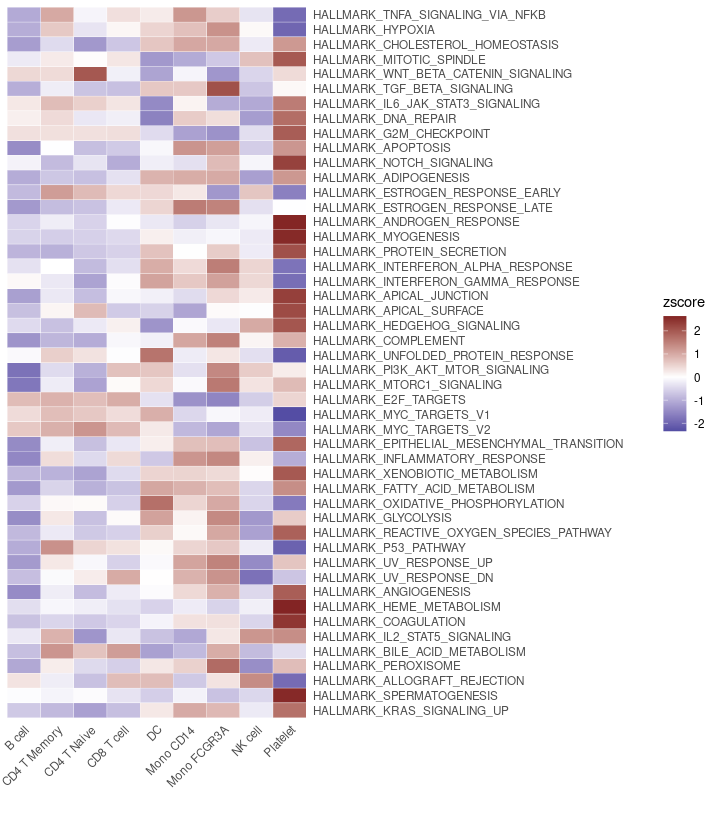
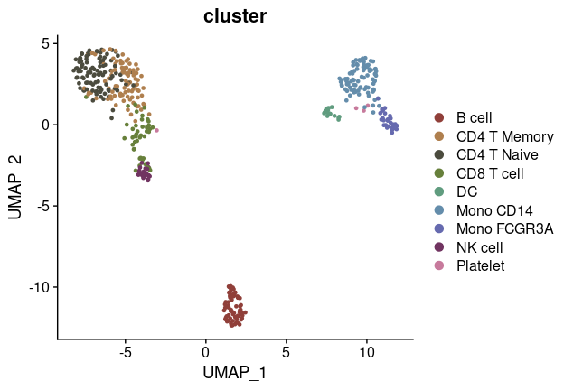

## Table of Contents

1.  [Facilitate Gene Naming Conversions](#facilitate-gene-naming-conversions)
2.  [Compute Statistics Grouped by Clusters](#compute-statistics-grouped-by-clusters)
3.  [Assess Proportion of Positive Cells in Clusters](#assess-proportion-of-positive-cells-in-clusters)
4.  [Run Standard Seurat Pipeline](#run-standard-seurat-pipeline)

## Facilitate Gene Naming Conversions

### Introduction

Gene naming conventions can vary significantly between organisms and
databases, presenting a common challenge in scRNA-seq data analysis.
`SeuratExtend` includes several functions to facilitate the conversion
between human and mouse gene symbols and Ensembl IDs, as well as
conversions between human and mouse homologous gene symbols. These
functions leverage the `biomaRt` database for conversions but improve on
reliability and performance by localizing the most commonly used
databases, thus eliminating the need for internet connectivity and
addressing the frequent instability issues with `biomaRt`.

### Functions for Gene Naming Conversions

The functions provided for these conversions are: 

- `HumanToMouseGenesymbol` 
- `MouseToHumanGenesymbol` 
- `EnsemblToGenesymbol` 
- `GenesymbolToEnsembl`

These functions share a similar usage pattern, as detailed below using
`HumanToMouseGenesymbol` as an example.

#### Getting Started with Examples

First, let’s retrieve a few human gene symbols from a dataset as an
example:

```{r}
library(Seurat)
library(SeuratExtend)

human_genes <- VariableFeatures(pbmc)[1:6]
print(human_genes)
```

    ## [1] "PPBP"   "LYZ"    "S100A9" "IGLL5"  "GNLY"   "FTL"

#### Default Usage

By default, `HumanToMouseGenesymbol` returns a data frame showing how
human gene symbols (HGNC) match with mouse gene symbols (MGI):

```{r}
HumanToMouseGenesymbol(human_genes)
```

    ##          MGI.symbol HGNC.symbol
    ## 227   9530003J23Rik         LYZ
    ## 6304           Ftl1         FTL
    ## 6305       Ftl1-ps1         FTL
    ## 8244         Gm5849      S100A9
    ## 15496          Ppbp        PPBP

This table indicates that not all human genes have direct mouse
homologs, and some human genes may correspond to multiple mouse genes.

#### Simplified Output

If you prefer a simpler vector output without the matching details:

```{r}
HumanToMouseGenesymbol(human_genes, match = FALSE)
```

    ## [1] "9530003J23Rik" "Ftl1"          "Ftl1-ps1"      "Gm5849"        "Ppbp"

#### One-to-One Correspondence

For cases where you require a one-to-one correspondence:

```{r}
HumanToMouseGenesymbol(human_genes, keep.seq = TRUE)
```

    ##         PPBP             LYZ          S100A9           IGLL5            GNLY             FTL 
    ##       "Ppbp" "9530003J23Rik"        "Gm5849"              NA              NA          "Ftl1"

#### Converting Gene Expression Matrices

These functions can also directly convert human gene expression matrices
to their mouse counterparts:

```{r}
# Create an example gene expression matrix
human_matr <- GetAssayData(pbmc)[human_genes, 1:4]
print(human_matr)
```

    ## 6 x 4 sparse Matrix of class "dgCMatrix"
    ##        CTATAAGATCGTTT-1 GTGATTCTGGTTCA-1 ACGTTGGACCGTAA-1 GGATACTGCAGCTA-1
    ## PPBP           .                .                .                .       
    ## LYZ            .                .                5.203442         2.145600
    ## S100A9         .                .                3.615756         .       
    ## IGLL5          .                .                .                .       
    ## GNLY           .                5.301497         .                .       
    ## FTL            3.804611         3.441956         6.284984         3.656766

```{r}
# Convert to a mouse gene expression matrix
HumanToMouseGenesymbol(human_matr)
```

    ## 4 x 4 sparse Matrix of class "dgCMatrix"
    ##               CTATAAGATCGTTT-1 GTGATTCTGGTTCA-1 ACGTTGGACCGTAA-1 GGATACTGCAGCTA-1
    ## Ppbp                  .                .                .                .       
    ## 9530003J23Rik         .                .                5.203442         2.145600
    ## Gm5849                .                .                3.615756         .       
    ## Ftl1                  3.804611         3.441956         6.284984         3.656766

#### Other Gene Naming Conversion Functions

The usage patterns for the other conversion functions in `SeuratExtend`,
such as `MouseToHumanGenesymbol`, `GenesymbolToEnsembl`, and
`EnsemblToGenesymbol`, are similar to those already discussed. These
functions also leverage local databases to enhance performance and
reliability but provide options to use online databases via `biomaRt` if
necessary.

Here are some examples demonstrating the use of other gene naming
conversion functions:

```{r}
# Converting mouse gene symbols to human
mouse_genes <- c("Cd14", "Cd3d", "Cd79a")
MouseToHumanGenesymbol(mouse_genes, match = FALSE)
```

    ## [1] "CD14"  "CD3D"  "CD79A"

```{r}
# Converting human gene symbols to Ensembl IDs
human_genes <- c("PPBP", "LYZ", "S100A9", "IGLL5", "GNLY", "FTL")
GenesymbolToEnsembl(human_genes, spe = "human", keep.seq = TRUE)
```

    ##              PPBP               LYZ            S100A9             IGLL5              GNLY 
    ## "ENSG00000163736" "ENSG00000090382" "ENSG00000163220" "ENSG00000254709" "ENSG00000115523" 
    ##               FTL 
    ## "ENSG00000087086"

```{r}
# Converting mouse gene symbols to Ensembl IDs
GenesymbolToEnsembl(mouse_genes, spe = "mouse", keep.seq = TRUE)
```

    ##                 Cd14                 Cd3d                Cd79a 
    ## "ENSMUSG00000051439" "ENSMUSG00000032094" "ENSMUSG00000003379"

```{r}
# Converting Ensembl IDs to human gene symbols
EnsemblToGenesymbol(c("ENSG00000163736", "ENSG00000090382"), spe = "human", keep.seq = TRUE)
```

    ## ENSG00000163736 ENSG00000090382 
    ##          "PPBP"           "LYZ"

```{r}
# Converting Ensembl IDs to mouse gene symbols
EnsemblToGenesymbol(c("ENSMUSG00000051439", "ENSMUSG00000032094"), spe = "mouse", keep.seq = TRUE)
```

    ## ENSMUSG00000051439 ENSMUSG00000032094 
    ##             "Cd14"             "Cd3d"

#### Using Online Resources

While `SeuratExtend` typically uses localized databases for conversions,
you have the option to directly fetch results from `biomaRt` databases
if required. This can be useful when working with less common genes or
newer annotations not yet available in the local database:

```{r}
# Fetching Ensembl IDs for human genes directly from biomaRt
GenesymbolToEnsembl(human_genes, spe = "human", local.mode = FALSE, keep.seq = TRUE)
```

    ## Posible mirrors: 'www', 'useast', 'asia'.

    ##              PPBP               LYZ            S100A9             IGLL5              GNLY 
    ## "ENSG00000163736" "ENSG00000090382" "ENSG00000163220" "ENSG00000254709" "ENSG00000115523" 
    ##               FTL 
    ## "ENSG00000087086"

#### Converting UniProt IDs to Gene Symbols

In addition to facilitating gene symbol and Ensembl ID conversions
between human and mouse, `SeuratExtend` also includes functionality to
convert UniProt IDs, which are widely used in proteomic databases, to
gene symbols. This can be particularly useful when integrating proteomic
and genomic data or when working with databases that use UniProt
identifiers.

The function `UniprotToGenesymbol` in `SeuratExtend` provides a
straightforward way to translate UniProt IDs into gene symbols. This
function supports both human and mouse species, accommodating research
that spans multiple types of biological data. Here’s how you can convert
UniProt IDs to gene symbols for both human and mouse:

```{r}
# Converting UniProt IDs to human gene symbols
UniprotToGenesymbol(c("Q8NF67", "Q9NPB9"), spe = "human")
```

    ## [1] "ANKRD20A12P" "ACKR4"

```{r}
# Converting UniProt IDs to mouse gene symbols
UniprotToGenesymbol(c("Q9R1C8", "Q9QY84"), spe = "mouse")
```

    ## [1] "Htr6"   "Actl7a"

## Compute Statistics Grouped by Clusters

The `CalcStats` function from the `SeuratExtend` package provides a
comprehensive approach to compute various statistics, such as mean,
median, z-scores, or LogFC, for genomic data. This function can handle
data stored in Seurat objects or standard matrices, allowing for
versatile analyses tailored to single-cell datasets.

Whether you’re analyzing genes or pathways, `CalcStats` simplifies the
task by computing statistics for selected features across different cell
groups or clusters.

### Using a Seurat Object

Begin by selecting a subset of features, such as genes. For this
example, let’s pick the first 20 variable features from a Seurat object:

```{r}
library(Seurat)
library(SeuratExtend)

genes <- VariableFeatures(pbmc)[1:20]
```

Using `CalcStats`, compute your desired metric, like z-scores, for each
feature across different cell clusters:

```{r}
genes.zscore <- CalcStats(pbmc, features = genes, method = "zscore", group.by = "cluster")
head(genes.zscore)
```

    ##            B cell CD4 T Memory CD4 T Naive CD8 T cell          DC  Mono CD14 Mono FCGR3A    NK cell
    ## PPBP   -0.3371314   -0.3304297  -0.3504324 -0.3241762 -0.35043243 -0.3026097  -0.3206744 -0.3504324
    ## LYZ    -0.7086608   -0.5312264  -0.7989052 -0.6494664  1.25840432  1.8734207   0.6437754 -0.7119758
    ## S100A9 -0.6585180   -0.5422840  -0.5670929 -0.5281999  0.06906373  2.3873809   0.7169325 -0.6237505
    ## IGLL5   2.6061006   -0.2791647  -0.3973560 -0.4712923 -0.47129230 -0.4712923  -0.2258753 -0.4712923
    ## GNLY   -0.4437914   -0.3985860  -0.4761490  0.2209286 -0.38933003 -0.2937568  -0.4197184  2.6058127
    ##          Platelet
    ## PPBP    2.6663186
    ## LYZ    -0.3753658
    ## S100A9 -0.2535318
    ## IGLL5   0.1814646
    ## GNLY   -0.4054095
    ##  [ reached 'max' / getOption("max.print") -- omitted 1 rows ]

Display the computed statistics using a heatmap:

```{r}
Heatmap(genes.zscore, lab_fill = "zscore")
```



Select more genes and retain the top 4 genes of each cluster, sorted by
p-value. This can be a convenient method to display the top marker genes
of each cluster:

```{r}
genes <- VariableFeatures(pbmc)
genes.zscore <- CalcStats(
  pbmc, features = genes, method = "zscore", group.by = "cluster", 
  order = "p", n = 4)
Heatmap(genes.zscore, lab_fill = "zscore")
```


### Using Matrices as Input

For instance, you might perform Enrichment Analysis (GSEA) using the
Hallmark 50 geneset and obtain the AUCell matrix (rows represent
pathways, columns represent cells):

```{r}
pbmc <- GeneSetAnalysis(pbmc, genesets = hall50$human)
matr <- pbmc@misc$AUCell$genesets
```

Using the matrix, compute the z-scores for the genesets across various
cell clusters:

```{r}
gsea.zscore <- CalcStats(matr, f = pbmc$cluster, method = "zscore")
```

Present the z-scores using a heatmap:

```{r}
Heatmap(gsea.zscore, lab_fill = "zscore")
```



## Assess Proportion of Positive Cells in Clusters

This section describes how to utilize the `feature_percent` function in
the `SeuratExtend` package to determine the proportion of positive cells
within specified clusters or groups based on defined criteria. This
function is particularly useful for identifying the expression levels of
genes or other features within subpopulations of cells in scRNA-seq
datasets.

### Basic Usage

To calculate the proportion of positive cells for the top 5 variable
features in a Seurat object:

```{r}
library(SeuratExtend)

genes <- VariableFeatures(pbmc)[1:5]

# Default usage
proportions <- feature_percent(pbmc, feature = genes)
print(proportions)
```

    ##            B cell CD4 T Memory CD4 T Naive CD8 T cell        DC  Mono CD14 Mono FCGR3A    NK cell
    ## PPBP   0.01492537   0.02247191  0.00000000 0.02173913 0.0000000 0.05050505  0.03333333 0.00000000
    ## LYZ    0.43283582   0.61797753  0.37931034 0.50000000 0.9333333 1.00000000  1.00000000 0.45833333
    ## S100A9 0.05970149   0.16853933  0.12931034 0.17391304 0.4666667 1.00000000  0.86666667 0.08333333
    ## IGLL5  0.20895522   0.02247191  0.00862069 0.00000000 0.0000000 0.00000000  0.03333333 0.00000000
    ## GNLY   0.05970149   0.08988764  0.02586207 0.32608696 0.1333333 0.15151515  0.10000000 0.95833333
    ##          Platelet
    ## PPBP   1.00000000
    ## LYZ    0.50000000
    ## S100A9 0.28571429
    ## IGLL5  0.07142857
    ## GNLY   0.07142857

This will return a matrix where rows are features and columns are
clusters, showing the proportion of cells in each cluster where the
feature’s expression is above the default threshold (0).

### Adjusting the Expression Threshold

To count a cell as positive only if its expression is above a value of
2:

```{r}
proportions_above_2 <- feature_percent(pbmc, feature = genes, above = 2)
print(proportions_above_2)
```

    ##            B cell CD4 T Memory CD4 T Naive CD8 T cell        DC  Mono CD14 Mono FCGR3A   NK cell
    ## PPBP   0.00000000   0.00000000  0.00000000 0.02173913 0.0000000 0.02020202   0.0000000 0.0000000
    ## LYZ    0.20895522   0.23595506  0.14655172 0.15217391 0.8666667 1.00000000   0.9000000 0.1250000
    ## S100A9 0.00000000   0.01123596  0.03448276 0.02173913 0.2666667 1.00000000   0.6333333 0.0000000
    ## IGLL5  0.08955224   0.00000000  0.00000000 0.00000000 0.0000000 0.00000000   0.0000000 0.0000000
    ## GNLY   0.00000000   0.00000000  0.00862069 0.23913043 0.0000000 0.07070707   0.0000000 0.9583333
    ##          Platelet
    ## PPBP   1.00000000
    ## LYZ    0.42857143
    ## S100A9 0.14285714
    ## IGLL5  0.00000000
    ## GNLY   0.07142857

### Targeting Specific Clusters

To calculate proportions for only a subset of clusters:

```{r}
proportions_subset <- feature_percent(pbmc, feature = genes, ident = c("B cell", "CD8 T cell"))
print(proportions_subset)
```

    ##            B cell CD8 T cell
    ## PPBP   0.01492537 0.02173913
    ## LYZ    0.43283582 0.50000000
    ## S100A9 0.05970149 0.17391304
    ## IGLL5  0.20895522 0.00000000
    ## GNLY   0.05970149 0.32608696

### Grouping by Different Metadata

If you wish to group cells by a different variable other than the
default cluster identities:

```{r}
proportions_by_ident <- feature_percent(pbmc, feature = genes, group.by = "orig.ident")
print(proportions_by_ident)
```

    ##           sample1    sample2
    ## PPBP   0.03571429 0.05421687
    ## LYZ    0.60119048 0.63554217
    ## S100A9 0.35119048 0.36445783
    ## IGLL5  0.03571429 0.03915663
    ## GNLY   0.13690476 0.15361446

### Proportions Relative to Total Cell Numbers

To also check the proportion of expressed cells in total across selected
clusters:

```{r}
proportions_total <- feature_percent(pbmc, feature = genes, total = TRUE)
print(proportions_total)
```

    ##            B cell CD4 T Memory CD4 T Naive CD8 T cell        DC  Mono CD14 Mono FCGR3A    NK cell
    ## PPBP   0.01492537   0.02247191  0.00000000 0.02173913 0.0000000 0.05050505  0.03333333 0.00000000
    ## LYZ    0.43283582   0.61797753  0.37931034 0.50000000 0.9333333 1.00000000  1.00000000 0.45833333
    ## S100A9 0.05970149   0.16853933  0.12931034 0.17391304 0.4666667 1.00000000  0.86666667 0.08333333
    ## IGLL5  0.20895522   0.02247191  0.00862069 0.00000000 0.0000000 0.00000000  0.03333333 0.00000000
    ## GNLY   0.05970149   0.08988764  0.02586207 0.32608696 0.1333333 0.15151515  0.10000000 0.95833333
    ##          Platelet total
    ## PPBP   1.00000000 0.048
    ## LYZ    0.50000000 0.624
    ## S100A9 0.28571429 0.360
    ## IGLL5  0.07142857 0.038
    ## GNLY   0.07142857 0.148

### Logical Output for Expression

For scenarios where you need a logical output indicating whether a
significant proportion of cells are expressing the feature above a
certain level (e.g., 20%):

```{r}
expressed_logical <- feature_percent(pbmc, feature = genes, if.expressed = TRUE, min.pct = 0.2)
print(expressed_logical)
```

    ##        B cell CD4 T Memory CD4 T Naive CD8 T cell    DC Mono CD14 Mono FCGR3A NK cell Platelet
    ## PPBP    FALSE        FALSE       FALSE      FALSE FALSE     FALSE       FALSE   FALSE     TRUE
    ## LYZ      TRUE         TRUE        TRUE       TRUE  TRUE      TRUE        TRUE    TRUE     TRUE
    ## S100A9  FALSE        FALSE       FALSE      FALSE  TRUE      TRUE        TRUE   FALSE     TRUE
    ## IGLL5    TRUE        FALSE       FALSE      FALSE FALSE     FALSE       FALSE   FALSE    FALSE
    ## GNLY    FALSE        FALSE       FALSE       TRUE FALSE     FALSE       FALSE    TRUE    FALSE

## Run Standard Seurat Pipeline

The `RunBasicSeurat` function in the `SeuratExtend` package automates
the execution of a standard Seurat pipeline for single-cell RNA
sequencing data analysis. This comprehensive function includes steps
such as normalization, PCA, clustering, and optionally integrates batch
effects using Harmony. This automation is designed to streamline the
analysis process, making it more efficient and reproducible.

### Overview of the Pipeline

The Seurat pipeline typically includes the following steps, which are
all encapsulated within the `RunBasicSeurat` function:

1.  **Calculating Percent Mitochondrial Content**: Identifying and
    filtering cells based on the proportion of mitochondrial genes,
    which is a common quality control metric.
2.  **Normalization**: Scaling data to account for cell-specific
    differences in library size.
3.  **PCA**: Performing principal component analysis to reduce
    dimensionality and highlight the major sources of variation.
4.  **Clustering**: Grouping cells based on their gene expression
    profiles to identify distinct cell types or states.
5.  **UMAP Visualization**: Projecting the high-dimensional data into
    two dimensions for visualization.
6.  **Batch Integration (Optional)**: Using Harmony to correct for batch
    effects, ensuring that variations driven by experimental conditions
    are minimized.

For a comprehensive tutorial on the standard Seurat workflow, refer to
the official [Seurat PBMC
tutorial](https://satijalab.org/seurat/articles/pbmc3k_tutorial).

### Using `RunBasicSeurat`

Below are examples demonstrating how to use the `RunBasicSeurat`
function to process scRNA-seq data:

```{r}
library(SeuratExtend)

# Run the full pipeline with forced normalization and default parameters
pbmc <- RunBasicSeurat(pbmc, force.Normalize = TRUE)
```

    ## Centering and scaling data matrix

    ## PC_ 1 
    ## Positive:  CST3, TYROBP, FTH1, LST1, AIF1, FCER1G, FTL, CFD, TYMP, LYZ 
    ##     S100A9, LGALS1, FCN1, SPI1, CD68, COTL1, PSAP, CTSS, SERPINA1, SAT1 
    ##     S100A11, IFITM3, AP1S2, IFI30, S100A8, LGALS2, NPC2, LGALS3, GPX1, OAZ1 
    ## Negative:  MALAT1, RPS27A, LTB, IL32, TPT1, CXCR4, IL7R, B2M, CTSW, RARRES3 
    ##     GZMA, TRAF3IP3, NOSIP, CST7, PRDX2, MYL12A, AQP3, RPL34, FAIM3, GIMAP5 
    ##     PPP2R5C, GIMAP7, MAL, PRF1, CD8B, ITM2A, CCL5, HOPX, SAMD3, OPTN 
    ## PC_ 2 
    ## Positive:  AP001189.4, GP9, ACRBP, TMEM40, CLDN5, PTCRA, CLEC1B, LY6G6F, AC147651.3, TUBA8 
    ##     PCP2, SDPR, HIST1H2AC, TSC22D1, C2orf88, PF4, CMTM5, PPBP, GNG11, ESAM 
    ##     MMD, SPOCD1, GP6, TMCC2, ENKUR, ASAP2, AC137932.6, LGALSL, MYLK, LCN2 
    ## Negative:  LYZ, S100A9, LGALS2, FCN1, TYROBP, AIF1, IFI30, CST3, S100A8, LST1 
    ##     MS4A6A, CTSS, CD14, NCF2, LGALS1, AP1S2, FTL, S100A6, S100A11, RGS2 
    ##     TYMP, PYCARD, IFITM3, FCER1G, CD68, FTH1, ALDH2, PSAP, CYBA, CTSB 
    ## PC_ 3 
    ## Positive:  NKG7, GZMA, CST7, PRF1, B2M, CTSW, S100A4, GNLY, FGFBP2, GZMB 
    ##     KLRD1, SPON2, GZMH, CCL4, CCL5, XCL2, PFN1, FCGR3A, HOPX, RARRES3 
    ##     IL32, CLIC3, TMSB4X, XCL1, AKR1C3, S1PR5, TPST2, GIMAP7, SRGN, ITGB2 
    ## Negative:  CD79A, HLA-DQA1, TCL1A, HLA-DQB1, MS4A1, LINC00926, HLA-DRA, CD79B, CD74, HLA-DPB1 
    ##     VPREB3, HLA-DPA1, FCER2, HLA-DRB5, HLA-DQA2, HLA-DRB1, HLA-DMA, CD37, TSPAN13, KIAA0125 
    ##     HLA-DOB, BLNK, SPIB, PKIG, FCRLA, BLK, BTK, PNOC, CD180, PDLIM1 
    ## PC_ 4 
    ## Positive:  GZMB, SERPINF1, CLIC3, PLD4, LILRA4, NKG7, FGFBP2, GNLY, CLEC4C, CST7 
    ##     PRF1, MZB1, KLRD1, SPON2, GZMH, HLA-DQA1, GZMA, PLAC8, FCGR3A, IRF8 
    ##     TIFAB, CD74, PTGDS, IL3RA, CCL4, TSPAN13, XCL2, IGJ, HLA-DPA1, C12orf75 
    ## Negative:  IL7R, S100A8, VIM, S100A9, MAL, S100A10, CD40LG, CD14, NOSIP, C6orf48 
    ##     LGALS2, GIMAP5, RGS10, AQP3, ANP32B, LTB, FLT3LG, GIMAP4, IL32, RBP7 
    ##     NGFRAP1, TMSB4X, LGALS3BP, FHIT, NDFIP1, FOLR3, FCN1, AIF1, AC013264.2, GIMAP7 
    ## PC_ 5 
    ## Positive:  FCGR3A, CDKN1C, CKB, SIGLEC10, HES4, MS4A7, RHOC, CD79B, CTD-2006K23.1, LILRA3 
    ##     RP11-290F20.3, CSF1R, MS4A4A, LRRC25, IFITM2, PAPSS2, LILRB1, FAM110A, BATF3, VMO1 
    ##     PPM1N, EMR2, CXCL16, TESC, MTSS1, INSIG1, CEACAM3, ZNF703, GSTA4, EMR1 
    ## Negative:  SERPINF1, LILRA4, GPX1, CLEC4C, PPP1R14B, GAS6, TIFAB, LGALS2, GRN, SCT 
    ##     CUEDC1, LRRC26, S100A8, MS4A6A, IL3RA, APP, SMPD3, ALDH2, GSN, GSTP1 
    ##     RPS6KA4, CD14, CD33, FAM213A, ZNF789, ZFAT, LYZ, ASGR1, LAMP5, VIM

    ## Using 'pca' as the reduction method for FindNeighbors, FindClusters, and RunUMAP.

    ## Computing nearest neighbor graph

    ## Computing SNN

    ## Modularity Optimizer version 1.3.0 by Ludo Waltman and Nees Jan van Eck
    ## 
    ## Number of nodes: 452
    ## Number of edges: 14235
    ## 
    ## Running Louvain algorithm...
    ## Maximum modularity in 10 random starts: 0.8333
    ## Number of communities: 5
    ## Elapsed time: 0 seconds

    ## 21:00:53 UMAP embedding parameters a = 0.9922 b = 1.112

    ## 21:00:53 Read 452 rows and found 10 numeric columns

    ## 21:00:53 Using Annoy for neighbor search, n_neighbors = 30

    ## 21:00:53 Building Annoy index with metric = cosine, n_trees = 50

    ## 0%   10   20   30   40   50   60   70   80   90   100%

    ## [----|----|----|----|----|----|----|----|----|----|

    ## **************************************************|
    ## 21:00:53 Writing NN index file to temp file /tmp/RtmpoZCA7B/file3100dd5f21e7e4
    ## 21:00:53 Searching Annoy index using 1 thread, search_k = 3000
    ## 21:00:53 Annoy recall = 100%
    ## 21:00:53 Commencing smooth kNN distance calibration using 1 thread with target n_neighbors = 30
    ## 21:00:55 Initializing from normalized Laplacian + noise (using irlba)
    ## 21:00:55 Commencing optimization for 500 epochs, with 16790 positive edges
    ## 21:00:56 Optimization finished

    # Visualize the clusters using DimPlot
    DimPlot2(pbmc, group.by = "cluster")



#### Parameters and Customization

The function allows for extensive customization of each step through
various parameters:

-   **`spe`**: Specifies the species (human or mouse) for mitochondrial
    calculations.
-   **`nFeature_RNA.min` and `nFeature_RNA.max`**: Define the range of
    RNA features considered for each cell.
-   **`percent.mt.max`**: Sets the maximum allowed mitochondrial gene
    expression percentage.
-   **`dims`**: Determines the number of dimensions used in PCA and
    neighbor finding.
-   **`resolution`**: Adjusts the granularity of the clustering
    algorithm.
-   **`reduction`**: Chooses the dimensional reduction technique, with
    options for PCA or Harmony.
-   **`harmony.by`**: Specifies the metadata column for batch correction
    when using Harmony.

### Conditional Execution

`RunBasicSeurat` intelligently decides whether to re-run certain steps
based on parameter changes or previous executions:

-   **`force.*` Parameters**: Each `force` parameter (e.g.,
    `force.Normalize`, `force.RunPCA`) overrides the function’s internal
    checks, ensuring that specific steps are executed regardless of
    prior results. This feature is particularly useful when parameters
    are adjusted or when updates to the dataset require reanalysis.

### Conclusion

The `RunBasicSeurat` function simplifies the execution of a
comprehensive scRNA-seq data analysis pipeline, incorporating advanced
features such as conditional execution and batch effect integration.
This function ensures that users can efficiently process their data
while maintaining flexibility to adapt the analysis to specific
requirements.
