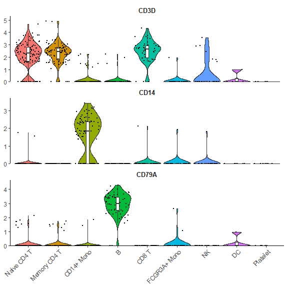
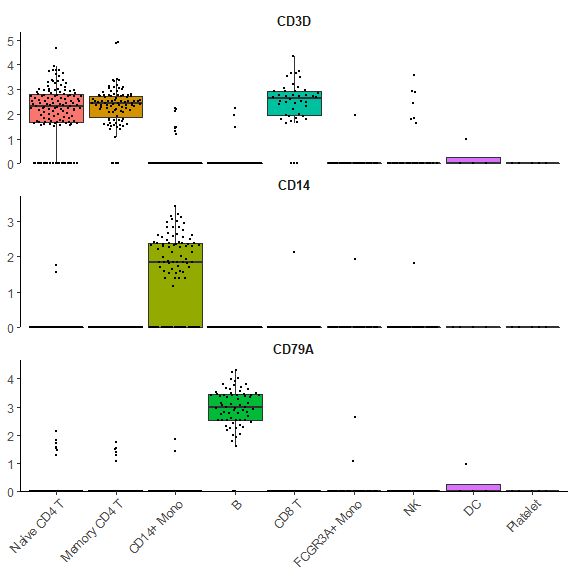
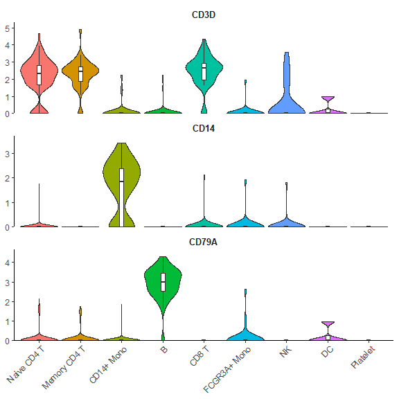
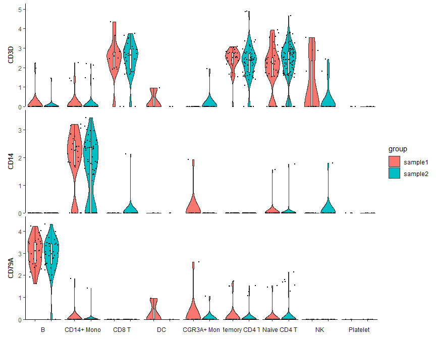
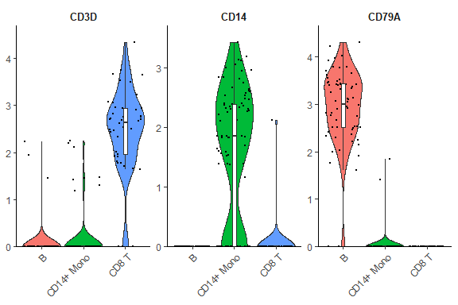
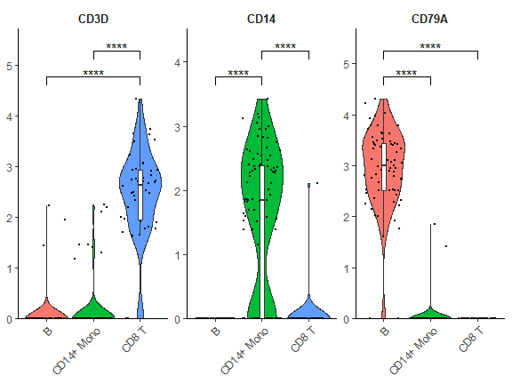
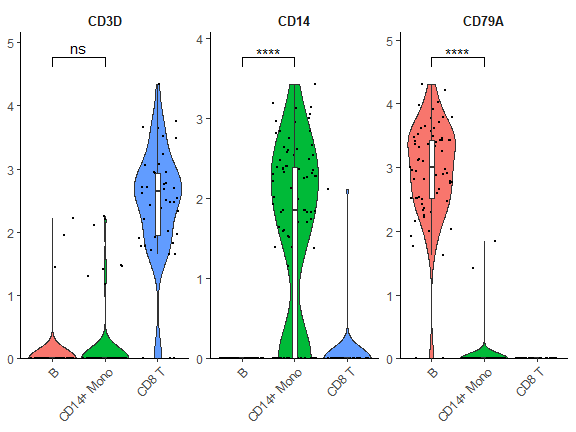
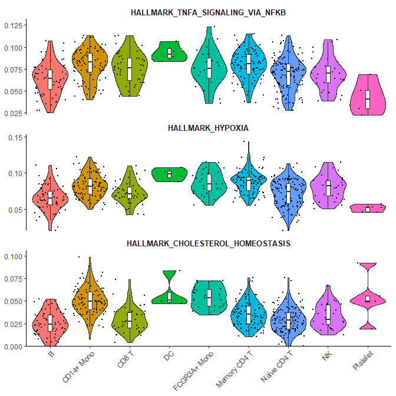

## Introduction

The `VlnPlot2` function from the `SeuratExtend` package offers a
revamped version of the traditional violin plot, designed to be more
space-efficient while introducing a wide array of additional
visualization features. Unlike the original `VlnPlot` in Seurat, the
enhanced `VlnPlot2` integrates functionalities to superimpose boxplots,
easily add statistical annotations, and offers greater flexibility in
the plot presentation.

This function has been optimized for visualizing multiple variables and
can handle both Seurat objects and matrices.

## Usage

Depending on your input, whether it’s a Seurat object or a matrix, the
method to employ `VlnPlot2` will differ.

### Using a Seurat Object

**Basic violin plot with box plot and points:** To begin with, select
the genes you intend to analyze. Here’s an example using three genes:

    library(Seurat)
    library(SeuratExtend)

    genes <- c("CD3D","CD14","CD79A")
    VlnPlot2(pbmc, features = genes)

**Customizing plot elements:** The function allows for versatile visual
alterations. For instance, one might want to omit the violin plot while
retaining the box plot, using a quasirandom style for point adjustment.

    VlnPlot2(pbmc, features = genes, violin = F, pt.style = "quasirandom")

**Hiding data points but retaining outliers:**

    VlnPlot2(pbmc, features = genes, pt = FALSE)

**Hide points and outliers for a cleaner appearance:**

    VlnPlot2(pbmc, features = genes, pt = FALSE, hide.outlier = T)

**Grouping by cluster and splitting each cluster by samples:**

    VlnPlot2(pbmc, features = genes, group.by = "cluster", split.by = "orig.ident")

**Filtering for certain subtypes and arranging plots in columns:**

    cells <- colnames(pbmc)[pbmc$cluster %in% c("B", "CD14+ Mono", "CD8 T")]
    VlnPlot2(pbmc, features = genes, group.by = "cluster", cell = cells, ncol = 3)

**Adding statistical annotations using the wilcoxon test:**

    VlnPlot2(pbmc, features = genes, group.by = "cluster", cell = cells, ncol = 3, 
             stat.method = "wilcox.test", hide.ns = TRUE)

**Restricting statistical comparisons and using t-test:**

    VlnPlot2(pbmc, features = genes, group.by = "cluster", cell = cells, ncol = 3, 
             stat.method = "t.test", comparisons = list(c(1:2)), hide.ns = FALSE)

### Using a Matrix

For an example employing a matrix input, let’s consider you have
performed a Geneset Enrichment Analysis (GSEA) using the Hallmark 50
geneset to get the AUCell matrix:

    pbmc <- GeneSetAnalysis(pbmc, genesets = hall50$human)
    matr <- pbmc@misc$AUCell$genesets

    # Plotting the first three pathways:
    VlnPlot2(matr[1:3,], f = pbmc$cluster)

