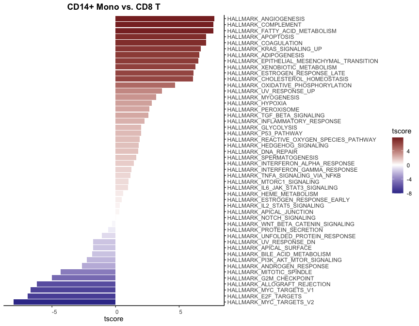
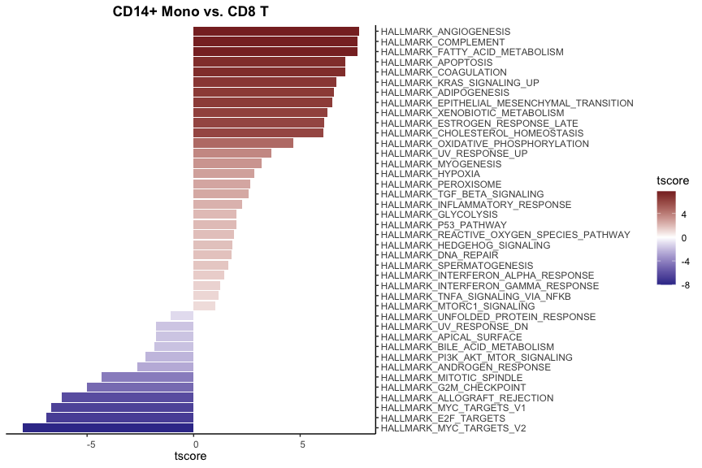
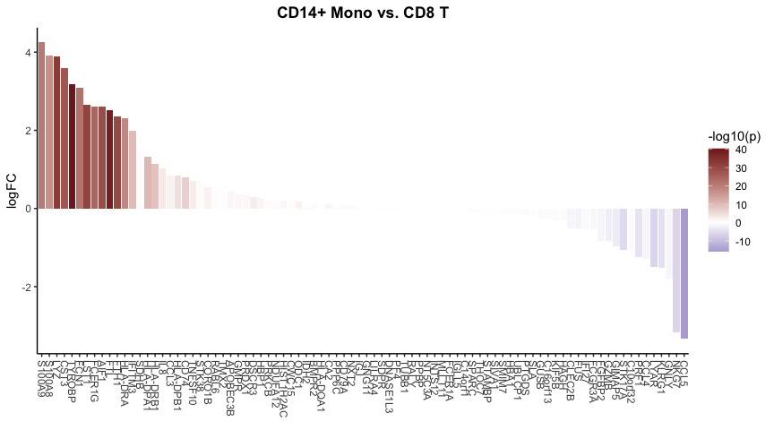

## Introduction

The `WaterfallPlot` function in the `SeuratExtend` package offers a
convenient way to visualize differences in gene expression or other
metrics across cell clusters or other groupings in single-cell datasets.
It’s especially useful when comparing the results of gene set analysis
across different cell populations.

## Basic Usage

The function can accept input either as a matrix/data frame or as a
Seurat object, and the functionality differs slightly depending on the
input.

## Using a Matrix or Data Frame

First, you may want to create a matrix using a gene set analysis
function. In this example, we use `GeneSetAnalysis()` to generate a
matrix with Hallmark 50 gene sets as rows and cells as columns:

    library(Seurat)
    library(SeuratExtend)

    # Assuming the necessary libraries and data are loaded
    pbmc <- GeneSetAnalysis(pbmc, genesets = hall50$human)
    matr <- pbmc@misc$AUCell$genesets

Now, you can use this matrix with `WaterfallPlot`:

    WaterfallPlot(matr, f = pbmc$cluster, ident.1 = "CD14+ Mono", ident.2 = "CD8 T")

`WaterfallPlot` comes with several customization options. For instance,
you can filter bars based on their length:

    WaterfallPlot(
      matr, f = pbmc$cluster, ident.1 = "CD14+ Mono", ident.2 = "CD8 T", 
      len.threshold = 1)

## Using a Seurat Object

Alternatively, you can use a Seurat object directly:

    genes <- VariableFeatures(pbmc)[1:100]
    WaterfallPlot(
      pbmc, group.by = "cluster", features = genes,
      ident.1 = "CD14+ Mono", ident.2 = "CD8 T", length = "logFC")

Show only the top and bottom 20 bars:

    WaterfallPlot(
      pbmc, group.by = "cluster", features = genes,
      ident.1 = "CD14+ Mono", ident.2 = "CD8 T", length = "logFC",
      top.n = 20)

