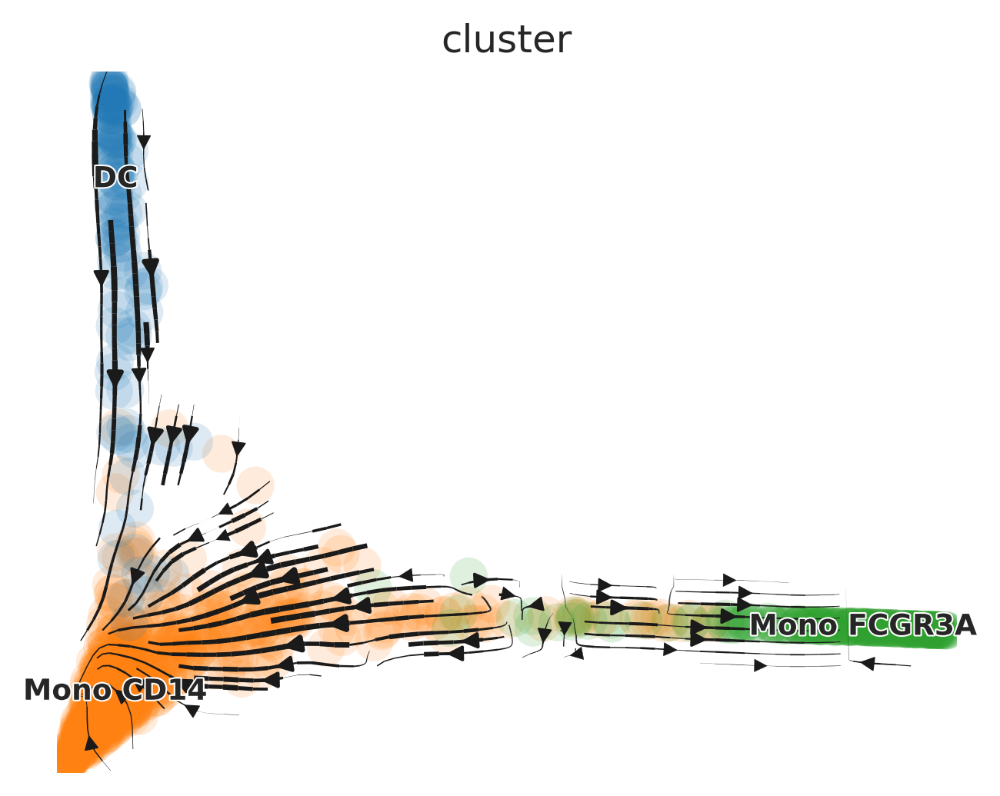

## Quick Start-Up Guide {#quick-start-up-guide}

This quick start-up guide provides an overview of the most frequently used functions in single-cell RNA sequencing (scRNA-seq) analysis. After running the standard Seurat pipeline (refer to this [Seurat pbmc3k tutorial](https://satijalab.org/seurat/articles/pbmc3k_tutorial)), you should have a Seurat object ready for further analysis. Below, we illustrate the use of a subset of the pbmc dataset as an example to demonstrate various functionalities of the `SeuratExtend` package.

### Visualizing Clusters

```{r, fig.width=5.5, fig.height=4, message=FALSE, warning=FALSE}
library(Seurat)
library(SeuratExtend)

# Visualizing cell clusters using DimPlot2
DimPlot2(pbmc, theme = theme_umap_arrows())
```

### Analyzing Cluster Distribution

To check the percentage of each cluster within different samples:

```{r, fig.width=7, fig.height=2.8, message=FALSE, warning=FALSE}
# Cluster distribution bar plot
ClusterDistrBar(pbmc$orig.ident, pbmc$cluster)
```

### Marker Gene Analysis with Heatmap

To examine the marker genes of each cluster and visualize them using a heatmap:

```{r, fig.width=5, fig.height=7, message=FALSE, warning=FALSE}
# Calculating z-scores for variable features
genes.zscore <- CalcStats(
  pbmc,
  features = VariableFeatures(pbmc),
  group.by = "cluster",
  order = "p",
  n = 4)
  
# Displaying heatmap
Heatmap(genes.zscore, lab_fill = "zscore")
```

### Enhanced Dot Plots (New in v1.1.0)

```{r, message=FALSE, warning=FALSE, fig.width=6.5, fig.height=4.6}
# Create grouped features
grouped_features <- list(
  "B_cell_markers" = c("MS4A1", "CD79A"),
  "T_cell_markers" = c("CD3D", "CD8A", "IL7R"),
  "Myeloid_markers" = c("CD14", "FCGR3A", "S100A8")
)

DotPlot2(pbmc, features = grouped_features)
```

### Enhanced Visualization of Marker Genes

For visualizing specific markers via a violin plot that incorporates box plots, median lines, and performs statistical testing:

```{r, fig.width=5, fig.height=3, message=FALSE, warning=FALSE}
# Specifying genes and cells of interest
genes <- c("CD3D", "CD14", "CD79A")
cells <- WhichCells(pbmc, idents = c("B cell", "CD8 T cell", "Mono CD14"))

# Violin plot with statistical analysis
VlnPlot2(
  pbmc,
  features = genes,
  group.by = "cluster",
  cells = cells,
  stat.method = "wilcox.test")
```

### Visualizing Multiple Markers on UMAP

Displaying three markers on a single UMAP, using RYB coloring for each marker:

```{r, fig.width=5.5, fig.height=5, message=FALSE, warning=FALSE}
FeaturePlot3(pbmc, feature.1 = "CD3D", feature.2 = "CD14", feature.3 = "CD79A", pt.size = 1)
```

### Create Volcano Plots (New in v1.1.0)

Create a basic volcano plot comparing two cell types:

```{r, message=FALSE, warning=FALSE, fig.width=5, fig.height=5}
VolcanoPlot(pbmc, 
            ident.1 = "B cell",
            ident.2 = "CD8 T cell")
```

### Conducting Geneset Enrichment Analysis (GSEA)

Examining all the pathways of the immune process in the Gene Ontology (GO) database, and visualizing by a heatmap that displays the top pathways of each cluster across multiple cell types:

```{r, fig.width=9.5, fig.height=5.5, message=FALSE, warning=FALSE}
options(spe = "human")
pbmc <- GeneSetAnalysisGO(pbmc, parent = "immune_system_process", n.min = 5)
matr <- RenameGO(pbmc@misc$AUCell$GO$immune_system_process)
go_zscore <- CalcStats(
  matr,
  f = pbmc$cluster,
  order = "p",
  n = 3)
Heatmap(go_zscore, lab_fill = "zscore")
```

### Detailed Comparison of Two Cell Types

Using a GSEA plot to focus on a specific pathway for deeper comparative analysis:

```{r, fig.width=5, fig.height=4, message=FALSE, warning=FALSE}
GSEAplot(
  pbmc,
  ident.1 = "B cell",
  ident.2 = "CD8 T cell",
  title = "GO:0042113 B cell activation (335g)",
  geneset = GO_Data$human$GO2Gene[["GO:0042113"]])
```

### Importing and Visualizing SCENIC Analysis

After conducting Gene Regulatory Networks Analysis using pySCENIC, import the output and visualize various aspects within Seurat:

```{r, fig.width=8.5, fig.height=5.5, message=FALSE, warning=FALSE}
# Downloading a pre-computed SCENIC loom file
scenic_loom_path <- file.path(tempdir(), "pyscenic_integrated-output.loom")
download.file("https://zenodo.org/records/10944066/files/pbmc3k_small_pyscenic_integrated-output.loom", scenic_loom_path, mode = "wb")

# Importing SCENIC Loom Files into Seurat
pbmc <- ImportPyscenicLoom(scenic_loom_path, seu = pbmc)

# Visualizing variables such as cluster, gene expression, and SCENIC regulon activity with customized colors
DimPlot2(
  pbmc,
  features = c("cluster", "orig.ident", "CEBPA", "tf_CEBPA"),
  cols = list("tf_CEBPA" = "OrRd"),
  theme = NoAxes()
) + theme_umap_arrows()
```

```{r, fig.width=7, fig.height=3.5, message=FALSE, warning=FALSE}
# Creating a waterfall plot to compare regulon activity between cell types
DefaultAssay(pbmc) <- "TF"
WaterfallPlot(
  pbmc,
  features = rownames(pbmc),
  ident.1 = "Mono CD14",
  ident.2 = "CD8 T cell",
  exp.transform = FALSE,
  top.n = 20)
```

### Trajectory Analysis with Palantir in R

Trajectory analysis helps identify developmental pathways and transitions between different cell states. In this section, we demonstrate how to perform trajectory analysis using the Palantir algorithm on a subset of myeloid cells, integrating everything within the R environment.

#### Download and Prepare the Data

First, we download a small subset of myeloid cells to illustrate the analysis:

```{r, fig.width=6.5, fig.height=5, message=FALSE, warning=FALSE}
# Download the example Seurat Object with myeloid cells
mye_small <- readRDS(url("https://zenodo.org/records/10944066/files/pbmc10k_mye_small_velocyto.rds", "rb"))
```

#### Diffusion Map Calculation

Palantir uses diffusion maps for dimensionality reduction to infer trajectories. Here's how to compute and visualize them:

```{r, fig.width=6.5, fig.height=5, message=FALSE, warning=FALSE}
# Compute diffusion map
mye_small <- Palantir.RunDM(mye_small)

# Visualize the first two diffusion map dimensions
DimPlot2(mye_small, reduction = "ms")
```

#### Pseudotime Calculation

Pseudotime ordering assigns each cell a time point in a trajectory, indicating its progression along a developmental path:

```{r, fig.width=7, fig.height=5.5, message=FALSE, warning=FALSE}
# Calculate pseudotime with a specified start cell
mye_small <- Palantir.Pseudotime(mye_small, start_cell = "sample1_GAGAGGTAGCAGTACG-1")

# Store pseudotime results in meta.data for easy plotting
ps <- mye_small@misc$Palantir$Pseudotime
colnames(ps)[3:4] <- c("fate1", "fate2")
mye_small@meta.data[,colnames(ps)] <- ps

# Visualize pseudotime and cell fates
DimPlot2(
  mye_small,
  features = colnames(ps),
  reduction = "ms",
  cols = list(continuous = "A", Entropy = "D"),
  theme = NoAxes())
```

#### Visualization Along Trajectories

Visualizing gene expression or regulon activity along calculated trajectories can provide insights into dynamic changes:

```{r, fig.width=6, fig.height=3, message=FALSE, warning=FALSE}
# Create smoothed gene expression curves along trajectory
GeneTrendCurve.Palantir(
  mye_small,
  pseudotime.data = ps,
  features = c("CD14", "FCGR3A")
)
```

```{r, fig.width=6, fig.height=3.2, message=FALSE, warning=FALSE}
# Create a gene trend heatmap for different fates
GeneTrendHeatmap.Palantir(
  mye_small,
  features = VariableFeatures(mye_small)[1:10],
  pseudotime.data = ps,
  lineage = "fate1"
)
```

### scVelo Analysis

scVelo is a Python tool used for RNA velocity analysis. We demonstrate how to integrate and analyze velocyto-generated data within the Seurat workflow using scVelo.

#### Preparing for scVelo

First, download the pre-calculated velocyto loom file:

```{r, fig.width=7, fig.height=5.5, message=FALSE, warning=FALSE}
# Download velocyto loom file
loom_path <- file.path(tempdir(), "pbmc10k_mye_small.loom")
download.file("https://zenodo.org/records/10944066/files/pbmc10k_mye_small.loom", 
              loom_path,
              mode = "wb")  # Use binary mode for Windows compatibility

# Set up the path for saving the AnnData object in the HDF5 (h5ad) format
if (.Platform$OS.type == "windows") {
    adata_path <- normalizePath(file.path(tempdir(), "mye_small.h5ad"), winslash = "/")
} else {
    adata_path <- file.path(tempdir(), "mye_small.h5ad")
}

# Integrate Seurat Object and velocyto loom into an AnnData object
scVelo.SeuratToAnndata(
  mye_small,
  filename = adata_path,
  velocyto.loompath = loom_path,
  prefix = "sample1_",
  postfix = "-1"
)
```

#### Plotting scVelo Results

Once the data is processed, visualize the RNA velocity:

```{r, fig.width=5, fig.height=4, message=FALSE, warning=FALSE, eval=FALSE}
# Plot RNA velocity
scVelo.Plot(color = "cluster", basis = "ms_cell_embeddings", 
            save = "quick_start_scvelo.png", figsize = c(5,4))
```

{width=700px}
